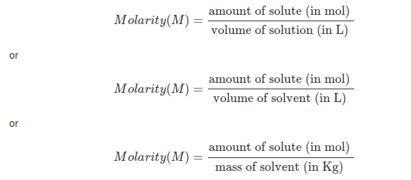

1) With increase in frequency, energy of electromagnetic waves increases or decreases  
  
2) Molarity is  

Often students confuse between molarity and molality.

  
  
3) In positive deviation from Raoult's Law, Solute-Solvent Interaction is strong or weak  
  

> **Students often confuse with these kinds of answers, when there is a dichotomy.**

  
It's nothing to do with the understanding of the subject, it's about memory. Students confuse because they have _not formed enough association with main concepts_. **Eliminating these confusion requires memory tricks.**  
  
Let's work with the first two example:  

  

  

  
  
The third one I leave to students or teachers to design so that they can memorize it.  In positive deviation, there will be more vapor pressure, this is only possible when solute-solvent interaction is weak. Weak intermolecular force means more particles in the gas phase.
