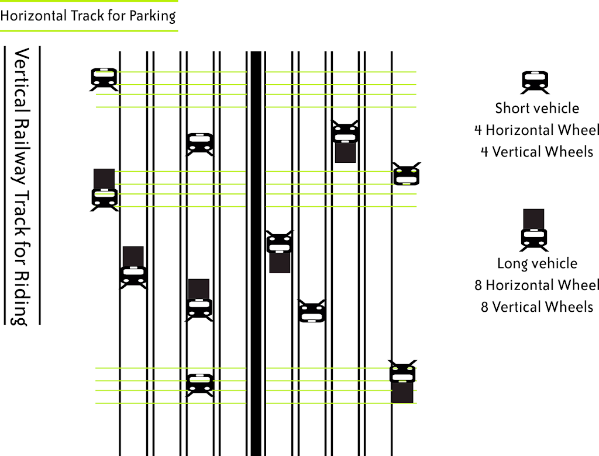

You can change and improve things if you are able to imagine it. You can't make it, if you can't imagine it. It's naive to think that everything will happen serendipitously or just knowing things is enough.  
Our schools _incentivise_ student just for knowing things in form of marks without giving considerations to _creativity_. Attitude toward inventiveness is almost negligible in our schools.

> **_You can't make it, if you can't imagine it._**

> Economic growth matters. Wealth brings us flush toilets, antibiotics, higher education, the ability to choose the career we want, fun vacations, and of course, a greater ability to protect our families against catastrophes.  
> **If wealth is so important, what makes a country rich?**  
> The most proximate cause is that wealthy countries have lots of physical and human capital per worker and they produce things in a relatively efficient manner, using latest technological knowledge. But why do so some countries have more physical and human capital and why is it organized well using the latest technological knowledge? In a word, incentives.
> 
> Entrepreneurs, investors, and savers need incentives to save and invest in physical capital, human capital, innovation and efficient organization.
> 
> Macroeconomists are especially interested in the incentives to produce **new ideas.** If the world never had any new ideas, the standard of living would eventually stagnate. But entrepreneurs draw on new ideas to create new products like iPhones, new pharmaceuticals, self-driving cars, and many other innovations. Just about any device, you use in daily life is based on multi innovations. Just about any device, you use in daily life is based on a multitude of ideas and discoveries, the lifeblood of economic growth. _New ideas, of course, require incentives and that means an active scientific community and the freedom and incentive to **put new ideas into action**._ Ideas also have peculiar properties. _One apple feeds one person but one idea can feed the world._ Ideas, in other words, aren't used up when they are used and that has tremendous implications for understanding the benefits of trade, the future of economic growth, and many other topics.
> 
> \-- Modern Principles of Economics by Tyler Cowen, Alex Tabarrok

**Idea:**

> We can dedicate the entire Saturday to bring ideas to the table for discussion. Students can be taught effective ways to generate ideas, they can think about the problem, zooming out the problem and zooming in into the problem, generate the hypothesis, design experiments and run tests for validation and iteratively improving upon ideas by looking at alternatives, flaws and what is missing in it.
> 
> Students don't need to work on different ideas each week. They can take months and years to refine their ideas.

Design Thinking Crash course  
[https://dschool.stanford.edu/resources/virtual-crash-course-video](https://dschool.stanford.edu/resources/virtual-crash-course-video)  
[https://www.ideou.com/pages/design-thinking](https://www.ideou.com/pages/design-thinking)

> **Comprehensive examples to generate ideas**  
> Smart Hackathon Problem Solving Kit  
> [https://drive.google.com/file/d/0B8x9dkicaW23WEVrbXAtdGhsdVk/view?usp=sharing](https://drive.google.com/file/d/0B8x9dkicaW23WEVrbXAtdGhsdVk/view?usp=sharing)

**Collaboration done intermittently: Solitude - Collaboration - Solitude - Collaboration - Solitude - Collaboration**

> When high and low performers interacted constantly, the low performers tended to simply copy high performers’ solutions and were in turn generally ignored by the high performers
> 
> [https://news.harvard.edu/gazette/story/2018/08/collaborate-on-complex-problems-but-only-intermittently/](https://news.harvard.edu/gazette/story/2018/08/collaborate-on-complex-problems-but-only-intermittently/)

**An example of a prototype for solving traffic problem:**

It saves space, as no requirement of the platform for every track, no pollution as vehicles are run by electricity, no traffic, luxurious public transport, high-speed vehicles, an automated timing for parking, no accidents, automated ticketing system,  number of vehicles with type (short or long or double Decker) running on the track dependent on statistics from number of tickets.  
Horizontal track for parking and can also be used for changing the tracks.

