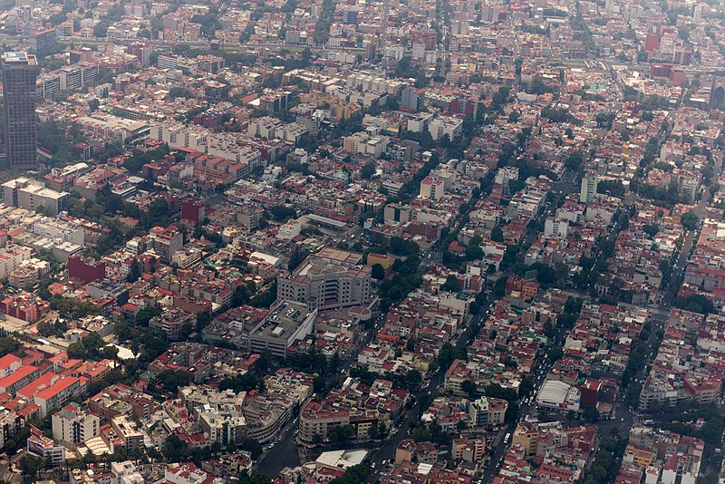
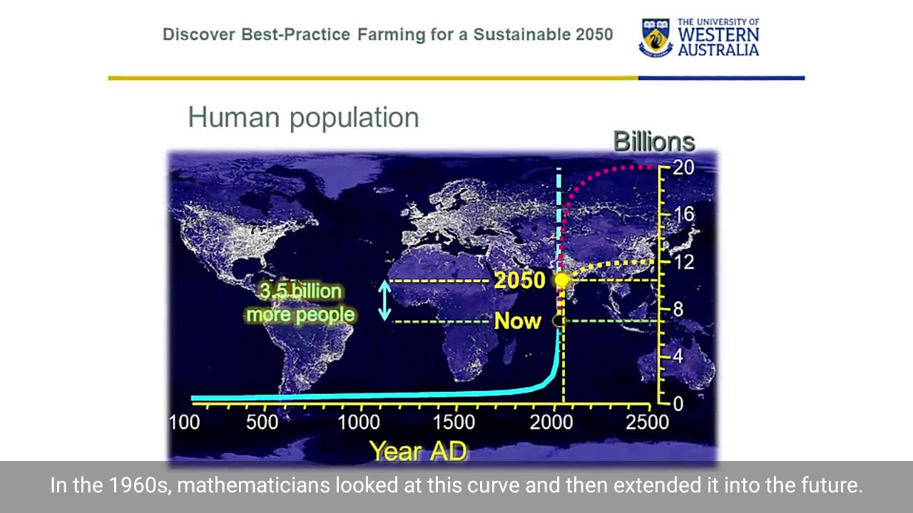
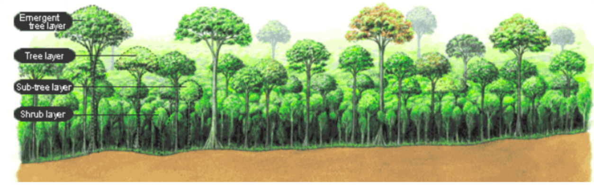

# Building better cities

## 7 principles for building better cities

More than half of the world's population already lives in cities, and another 2.5 billion people are projected to move to urban areas by 2050. The way we build new cities will be at the heart of so much that matters, from climate change to economic vitality to our very well-being and sense of connectedness. Peter Calthorpe is already at work planning the cities of the future and advocating for community design that's focused on human interaction. He shares seven universal principles for solving sprawl and building smarter, more sustainable cities.

<iframe width="560" height="315" src="https://www.youtube.com/embed/IFjD3NMv6Kw?si=XJPee-NI1bNSmzUk" title="YouTube video player" frameborder="0" allow="accelerometer; autoplay; clipboard-write; encrypted-media; gyroscope; picture-in-picture; web-share" allowfullscreen></iframe>

*- 7 principles for building better cities | Peter Calthorpe*

<iframe width="560" height="315" src="https://www.youtube.com/embed/W1ZbbQdWfN8?si=OYsMmpHmI0ClTmYz" title="YouTube video player" frameborder="0" allow="accelerometer; autoplay; clipboard-write; encrypted-media; gyroscope; picture-in-picture; web-share" allowfullscreen></iframe>

[HappiCitites](http://www.happicities.com/)

## Urban Sprawl, slums vs skycrapers

**Service providers need not have to build sprawl for providing housing for services but skyscrapers**

> Urban sprawl or suburban sprawl mainly refers to the unrestricted growth in many urban areas of housing, commercial development, and roads over large expanses of land, with little concern for urban planning

<iframe width="560" height="315" src="https://www.youtube.com/embed/lWg2bgJPakM?si=aCK7KqM-t0JNIJcm" title="YouTube video player" frameborder="0" allow="accelerometer; autoplay; clipboard-write; encrypted-media; gyroscope; picture-in-picture; web-share" allowfullscreen></iframe>

## The Course of Farming

**Discover Best Practice Farming for a Sustainable 2050 A multi-disciplinary approach to solve wide range of issues confronting the agricultural industry.**

Although this course is based on agriculture, it's not only about farming. It is a **multi-disciplinary** course that addresses a wide range of issues confronting the industry, including rural communities, rural infrastructure and conservation of biodiversity in agriculture. By completing this course you will understand that feeding and clothing the planet requires a multi-disciplinary approach and upon completion you will be able to explain best practices of sustainable farming and apply them in new contexts.

[https://www.coursera.org/learn/best-practice-farming-sustainable-2050#syllabus](https://www.coursera.org/learn/best-practice-farming-sustainable-2050#syllabus)

In all scenarios, we will have about 10 billion humans on the planet by 2050.

## How to build dense and self sustainable forest near your cities?

<iframe width="560" height="315" src="https://www.youtube.com/embed/uKt5htrDvlk?si=2LbEyoktIhU3O3hF" title="YouTube video player" frameborder="0" allow="accelerometer; autoplay; clipboard-write; encrypted-media; gyroscope; picture-in-picture; web-share" allowfullscreen></iframe>

[https://www.afforestt.com/methodology](https://www.afforestt.com/methodology)

The Miyawaki Technique is a unique methodology proven to work worldwide, irrespective of soil and climatic conditions. More than 3,000 forests have been successfully created worldwide using this methodology.

Upto 30 times more dense compared to conventional plantations.

30 times better noise and dust reduction.

Upto 30 times better Carbon-dioxide absorption as compared to a monoculture plantation.

A completely maintenance-free, wild and native forest after the first three years.

A completely chemical and chemical fertiliser free forest that sustains itself and supports local bio-diversity.

## Exploring the Pathways Between Urban Green Space and Mental Health

Green space has been found to have a significant impact on mental health, contributing to psychological relaxation and reduced stress levels. A growing body of research supports the idea that urban green space can improve residents' mental health by stabilizing emotions and releasing stress. Living in areas with higher levels of greenness has been linked to lower levels of mental distress and higher life satisfaction.

While the benefits of urban green space for mental health are clear, understanding the mechanisms behind these benefits is crucial for informing effective urban planning and design. Current challenges in this research field include defining the mediators of green space's beneficial effects and distinguishing them from measures of green space or mental health. [The Article: *How Does Urban Green Space Impact Residents’ Mental Health: A Literature Review of Mediators*](https://www.ncbi.nlm.nih.gov/pmc/articles/PMC8621109/) seeks to summarize the current mediators and identify the impact paths of different mediators, taking into account the heterogeneous effects of different types of green spaces and residents with varying socioeconomic characteristics.

> After conducting a thorough literature search and selecting relevant studies, this review identifies three primary mediators between urban green space and mental health: **environmental factors, outdoor activity, and social cohesion**. Environmental factors, such as cleaner air and reduced noise pollution, contribute to mental health by directly reducing physical damage and increasing visual benefits. Outdoor activity, facilitated by accessible green spaces, encourages physical activity and social interaction, which can boost mood and reduce stress. Social cohesion, fostered by green spaces that encourage neighbor interactions and a sense of community, can also positively impact mental health. Understanding these mediators and their impact paths can inform effective urban green space planning and policymaking, ultimately promoting better mental health outcomes for urban residents.
