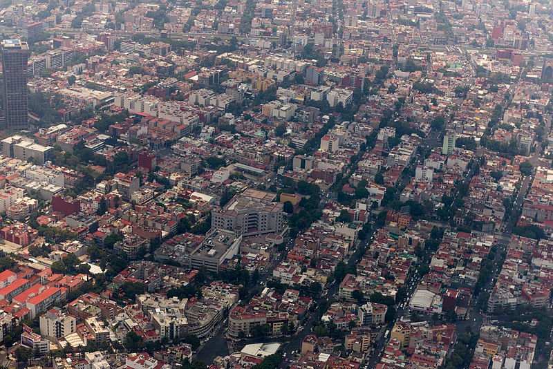
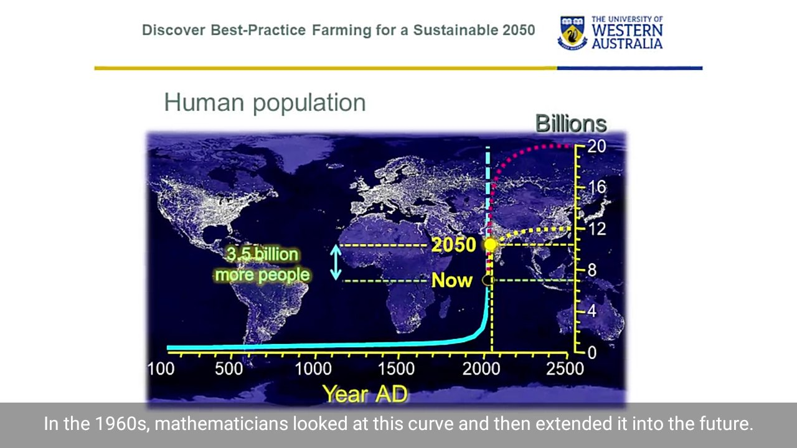
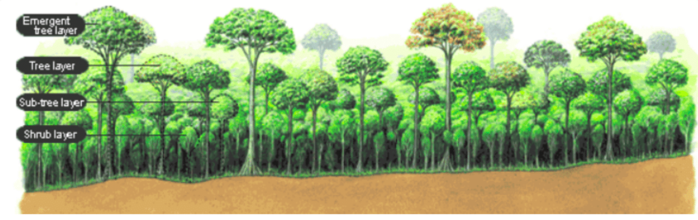

# Building better cities

## date: "2019-04-17"

---
categories: 
  - "cities"
tags: 
  - "education"
  - "farming"
  - "skycrapers"
  - "sprawl"
  - "urban-planning"
---

More than half of the world's population already lives in cities, and another 2.5 billion people are projected to move to urban areas by 2050. The way we build new cities will be at the heart of so much that matters, from climate change to economic vitality to our very well-being and sense of connectedness. Peter Calthorpe is already at work planning the cities of the future and advocating for community design that's focused on human interaction. He shares seven universal principles for solving sprawl and building smarter, more sustainable cities.

https://www.youtube.com/watch?v=IFjD3NMv6Kw

7 principles for building better cities | Peter Calthorpe

https://youtu.be/W1ZbbQdWfN8

[HappiCitites](http://www.happicities.com/)

**Education and Job Just near you through Competition Collaboration Algorithm**

The network can include all service providers, such as classroom, content provider such as MOOCs, open laboratories,  dance classes, gym, parks, playground, child care for working parents, teachers based on specialization, science park with essential experiments and equipments like telescope to validate what has been learned in classroom, even part-time job providers at the same place or just anything that is required in education.

**Service providers need not have to build sprawl for providing housing for services but skyscrapers**

> Urban sprawl or suburban sprawl mainly refers to the unrestricted growth in many urban areas of housing, commercial development, and roads over large expanses of land, with little concern for urban planning

_Urban sprawl_

https://youtu.be/lWg2bgJPakM

Skyscrapers and Slums

**The Course of Farming:**

**Discover Best Practice Farming for a Sustainable 2050 A multi-disciplinary approach to solve wide range of issues confronting the agricultural industry.**

Although this course is based on agriculture, it's not only about farming. It is a **multi-disciplinary** course that addresses a wide range of issues confronting the industry, including rural communities, rural infrastructure and conservation of biodiversity in agriculture. By completing this course you will understand that feeding and clothing the planet requires a multi-disciplinary approach and upon completion you will be able to explain best practices of sustainable farming and apply them in new contexts.

[https://www.coursera.org/learn/best-practice-farming-sustainable-2050#syllabus](https://www.coursera.org/learn/best-practice-farming-sustainable-2050#syllabus)

In all scenarios, we will have about 10 billion humans on the planet by 2050.

https://www.youtube.com/watch?v=uKt5htrDvlk&feature=youtu.be

How to build dense and self sustainable forest near your cities?

[https://www.afforestt.com/methodology](https://www.afforestt.com/methodology)

The Miyawaki Technique is a unique methodology proven to work worldwide, irrespective of soil and climatic conditions. More than 3,000 forests have been successfully created worldwide using this methodology.

Upto 30 times more dense compared to conventional plantations.

30 times better noise and dust reduction.

Upto 30 times better Carbon-dioxide absorption as compared to a monoculture plantation.

A completely maintenance-free, wild and native forest after the first three years.

A completely chemical and chemical fertiliser free forest that sustains itself and supports local bio-diversity.
