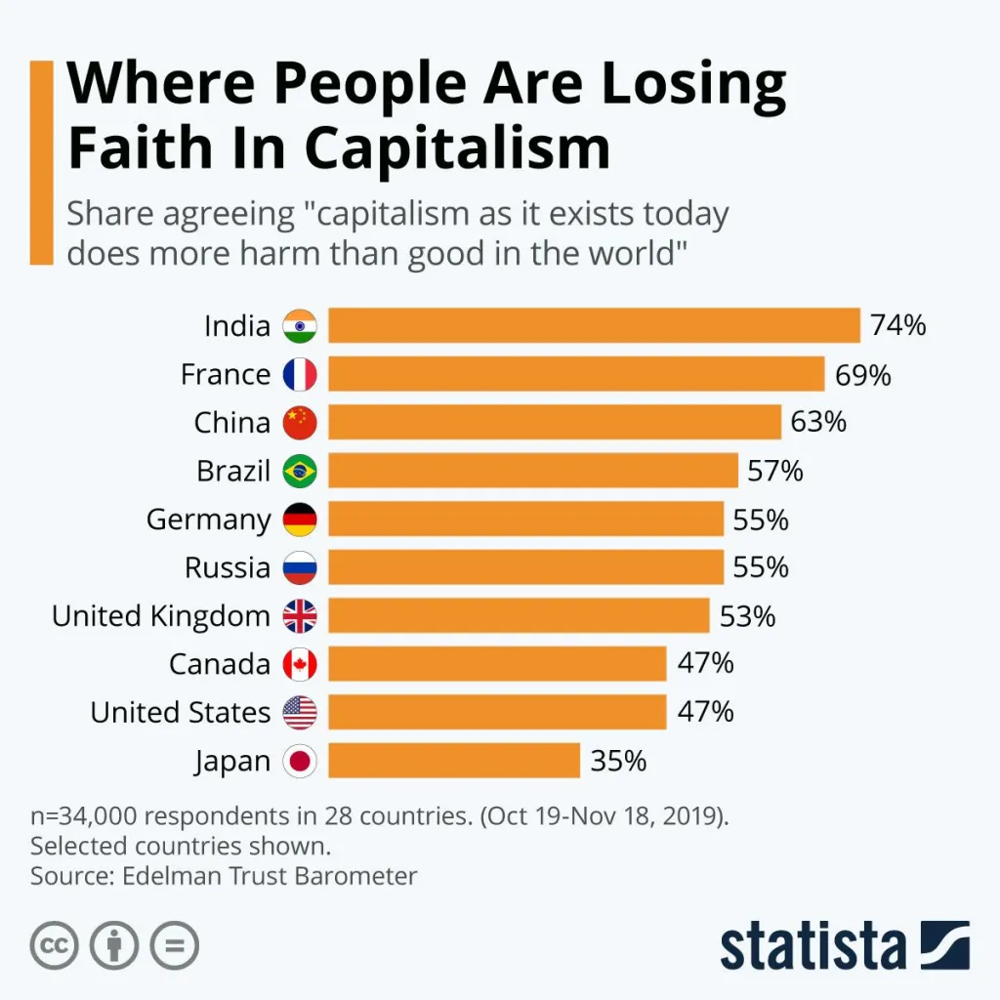

# Capitalism vs Socialism: Which one is working?

---
date: "2020-02-12"
categories: 
  - "democracy"
  - "economics"
---

## This is the dictionary definition of capitalism:

> an economic and political system in which a country's trade and industry are controlled by private owners for profit.

Characteristics central to capitalism include private property, capital accumulation, wage labor, voluntary exchange, a price system and competitive markets

--Wikipedia

## Definition of _socialism_

> Socialism is a political philosophy and movement encompassing a wide range of economic and social systems which are characterised by social ownership of the means of production, as opposed to private ownership.

## Defination of Free Market

> In economics, a free market is an economic system in which the prices of goods and services are determined by supply and demand expressed by sellers and buyers.

## **But do socialism works?** 

Here are some of the video that explains why socialism is much more worse than capitalism?

But both the videos have serious flaws:

## **It assumes Capitalism = Free Market**

Capitalism and the Free Market is often incompatible with each other. Capitalism entails private ownership, and through private ownership, individuals and entities can amass excessive wealth, establish monopolies, and potentially undermine the principles of a free market. Furthermore, they often utilize financial resources to lobby the government, seeking regulations that favour their interests and, in the process, potentially disrupt the free market.

Advocates of free-market socialism assert that authentic free markets cannot exist when productive property is privately owned. They argue that private ownership fosters class disparities and income/power inequalities, allowing the dominant class to manipulate the market in their favor through tactics like monopolies, market power, or influencing government policies to suit their business interests. Furthermore, in a socialist system with cooperative and self-managed enterprises, workers are motivated to enhance productivity because they not only receive a fixed wage or salary but also a share of the profits based on their enterprise's overall performance. This heightened motivation for productivity, envisioned in a socialist setup, could be replicated in a free-market economy if employee and public-owned companies were the prevalent norm, as envisioned by various thinkers.

Further more, capitalism exacerbates negative externalities, adversely affecting communities through the [tyranny of shareholders](./democracy/tyranny_of_the_majority.md#tyranny-of-shareholders).

Examples are Microsoft and Iphone with their proprietary software or hardware

> Apple has been forced to make their phones easier to repair, but, as the evil company that they are, they've found another way of creating unneeded friction in the system.
> 
> We've now reached the point where it's technically easy to remove the screen or the battery from an #iPhone 14, you can replace them with genuine Apple parts purchased from their store, but when you turn on the phone things probably won't work unless somebody from Apple registered the parts' serial numbers (which have all to be genuine and new btw, throwing a wrench into the idea of sustainability through used/refurbished/compatible parts) to your phone.
> 
> In other words, they've been forced to [remove the hardware barriers, and they've just moved them to the software](./what-do-we-need-to-decentralize-in-the-coming-years.md#apple-against-interoperability).
> 
> \-@blacklight

## **It assumes Socialism = Govt Ownership**

Socialism is centered around the idea of public, collective, or common ownership of the means of production. Its not about government control, where approximately 200 to 500 elected representatives manage the means of production, or where a single elected head, such as the Prime Minister or President, exercises control over the means of production.

Example of socialism is [FOSS](https://www.gnu.org/philosophy/free-sw.html) software or hardware

> “Free software” means software that respects users' freedom and community. Roughly, it means that **the users have the freedom to run, copy, distribute, study, change and improve the software**. Thus, “free software” is a matter of liberty, not price. To understand the concept, you should think of “free” as in “free speech,” not as in “free beer.”
> 
> [https://www.gnu.org/philosophy/free-sw.html](https://www.gnu.org/philosophy/free-sw.html)
> 
> [Open Source or Free Software or FOSS Philosophy](./programming/foss_philosophy.md)

So, no one owns a FOSS software, anyone can study, change or improve the software.

There are also open source hardware like build on [RISC V.](https://www.pine64.org/)

e.g Pine64 [https://www.pine64.org/](https://www.pine64.org/)

Another example can be decentralized computation using blockchain, its free market as well as owned by common with #FOSS software. You don't have to rely on aws, you can use your home computer to provide service.

[https://runonflux.io/](https://runonflux.io/)

[Akash Network](https://akash.network/)

## Anarchism
<https://en.wikipedia.org/wiki/Anarchism>

Anarchism is a political philosophy and movement that is against all forms of authority and seeks to abolish the institutions it claims maintain unnecessary coercion and hierarchy, typically including the state and capitalism. Anarchism advocates for the replacement of the state with stateless societies and voluntary free associations

## Stateless society

<https://en.m.wikipedia.org/wiki/Stateless_society>

A stateless society is a society that is not governed by a state. In stateless societies, there is little concentration of authority; most positions of authority that do exist are very limited in power and are generally not permanently-held positions.

### Rule of Law
But in order to maintain order in a stateless society, there has to be the rule of law. The rule of law provides a framework for resolving disputes and addressing conflicts in a peaceful and just manner. By ensuring that everyone is treated equally under the law, regardless of their social status, wealth, or political connections, the rule of law helps to prevent the abuse of power and the violation of individual rights.

Moreover, the rule of law acts as a deterrent against crime by providing a consistent and transparent system of consequences for unlawful behavior. When individuals know that their actions will be judged fairly and in accordance with established legal principles, they are less likely to resort to criminal activities. Furthermore, the rule of law empowers communities to establish mechanisms for conflict resolution and dispute settlement, reducing the likelihood of violence and promoting social cohesion. 

### But how can we have the rule of law in a stateless society where there is no concentration of authority?

We can have the rule of law with distributed authority rather than a concentration of authority, where the constitution is framed, adapted, or amended through deliberation between the public and [thousands or millions of specialized groups with expertise](./democracy/upholding-justice.md).

With automated smart contracts, thousands, even millions, can participate in the lawmaking and judgement process and approve decisions through different optimal voting methods.

### Classical Liberalism

<https://bigthink.com/thinking/classical-liberalism-explained/>

Classical liberalism is a political tradition and a branch of liberalism that advocates free market and laissez-faire economics and civil liberties under the rule of law, with special emphasis on individual autonomy, limited government, economic freedom, political freedom and freedom of speech. Classical liberalism, contrary to liberal branches like social liberalism, looks more negatively on social policies, taxation and the state involvement in the lives of individuals, and it advocates deregulation.

#### Regulation or Deregulation

Deregulation of markets hardly works in tackling negative externalities. Negative externalities need to be taxed or regulated. Though markets need to be free, with [no price control](./economics/price_controls.md)— in other words, prices are decided by demand and supply— markets need to be regulated to prevent monopolization and also to prevent negative externalities.

Organizations need to be publicly owned, with better [predistribution through smart contracts and game theory](./economics/yard-sale-model.md).

## Two videos compare capitalism and socialism, and the problems of the videos are highlighted above.

<iframe width="560" height="315" src="https://www.youtube.com/embed/AkFZgZ5IjTU?si=nyAewzTyniBjMfyi" title="YouTube video player" frameborder="0" allow="accelerometer; autoplay; clipboard-write; encrypted-media; gyroscope; picture-in-picture; web-share" allowfullscreen></iframe>

<iframe width="560" height="315" src="https://www.youtube.com/embed/Fdfru9NHGvE?si=lXXEwR1jLZF8wQSy" title="YouTube video player" frameborder="0" allow="accelerometer; autoplay; clipboard-write; encrypted-media; gyroscope; picture-in-picture; web-share" allowfullscreen></iframe>

> But what about capitalism. We have one-sided economy where only very few control the market. 

[https://iambrainstorming.wordpress.com/2019/10/20/one-sided-economics/](https://iambrainstorming.wordpress.com/2019/10/20/one-sided-economics/)

> Wealth inequality is on the rise. People are unemployed and in poverty. Capitalists are creating more problems (or negative externalities like climate change, pollution) than solving. 

## Capitalism is not working

[https://www.weforum.org/agenda/2020/02/countries-losing-faith-capitalism-economics-global-political-systems](https://www.weforum.org/agenda/2020/02/countries-losing-faith-capitalism-economics-global-political-systems)
