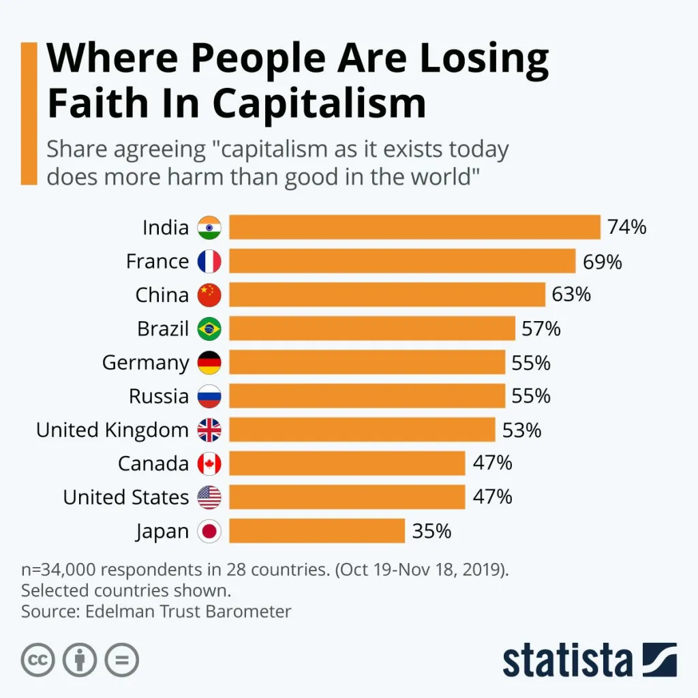

# Capitalism vs Socialism: Which one is working?

---
date: "2020-02-12"
categories: 
  - "democracy"
  - "economics"
---

## This is the dictionary definition of capitalism:

> an economic and political system in which a country's trade and industry are controlled by private owners for profit.

Characteristics central to capitalism include private property, capital accumulation, wage labor, voluntary exchange, a price system and competitive markets

\--Wikipedia

## Definition of _socialism_

> Socialism is a political philosophy and movement encompassing a wide range of economic and social systems which are characterised by social ownership of the means of production, as opposed to private ownership.

## **But do socialism works?** 

Here are some of the video that explains why socialism is much more worse than capitalism?

But both the videos have serious flaws:

## **It assumes Capitalism = Free Market**

Capitalism and the Free Market is often incompatible with each other. Capitalism entails private ownership, and through private ownership, individuals and entities can amass excessive wealth, establish monopolies, and potentially undermine the principles of a free market. Furthermore, they often utilize financial resources to lobby the government, seeking regulations that favour their interests and, in the process, potentially disrupt the free market.

Examples are Microsoft and Iphone with their proprietary software or hardware

> Apple has been forced to make their phones easier to repair, but, as the evil company that they are, they've found another way of creating unneeded friction in the system.
> 
> We've now reached the point where it's technically easy to remove the screen or the battery from an #iPhone 14, you can replace them with genuine Apple parts purchased from their store, but when you turn on the phone things probably won't work unless somebody from Apple registered the parts' serial numbers (which have all to be genuine and new btw, throwing a wrench into the idea of sustainability through used/refurbished/compatible parts) to your phone.
> 
> In other words, they've been forced to [remove the hardware barriers, and they've just moved them to the software](./what-do-we-need-to-decentralize-in-the-coming-years.md#apple-against-interoperability).
> 
> \-@blacklight

## **It assumes Socialism = Govt Ownership**

Socialism is centered around the idea of public, collective, or common ownership of the means of production. Its not about government control, where approximately 200 to 500 elected representatives manage the means of production, or where a single elected head, such as the Prime Minister or President, exercises control over the means of production.

Example of socialism is [FOSS](https://www.gnu.org/philosophy/free-sw.html) software or hardware

> “Free software” means software that respects users' freedom and community. Roughly, it means that **the users have the freedom to run, copy, distribute, study, change and improve the software**. Thus, “free software” is a matter of liberty, not price. To understand the concept, you should think of “free” as in “free speech,” not as in “free beer.”
> 
> [https://www.gnu.org/philosophy/free-sw.html](https://www.gnu.org/philosophy/free-sw.html)
> 
> [Open Source or Free Software or FOSS Philosophy](./programming/foss_philosophy.md)

So, no one owns a FOSS software, anyone can study, change or improve the software.

There are also open source hardware like [RISC V.](https://www.pine64.org/)

e.g Pine64 [https://www.pine64.org/](https://www.pine64.org/)

Another example can be decentralized computation using blockchain, its free market as well as owned by common with #FOSS software. You don't have to rely on aws, you can use your home computer to provide service.

[https://runonflux.io/](https://runonflux.io/)

[Akash Network](https://akash.network/)

<iframe width="560" height="315" src="https://www.youtube.com/embed/AkFZgZ5IjTU?si=nyAewzTyniBjMfyi" title="YouTube video player" frameborder="0" allow="accelerometer; autoplay; clipboard-write; encrypted-media; gyroscope; picture-in-picture; web-share" allowfullscreen></iframe>

<iframe width="560" height="315" src="https://www.youtube.com/embed/Fdfru9NHGvE?si=lXXEwR1jLZF8wQSy" title="YouTube video player" frameborder="0" allow="accelerometer; autoplay; clipboard-write; encrypted-media; gyroscope; picture-in-picture; web-share" allowfullscreen></iframe>

> But what about capitalism. We have one-sided economy where only very few control the market. 

[https://iambrainstorming.wordpress.com/2019/10/20/one-sided-economics/](https://iambrainstorming.wordpress.com/2019/10/20/one-sided-economics/)

> Wealth inequality is on the rise. People are unemployed and in poverty. Capitalists are creating more problems (or negative externalities like climate change, pollution) than solving. 

## Capitalism is not working

[https://www.weforum.org/agenda/2020/02/countries-losing-faith-capitalism-economics-global-political-systems](https://www.weforum.org/agenda/2020/02/countries-losing-faith-capitalism-economics-global-political-systems)
