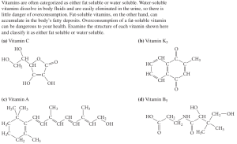
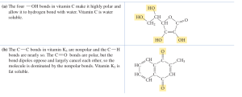
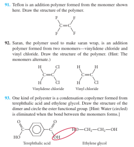
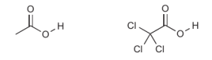

  
**Most questions of CBSE 12th board, all requires rote memorization of abstract information that adds no understanding to the subject.**  
Let us analyze the style of question in CBSE:  
  
**This is the question from book Nivaldo J Tro:**  
  
The question gives some background knowledge,  structures are already given and the question really tests your understanding, not how much you have memorized.  
  

  
  
  
  

#### **"All books must be removed from recommendation if it doesn't meet the learning criteria from next session. This is the most important thing we need to do to save our children and all future generations."**

  

[http://technoperiod.blogspot.in/2017/01/all-books-that-dont-meet-learning.html](http://technoperiod.blogspot.in/2017/01/all-books-that-dont-meet-learning.html)
