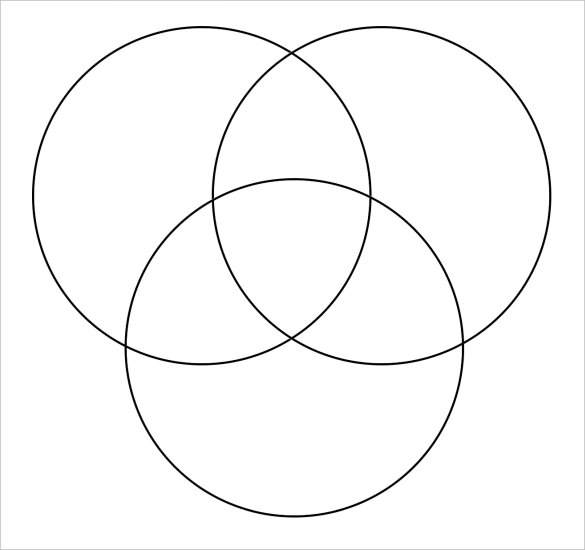

A student is not scoring well, the main reason given:  
He/She has the **less innate** **ability**.  
He/She was **not working hard**.  
  
Let's bust the second myth first.  
My question to schools, teachers, and parents is after spending about **6-7 hours** in schools, or 24 hrs in residential schools and colleges, how can you really blame children for not working hard.  
Why do schools expect children to study all by themselves? **Why they have to do homework?**  
The problem is not about working hard, it's about not following effective study strategies. Not providing them to do enough retrieval practice. The implementing of the effective study strategies is a very complicated process and often contextual, so much of attributes involved, from content, curriculum to test questions. But the good thing is so much of research already available that will guide teachers to help students in learning.  
[http://www.learningscientists.org/](http://www.learningscientists.org/)  
  
Now the first myth:  
She lacks the innate ability.  
  
**Fact:**  
All organisms at the individual level are different, even no two bacteria are exactly same. We have the DNA, that is different for each organism, but it is different for a purpose, to maintain diversity. Diversity helps to stay in an interdependent manner, meeting each other need without having to do everything alone. Diversity helps us to do specialization so that someone else can take care of your requirement, without having to do everything by yourself.  
**So why don't we appreciate the diversity?**  
  
But there is another Fact:  
**Abilities do overlap with each other.** All humans share many common abilities, there are shared abilities between monkeys and humans, plants and animals, animals and prokaryotes. But same species have many shared abilities, because of that reason humans are called humans (Homo sapiens)  
  

  
  
So why aren't our exams and curriculum are build based on shared abilities? Also, specialized test and learning goals to meet the individual needs.  
**How do you know, someone is more intelligent and someone is not?** _It is tests, right?_  What if tests itself are not well formed. How can someone answer your questions if the information is not in his/her brain? How can someone answer your questions if he/she has not been taught well or understood? How can someone answer your question if he/she has forgotten the answer? Are we addressing these issues before testing?
