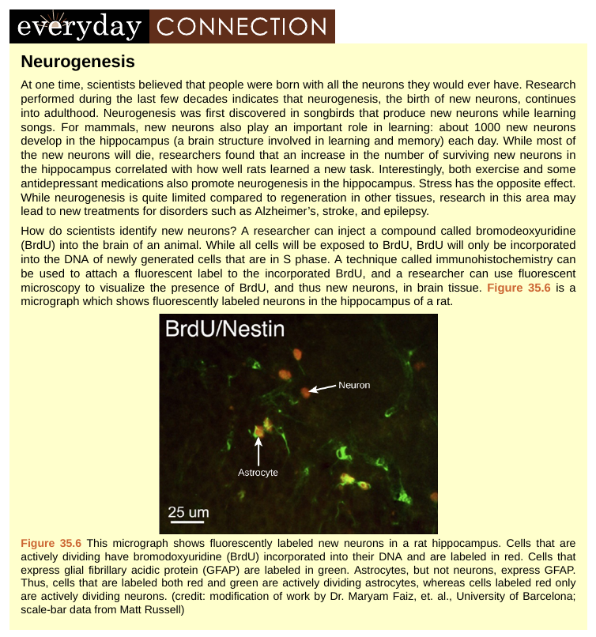

**The sequence of chapters:**  
Openstax biology:

In openstax biology, chapters are **arranged based on increasing biological complexity**. The second chapter is about atoms, molecules, water, and carbons. It gives applied techniques about how biology is being done, for example, carbon dating, molecular interactions that take place in lifeforms and why, how it takes place, its describes all the basics at the atomic and molecular level, and also talks about environmental conditions of life forms such as pH. At the end of the chapter, it says about Carbon, and why it's important for life. Next chapter is about Biological Macromolecules (increasing complexity from atoms to long polymers), then cell structure and other chapters about functioning.

**Evolution is taught before the five kingdom classification. Why?** Because classification is completely phylogenetically linked. You have to understand evolution, in order to understand classification. _Classification is also written with linking evolution in context._ e.g. endosymbiosis and the evolution of eukaryotes, how land plants evolved from green algae, when seed plants first appeared and when gymnosperms became the dominant plant group.

NCERT Biology:  
But NCERT biology doesn't follow such sequence, that is important to understanding the biology. You can't say ribosome function is protein synthesis, without knowing proteins are made up of amino acids. Without knowing DNA and RNA(biomolecules), how can you talk about virus and virus structure?

**Connections:**

Openstax biology:  
Openstax biology contains many separate boxes that contain interesting information, from important application oriented techniques to career connections that talks about e.g. what a pharmaceutical chemist or microbiologist does, which section of biology is important to which career. It will also help students to become curious and motivate them for pursuing biology as a career.

NCERT Biology:  
It does have boxes for scientists. But nothing much interesting. Instead of describing how his/her experiment is done in details, it talks more about degrees, certificates, and university studied in half of the box.

**Content:**  
Openstax biology gives comprehensive content answering probing questions in biology, but NCERT biology gives information just like short notes without touching the new leading edge research. The text of NCERT biology lives students baffling and statements of it don't answer the questions of the working or mechanism that comes to mind. Text that is written doesn't create mental picturization or associations in mind so that students can learn and remember better. Also, it fails to bring curiosity, as the texts don't ask probing questions before explaining the details.

**Examples of how it lives students baffling and doesn't produce associations?**  
Ribosomes are the granular structures first observed under the electron microscope as dense particles by George Palade.  
Why dense? Because it is a solid structure, without spaces in it.  
It composed of ribonucleic acid (RNA) and proteins and are not surrounded by a membrane.  
Where is the structure of ribosome?  
Here 'S' (Svedberg's unit) stands for the sedimentation coefficient, it indirectly is a measure of density and size.  
What is indirectly here? How it's done? No explanation. Also, subunit structures are not given.

The central tubules are connected by bridges and are also enclosed by a central sheath, which is connected to one of the tubules of each peripheral doublets by a radial spoke. Thus, there are nine radial spokes. The peripheral doublets are also interconnected by linkers. Both the cilium and flagellum emerge from a centriole-like structure called the basal bodies.

What is the importance of all these texts about central tubules? Structural as well as functional? If it's out of scope at 11th level, then why at all these are discussed?

**Exercises:**  
It contains conceptual and critical thinking questions, and also ncert biology questions are good for discussion.

**Scientific Method:**  
NCERT biology like all other books of ours doesn't contain scientific method, how biology needs to be done.

[Cell Notes through compilation](https://nbviewer.jupyter.org/github/amiyatulu/biology/blob/master/Cell.ipynb)

Word count analysis of openstax Biology, campbell  Biology and NCERT Biology with removing all stopwords  
[https://github.com/amiyatulu/biologybooks\_wordcounts](https://github.com/amiyatulu/biologybooks_wordcounts)

Conclusion for word count analysis:  
Instances of '_data_' are maximum in Campbell Biology. Most thing in the book is explained with giving real world experimental _data_.  
Both Campbell Biology and OpenStax Biology stress biology in the purview of _evolution_ with maximum _examples_ and emphasizing on _structures_ in biology as form follows function, along with answering maximum probing questions (as _how_ ranks much higher)

NCERT biology lacks emphasis of all these concepts. Even though _figures_ tops in NCERT biology, but in many chapters, relevant _figures_ of textual content is missing. _Data_ word doesn't exist in top 500.

P.S.  
Why ncert books (not particularly biology) are written like a one-liner, without digging into details? Also why questions can come from any line of the book especially in entrances, which students may have dropped reading because the author didn't pay much regard to describe it in detail?  
If you read the concepts in detail, you can answer the basic and important questions with forgetting some details. But if you read the concepts, in short, you will have trouble in answering even basic and important questions. More you dig into the concepts, more you will get comfortable with the basics because it will create more neural connections to the basics that are hard to forget.

> Teach less number of concepts/topics but teach it more indepth.
