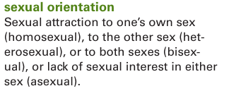
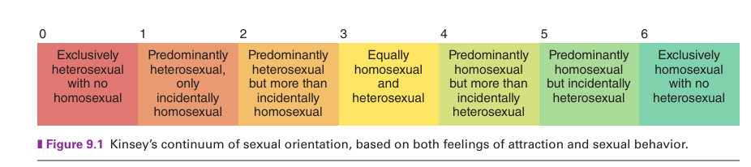
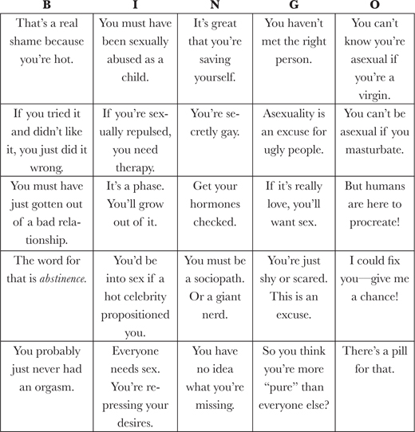

# Complicatedness of Sexuality

---

date: "2019-04-10"

- categories:

  - "compilation"
  - "sex"
  - "sexual-orientation"
  - "sexuality"

- tags:

  - "asexual"
  - "demisexual"
  - "homosexuality"
  - "lgbtqa"

---

## Sexuality definition

Human sexuality is the way people experience and express themselves sexually. This involves biological, erotic, physical, emotional, social, or spiritual feelings and behaviors. So **definition of sexuality is nuanced, broad and multifaceted**.

Multidimensional components indicate a specific sexual orientation and can include whether an individual:

1. Engages in sexual behaviour with men, women, both or neither.

2. Feels sexual desire for men, women, both or neither.

3. Falls in love with men, women, both, or neither.

4. Identifies himself or herself with a specific sexual orientation.

### **The complexity and ambiguity of defining sexual orientation.**

The complexity and ambiguity of defining sexual orientation result from the varying combinations and degrees of these four components. For example, **how much sexual attraction** to and experience with the same sex can someone have and still be heterosexual? And, vice versa, how much sexual attraction to and behavior with the other sex can someone have and still be homosexual? Or, is everyone who does not consistently and completely meet these four components bisexual? Further, can someone who self-identifies as heterosexual but is sexual exclusively with same-sex partners really be heterosexual? Even scientists who do research about sexual orientation do not use consistent criteria in categorizing subjects according to sexual orientation. _**In some studies, subjects are included in the bisexual/homosexual category if they have had any element of same-sex attraction, behavior, or self-identity. In other studies, subjects are not considered homosexual unless their sexual behavior, attraction, and self-identity have been consistently with the same sex since puberty.**_

A Continuum of Sexual Orientations\
The Kinsey scale did not include asexaulity

### sexual fluidity

**Variability in same-sex and other-sex attraction and involvement at different times and in different situations throughout the life span.**

The Kinsey scale may be interpreted incorrectly to indicate that all people have a fixed, stable sexual orientation. In fact, sexual orientation is more accurately determined by patterns over time rather than at any given point in time (Baumgardner, 2007). Psychologist and researcher Lisa Diamond (2008a) uses the term s**exual fluidity to describe variability in same-sex and other-sex attraction and/or involvement at various times and situations throughout the life span**. Her research indicates that, for some women, sexual self-identity and the biological sex of preferred sexual partners can vary over time and experience unexpected transitions.

Lisa Diamond’s research on sexual fluidity followed almost 80 women ages 18 to 25 over a 10-year period. At the beginning of the study, all the subjects were involved with other women and labeled themselves variably as lesbian, bisexual, or unlabeled. **At the end of the study, about one third of the women were consistent in their self-identification** as lesbian and in their attraction to and sexual involvement with women. However, the remaining women—initially self-identified as lesbian, bisexual, or unlabeled—had changed their self-identification at least once during the 10 years. Notably, these changes were variable: Lesbian changed to bisexual or unlabeled, bisexual changed to lesbian or unlabeled, unlabeled changed to bisexual or lesbian, and some previously self-identified lesbian, bisexual, and unlabeled changed to heterosexual. Some of the changes in self-labeling were due to sexual and/or romantic attraction to or involvement with men. However, **_the women who became involved with men continued to feel the same amount of attraction toward other women as they had at the beginning of the study 10 years earlier_** (Diamond, 2008b).

### Asexuality: The Invisible Orientation

**ASEXUALITY IS:**

**_A sexual orientation currently estimated to describe 1 percent of the population_**. Asexuality is usually defined as the experience of not being sexually attracted to others. Less commonly, _**it is defined as not valuing sex or sexual attraction enough to pursue it**_.

**WE’RE NOT:**

> Asexuality isn’t a complex. It’s not a sickness. It’s not an automatic sign of trauma. It’s not a behavior. It’s not the result of a decision. It’s not a chastity vow or an expression that we’re “saving ourselves.” We aren’t by definition religious. We aren’t calling ourselves asexual as a statement of purity or moral superiority.

We’re not amoebas or plants. We aren’t automatically gender confused, anti-gay, anti-straight, anti-any-sexual-orientation, anti-woman, anti-man, anti-any-gender, or anti-sex. We aren’t automatically going through a phase, following a trend, or trying to rebel. We aren’t defined by prudishness. We aren’t calling ourselves asexual because we failed to find a suitable partner. We aren’t necessarily afraid of intimacy. And we aren’t asking for anyone to “fix” us.

WE DON’T:

Asexual people don’t all look down on sex or people who have sex. **We don’t all avoid romantic or emotionally close relationships, and we aren’t automatically socially inept**. We aren’t defined by atypical biology or nonfunctional genitals. We aren’t defined by mental illness, autism, or disability. We don’t try to recruit anyone.

We don’t have a hole in our lives where sexual attraction “should” be. **We can’t be converted by trying sex.** We aren’t, by definition, lonely or empty. We aren’t, by definition, immature or incompetent. We aren’t, as a group, uglier or prettier than anyone else. We don’t tell people not to have sex in the name of our orientation, nor do we use the term _asexual_ to imply perceiving ourselves to be “above” sex.

An asexual person does not experience sexual attraction – they are not drawn to people sexually and do not desire to act upon attraction to others in a sexual way. Unlike celibacy, which is a choice to abstain from sexual activity, asexuality is an intrinsic part of who we are, just like other sexual orientations. Asexuality does not make our lives any worse or better; we just face a different set of needs and challenges than most sexual people do. There is considerable diversity among the asexual community in the needs and experiences often associated with sexuality including relationships, attraction, and arousal.

**Attraction**\
Many asexual people may experience forms of attraction that can be romantic, aesthetic, or sensual in nature but do not lead to a need to act out on that attraction sexually. **_Instead, we may get fulfillment from relationships without sex, but based on other types of attraction. Romantic attraction is the desire to be romantically involved with another person. Aesthetic attraction is appreciation for a person’s appearance. Sensual attraction is the desire to engage in sensual (but not sexual) activities with a person, such as cuddling, hugging, or kissing_**. Asexual people who experience these other forms of attraction will often be attracted to particular gender. **These people may still identify as lesbian, gay, bi, or straight.** The [split attraction model](https://aroacefaq.tumblr.com/post/143810110365/the-split-attraction-model-what-is-it) has led some people to identify separate sexual and romantic attractions. For example, a person who’s asexual but wants relationships with the opposite sex may identify as a “heteroromantic asexual”. Most sexual people may not view their orientation that way, and may simply combine their sexual and romantic attractions into one characteristic if they’re aligned. Asexual people often feel the need to specify both sexual and romantic attractions to make it clear what drives them and what they’re seeking from other people.

**Arousal**\
For some asexual people, arousal (sometimes interchanged with “[libido](http://wiki.asexuality.org/Libido)” in asexual dialogue) is a fairly regular occurrence, though it is not associated with a desire to find a sexual partner or partners. This could include, but is not limited to, arousal from hormone variation in a person’s menstrual cycle, or erections at certain times of the day. Some may occasionally masturbate, but feel no desire for partnered sex. Other asexual people may experience little or no arousal, often called [non-libidoist](http://wiki.asexuality.org/Nonlibidoism) asexuals. Both types are equally valid in identifying as asexual, as sexual orientation is about attraction and desire towards other people, rather than strictly physiological reactions.

Because we don’t have an intrinsic need for sex, asexual people generally do not see a lack of sexual arousal as a problem to be corrected, and if they do have a libido or experience arousal, they do not feel needs are unmet by a lack of sexual activity.

It is important to note that asexuality is different from medical conditions such as Hypoactive Sexual Desire Disorder (HSDD). HSDD is listed in the DSM-V, while asexuality is not. In cases of HSDD, there are underlying sexual needs that are not being met, to the point of personal distress. If not experiencing arousal or suddenly losing interest in sex is distressing, it is advisable to discuss this with a medical professional to get a diagnosis.

**\
Relationships**\
Asexuality does not limit a person’s emotional needs. As is the case for sexual people, we vary widely in how we fulfill those needs. Some asexual people may still desire romantic relationships. Other asexual people may be most satisfied with close friendships, or happier on their own.

Sexual or nonsexual, all relationships are made up of the fabric of interpersonal connection. Communication, closeness, fun, humor, excitement, and trust are all just as important in nonsexual relationships as in sexual ones. Asexual people who desire romantic relationships may have fewer cultural scripts to rely on, but they are still seeking an emotional connection of shared romantic love. \
**_For asexual people who desire romantic relationships, the dating pool for other asexual people is very small, as we are a very small minority of the population._** In addition to that, asexuality is often invisible and has a shorter history as an identity/community than other minority sexual orientations that may have established cultural venues of courtship. Due to this, many asexual people end up in mixed relationships with sexual people. Mixed relationships face challenges that often require compromise.

### Definitions

**Asexual:** Someone who does not experience sexual attraction or an intrinsic desire to have sexual relationships (or the adjective describing a person as such).

**Demisexual:** _Someone who can only experience sexual attraction or desire after an emotional bond has been formed_ (or the adjective describing a person as such). This is different from the choice to abstain from sex until certain criteria are met.

**Gray-asexual (gray-a)** or **gray-sexual:** Someone who identifies with the area between asexuality and sexuality (or the adjective describing a person as such). For example, they may experience sexual attraction very rarely, only under specific circumstances, or of an intensity so low that is ignorable and not a necessity in relationships. (Note: the spelling of gray/grey may vary by country.)

### Criticism or inappropriate comment or nagging faced by asexual people

Criticism or inappropriate comment or nagging faced by asexual people

## Is human sexuality polygenic?

Let's look at the definition of polygenic trait: 

A polygenic trait is a characteristic, such as height or skin color, that is influenced by two or more genes. Because multiple genes are involved, polygenic traits do not follow the patterns of Mendelian inheritance. Many polygenic traits are also influenced by the environment and are called multifactorial.

So polygenic traits involves many more genes and many are also influenced by the environmental factor. 

> Although no “gay gene” has been discovered, studies of identical twins find they are more likely to have the same sexual orientation (gay or straight) than would be expected from chance alone ([Kendler, Thornton, Gilman, & Kessler, 2000](https://pubmed.ncbi.nlm.nih.gov/11058483/); Santtila et al., 2008). Because identical twins have the same DNA, this similarity suggests, but does not prove, a genetic basis for sexual orientation. Keep in mind, however, that any physical or behavioral trait that is _totally_ due to genetics should show up in both twins or in neither twin. Because many identical twins do _not_ have the same sexual orientation, this dissimilarity suggests that genetics are far from the only cause of sexual orientation, to the extent they cause it at all. Several methodological problems also cast doubt on findings from many of these twin studies.
>
> [Reference Book: Social Problems: Continuity and Change](https://saylordotorg.github.io/text_social-problems-continuity-and-change/s08-01-understanding-sexual-orientati.html)

Further defining sexuality is broad and can be very complicated. It's not as simple as being attracted to the same or different sex or both. Take, for example, demisexuality, where attraction occurs only when an emotional attachment is formed. Moreover, emotional attachment itself is not straightforward. You might be emotionally attached to your friends without experiencing any sexual attraction to them, even if the other party is interested. The dynamics can be highly specific. While you may appreciate someone's looks, it doesn't necessarily mean you are not sexually attracted to men or women. You can remain completely neutral during the first encounter or multiple encounters.

References:

1. [Our Sexuality, Crooks and Baur](https://cloudflare-ipfs.com/ipfs/bafykbzaceax2n7vszuvr6tuatx6yirr2kbrmgpjuluemlqh5tnact4bz5wlji?filename=Robert%20L.%20Crooks%2C%20Karla%20Baur%20-%20Our%20sexuality-Cengage%20Learning%20%282010%29.pdf) Pdf Link

2. The Invisible Orientation, Julie Sondra Decker

3. [https://asexuality.org/](https://asexuality.org/)

4. [Social Problems: Continuity and Change](https://open.lib.umn.edu/socialproblems/chapter/5-1-understanding-sexual-orientation/)
