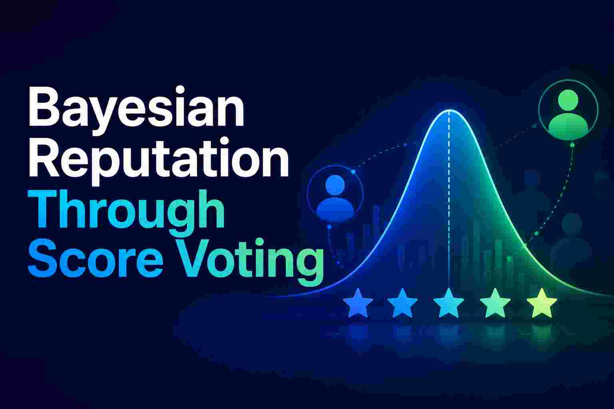
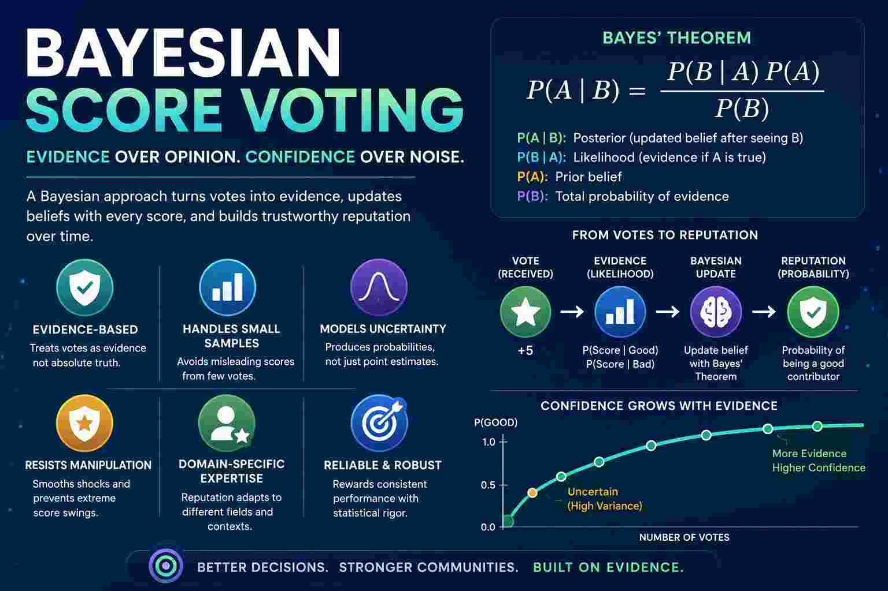

# Bayesian Reputation Through Score Voting


Date: 25-06-2026 




### Evidence-Based Reputation

A major advantage of a Bayesian score voting reputation system is that it treats votes as **evidence rather than truth**. In a normal score voting system, if a person receives a single 5/5 score, they immediately obtain a perfect average score of 5. In a Bayesian system, the score is combined with prior knowledge and uncertainty. A few positive votes increase confidence gradually, while a large body of evidence is needed before someone is considered highly reputable. This makes the system more stable and resistant to manipulation.

### Handling Small Sample Sizes

Another advantage is that Bayesian reputation naturally handles **small sample sizes**. Traditional averages often produce misleading results when only a few people have voted. For example, someone with one 5-star rating may rank above someone with one hundred 4.8-star ratings. A Bayesian approach accounts for the amount of evidence behind the score, preventing new participants from immediately overtaking well-established contributors based on a handful of votes.

### Modeling Uncertainty and Confidence

Bayesian systems also provide a natural way to model **uncertainty**. Instead of saying "Alice's reputation is 4.2," the system can estimate the probability that Alice is a trustworthy or competent contributor. As more votes arrive, uncertainty decreases and the estimate becomes more reliable. This is particularly useful in governance systems where decisions should be based not only on popularity but also on confidence in the underlying assessment.

### Resistance to Reputation Shocks

Another benefit is resistance to **reputation shocks**. In a simple averaging system, one extremely positive or negative vote can significantly alter someone's score. Bayesian updating smooths these changes because each new vote is weighed against all previous evidence. Reputation evolves gradually, making it harder for coordinated attacks, personal disputes, or temporary popularity swings to distort the system.

### Support for Domain-Specific Expertise

Finally, Bayesian score voting works well with **domain-specific expertise**. A person may have strong reputation in economics but little reputation in agriculture or engineering. Separate Bayesian reputations can be maintained for each field, and votes become evidence for expertise within that domain. This is particularly valuable for knowledge-based governance, where influence should come from demonstrated competence and consistent evaluation over time rather than from a single global popularity score.

### Combining Expressiveness with Statistical Rigor

In short, Bayesian score voting combines the expressiveness of score voting with the statistical rigor of evidence accumulation. It rewards consistent performance, handles uncertainty, reduces manipulation, and produces reputation scores that are generally more reliable than simple averages.





## Walk Through Bayesian Reputation

Let's walk through a complete Bayesian reputation calculation using score voting.

Suppose we want to estimate:

> What is the probability that Alice is a good contributor?

Initially we know nothing.

## Step 1: Prior Belief

Assume:

* P(Good) = 0.5
* P(Bad) = 0.5

Before seeing any votes, Alice has a 50% chance of being good.

---

## Step 2: Define Score Distributions

Suppose historical data shows:

| Score | P(Score \| Good) | P(Score \| Bad) |
|-------|------------------|-----------------|
| 5     | 0.40             | 0.05            |
| 4     | 0.30             | 0.10            |
| 3     | 0.15             | 0.20            |
| 2     | 0.10             | 0.25            |
| 1     | 0.05             | 0.40            |

Meaning:

* Good contributors receive a 5-star score 40% of the time.
* Bad contributors receive a 5-star score only 5% of the time.

---

## Step 3: Alice Receives a Score of 5

We want:

> P(Good | Score=5)

Use Bayes' theorem:

\\[ P(A \mid B) = \frac{P(B \mid A)P(A)}{P(B)} \\]

Substitute values:

Numerator:

```text
P(5 | Good) × P(Good)

0.40 × 0.50

= 0.20
```

Denominator:

```text
P(5)

=
P(5 | Good)P(Good)
+
P(5 | Bad)P(Bad)

=
0.40×0.50
+
0.05×0.50

=
0.225
```

Posterior:

```text
0.20 / 0.225

= 0.8889
```

Result:

```text
P(Good | Score=5)
=
88.89%
```

One strong vote increased confidence from:

```text
50%
→
88.89%
```

---

## Step 4: Alice Receives Another 5

Prior becomes:

```text
P(Good)=0.8889

P(Bad)=0.1111
```

Again apply Bayes.

Numerator:

```text
0.40 × 0.8889

=
0.3556
```

Denominator:

```text
0.40×0.8889
+
0.05×0.1111

=
0.3611
```

Posterior:

```text
0.3556 / 0.3611

=
0.9846
```

Now:

```text
98.46%
```

---

## Step 5: Alice Receives a Score of 2

Now evidence becomes mixed.

Prior:

```text
Good = 0.9846

Bad = 0.0154
```

From the table:

```text
P(2|Good)=0.10

P(2|Bad)=0.25
```

Numerator:

```text
0.10 × 0.9846

=
0.09846
```

Denominator:

```text
0.10×0.9846
+
0.25×0.0154

=
0.10231
```

Posterior:

```text
0.09846 / 0.10231

=
0.9624
```

Reputation falls slightly:

```text
98.46%
→
96.24%
```

One bad score does not completely destroy reputation.

---

## Applying to a -5 to +5 Governance Vote

Suppose your system uses:

```text
-5 -4 -3 -2 -1 0 1 2 3 4 5
```

Create likelihood tables.

Example:

| Vote | P(vote \| Good) | P(vote \| Bad) |
| ---- | -------------- | ------------- |
| +5   | 0.30           | 0.02          |
| +4   | 0.20           | 0.05          |
| +3   | 0.15           | 0.08          |
| +2   | 0.10           | 0.10          |
| 0    | 0.10           | 0.10          |
| -2   | 0.05           | 0.15          |
| -3   | 0.04           | 0.20          |
| -4   | 0.03           | 0.15          |
| -5   | 0.03           | 0.15          |

Each incoming score becomes evidence.

You repeatedly apply Bayes after every vote.

---

## Simpler Beta-Reputation Version

Most real systems avoid computing full Bayes every vote.

Store:

```text
α = positive evidence
β = negative evidence
```

Start:

```text
α = 1
β = 1
```

Suppose scores:

```text
+5
+4
+3
-2
+5
```

Convert:

```text
Positive:
5+4+3+5 = 17

Negative:
2
```

Update:

```text
α = 1 + 17 = 18

β = 1 + 2 = 3
```

Expected reputation:

```text
18/(18+3)

=
0.8571
```

Reputation:

```text
85.71%
```

This is mathematically equivalent to a Bayesian estimate using a Beta distribution and is much easier to implement on-chain.
