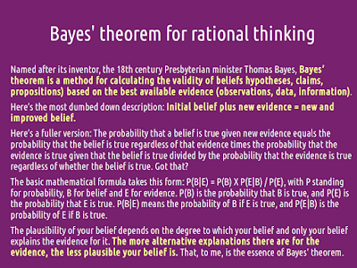
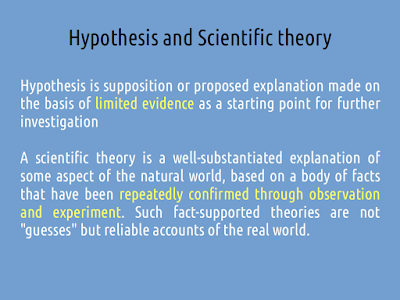
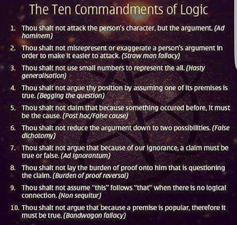
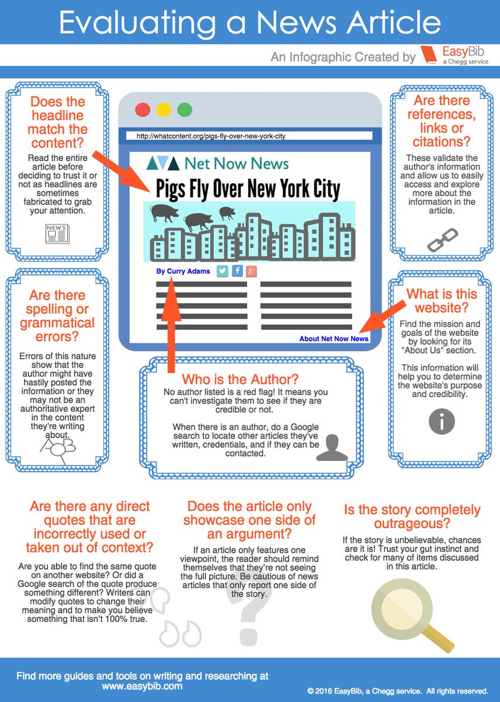

**How to analyze news and what shall be the criteria?**

Are the information provided backed by the evidence?

[https://drive.google.com/file/d/0B8x9dkicaW23WmZhREpYYzhJeDA/view](https://drive.google.com/file/d/0B8x9dkicaW23WmZhREpYYzhJeDA/view)

Do they site down the evidence in the news? Do evidence are from reliable sources with rigorous testing? Does the news show one-sided or biased views without looking at all angles? Is the information provided is an opinion/belief/viewpoint or hypothesis or scientific theory?

[https://drive.google.com/file/d/0B8x9dkicaW23OHRabldhNzJrcUE/view](https://drive.google.com/file/d/0B8x9dkicaW23OHRabldhNzJrcUE/view)

_**Opinion:** a view or judgment formed about something, not necessarily based on fact or knowledge._

Does the hypothesis/claim is well tested and is statistically significant to draw the conclusion?

<table style="margin-left:auto;margin-right:auto;text-align:center;" cellspacing="0" cellpadding="0" align="center"><tbody><tr><td style="text-align:center;"></td></tr><tr><td style="text-align:center;">Alternate and Null Hypothesis</td></tr></tbody></table>

Is media promoting pseudoscience?

Does the discussion done come under any of the logical fallacy or cognitive biases?

For more detailed explanation of logical fallacy with examples is given in

or

[https://yourlogicalfallacyis.com/](https://yourlogicalfallacyis.com/)

Important details for Evaluating a News Article:

Line by line scripts of news taking context into consideration must be analyzed along with bulk analysis by data scientists.

**The independent institute should open source the analysis to public so that it can be audited and reviewed by third parties. It should also come under RTI.**

**The institute will provide feedback to the media so that they can improve upon themselves.**
