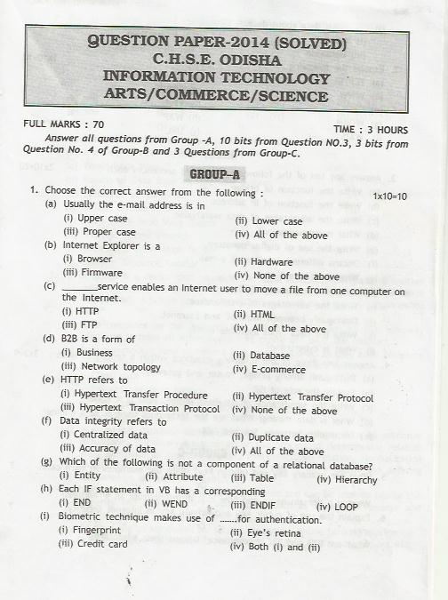
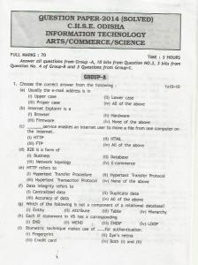

Analysis of first 3 pages of Chapter 1:  
  
  
1st Paragraph:  
"The correlation between structure and properties helps in discovering new solid materials  
with desired properties like high temperature superconductors, magnetic materials, biodegradable  
polymers for packaging, biocompliant solids for surgical implants, etc."  
  
The first paragraph itself start with the technical terms like biodegradable polymers for packaging, biocompliant solids for surgical implants. But the book does not explain what are these. How will a student imagine such technical terms and correlate with the structure of solids? Where are the solid structures of a biocompliant solids for surgical implants? And how structure suits the need for surgical implants.  
Regarding magnetic materials, it's written at the end of the chapter. So at least say about it, that you will read about it soon  
  
Another Paragraph:  
Some glass objects from ancient civilisations are found to become milky in appearance because of some crystallisation. Like  liquids, amorphous solids have a tendency to flow, though very slowly. Therefore, sometimes these are called pseudo solids or super cooled liquids.  
  
Where is the diagram for it? How will a student imagine solids which behave like liquids, that have a tendency to flow?  
  
"Glass panes fixed to windows or doors of old buildings are invariably found to be slightly thicker at the bottom than at the top. This is because the glass flows down very slowly and makes the bottom  
portion slightly thicker."  
  
Where is the diagram for it? And how this happens? Where is the proper explanation?  
  
Intext Questions:  
Classify the following as amorphous or crystalline solids: Polyurethane, naphthalene, benzoic acid, teflon, potassium nitrate, cellophane, polyvinyl, chloride, fibre glass, copper.  
  
Do the author thinks, students already know what is polyurethane, teflon, cellophane, polyvinyl etc. ? How can they put a question that is not told before? What the author expects, the student will search the internet and find the answers? Where are the structures of teflon, cellophane etc.? How it is significant?  
  
These kinds of situation arise throughout the book.  
**The solution is to take feedback from students for every paragraph you write. What question arises in their mind? How can it be explained better? Students should be the stakeholders for  the book.**  
  
  
Update:  
Now a review of state board books.  
e.g. In Odisha, college teachers are fanatic about these books and are most recommended for students.  
Lets, review an Information Technology book. Even though I can't analyze the complete book, as the number of pages will become more than 10 times of the original book.  
  

  

a) Usually the e-mail address is in

i) Upper case ii) Lower case iii) Proper case iv) All of the above

  

If you search the internet, or if you have some practical knowledge about e-mail, you will find that emails are usually case-insensitive. So, the answer should be All of the above. But the author writes the answer as lower case

  

c) \_\_\_\_\_\_ service enables an Internet user to move a file from one computer on the Internet.

i) HTTP ii)HTML iii) FTP iv) All of the above

  

Seems the question setter knows only the full form of HTTP and FTP, without knowing any detail about HTTP and FTP. The author gives the answer as FTP perhaps because FTP full form is File Transfer Protocol

https://daniel.haxx.se/docs/ftp-vs-http.html

  

**Well, this is only the tip of the iceberg.** 

**Now, come to the theory part of the book. It's very interesting. I can make such books in one or two days. Just give the keywords of the syllabus, run a web crawler and done. The book is ready. You will not even get any factual errors in the book.**

  

And student work is to mug up the book without understanding anything with just superficial knowledge and get marks in the exam.
