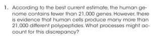

All entrance exams only test rote memorization of abstract concepts without testing critical thinking and in-depth knowledge. Questions don't let you think, just requires a recall of abstract data that you have memorized.  
  
Today I will review few questions of NEET and compare those questions with Campbell book  
  
Look at the question, it's very descriptive, and promotes critical thinking, just reading the question itself makes you think even if you don't know the answer  
  

  

  

  

  

  
  
But what NEET will ask  
The equivalent of a structural gene is:  
1) Operon 2) Recon 3) Muton 4) Cistron  
  
Believe me, students would have just memorized or linked structural gene with cistron by attempting previous years questions. **The questions simply don't make you think. Do the questions address the answer to the question why Cistron is called a structural gene?**  
From the internet:  
A structural gene is a gene that codes for any RNA or protein product other than a regulatory factor (i.e. regulatory protein)  
Cistron  
It is the functional unit which can synthesize one polypeptide.  
Does it mean a regulatory protein is not a polypeptide? Does it mean all structural genes are not cistron?  
These questions are not at all addressed. Just memorize previous year questions day and night, you are ready for the exam.  
  
Next question from NEET:  
Taylor conducted the experiment to prove semiconservative mode of chromosome replication on  
1) Drosophila melanogaster  
2) E. Coli  
3) Vinca rosea  
4) Vicia faba  
  
Another rote learning question, where the student would have memorized it from previous year questions.  
Who cares which organism he chose? **What is important is why he chose vicia faba?** Don't have the reason, but I think he chose to see the effect in the plant.  
  
First, the plant name given is scientific (abstract), very difficult to memorize. One can't distinguish between vinca rosea and vicia faba even if the student knows it was a plant, root tip and all other procedure and mechanism.  
  
  
Again look how NEET gives the question:  
Which of the following is not a component of downstream processing?  
1) Preservation 2)Expression 3) Separation 4) Purification  
  
**The question itself is simply laughable. Lacks specificity. What is downstream?**  
So many definitions:  
situated or moving in the direction in which a stream or river flows.  
"the bridge spanned the river just downstream of the rail line"  
BIOLOGY  
situated in or towards the part of a sequence of genetic material where transcription takes place later than at a given point.  
"a termination signal was found downstream from the coding region"  
at a stage in the process of gas or oil extraction and production after the raw material is ready for refining.  
Seems its means the last definition, process of gas or oil extraction etc.  
  
And most questions are like this.  
  
Final Note:  
**In such an Indian education system, students are just donkeys who are not allowed to think anything. They are just slaves of masters who are burdened with heavy books that fill the vessel with junk via hard work.**
