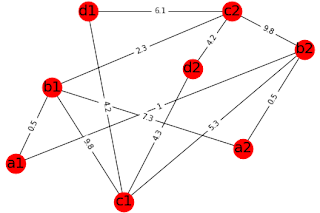

# The Competitive Collaboration Algorithm

Competitive Collaboration Algorithm:

> It's a decentralized network where you compete to collaborate.

Edge weight represents difficulty to get connected. Difficulty depends on factors such as distance, location, quality, price.

> We need to choose subgraph containing all the required nodes (e.g. nodes containing a,b,c,d ) that has a minimum weight or optimal weight.

<!--  -->

a,b,c,d can represent different services, whereas a1, a2 represents the same services from a different service provider.
For example,
'a' can represent a student, 'b' can represent a teacher, 'c' can represent content provider such as a biology textbook and 'd' can represent a classroom or building.
Similarly  'b1' represents teacher1, 'b2' represents teacher2, etc.

So, For student1 (a1), the optimum subgraph or subgraph with minimum weight containing all the required services are a1,b1,c2, d2 with weight 0.5+2.3+4.2 .

## Usefulness of the model

### Prediction

One can make a prediction using the model, to select the best subgraph or services for an individual. Entrepreneurs can use the data to set up new nodes, based on the requirements of people. Policymakers can use the data to evaluate the quality and provide suggestions for the optimal functioning of the network.

### Equal chance to everyone

Its fairer and everyone can get an equal chance to reach their goals.  It will bring competition for quality. Equal chance means many selected subgraphs for many individual will have similar weight, the possibility of getting similar weight increases when we increase the nodes.

### Continuous Improvement

If any single subgraph, even a node of subgraph gets upgraded and refined, it builds a pressure on other subgraph and nodes to upgrade through competition.

### No burnouts

Nodes shall not suffer from burn out problems as there is a division of work time between people and a division of labor.

### Non-hierarchical and autonomous

As different nodes are independent of each other and are free to connect to other nodes, there is no hierarchy or concentration of power or monopoly. No need for management, teachers, and students self-manage their work. 

### Updated and Validated information

Nodes are protected by game-theoretic incentive system, those who behave frivolously are punished.

## Modularity

Modularity refers to the design principle of breaking down a system into smaller, self-contained components or modules that can function independently but are interconnected to work together as a whole. Each module performs a specific function, allowing for greater flexibility, scalability, and efficiency in the system. The advantage of modularity lies in its ability to simplify complex systems, as changes or improvements can be made to individual modules without disrupting the entire structure. Additionally, modular systems encourage reuse, adaptability, and collaborative development, as different parts can be optimized or upgraded independently. This approach is commonly used in areas such as software development, network design, and organizational structures, promoting both innovation and resilience.

## Decentralized Governance

Modular design operates on the principle that systems can be broken into independent components or modules, each functioning autonomously, eliminating the need for centralized governance. Without a central authority dictating the actions of every part, each module can manage its tasks, adapt to changes, and collaborate with others seamlessly. This decentralized approach increases system efficiency, as each module can optimize its own performance without waiting for top-down instructions. Moreover, issues within one module do not compromise the entire system, ensuring resilience and faster responses to problems. By allowing individual parts to self-organize and interact based on set rules or shared goals, modular design fosters innovation, flexibility, and scalability, making it both robust and efficient.

## 15 min cities and modular competitive collaboration algorithm

15-minute cities are a concept that aims to create urban environments where residents can access all the essential services and amenities within a [15-minute walk or bike ride](../road-planning-of-cities.md). Decentralizing cities means distributing these services throughout the city, ensuring that they are accessible to all residents, regardless of their location. We will explore how decentralizing cities can benefit various aspects of urban life, including jobs, healthcare, childcare, schools, colleges, and supermarkets.

### [Jobs, Remote Work](../rethinking-work-culture.md)

The rise of remote work has made it possible for people to work from anywhere, as long as they have a stable internet connection. Decentralizing cities can help create more job opportunities in different neighborhoods, reducing the need for long commutes and making it easier for people to find work closer to home. This can not only improve the quality of life for residents but also reduce the environmental impact of commuting.

### Hospitals

Access to healthcare is a critical aspect of urban life. Decentralizing cities can help ensure that hospitals and other healthcare facilities are evenly distributed throughout the city, making it easier for residents to access medical care when they need it. This can be particularly beneficial for low-income and marginalized communities, who often face barriers to accessing healthcare services.

### [Child Care, Schools, Colleges](../how-avrit-learning-solves-our-education-puzzle.md)

Education is another essential service that can benefit from decentralization. By ensuring that childcare facilities, schools, and colleges are located within a 15-minute walk or bike ride from residential areas, we can make it easier for parents to drop off and pick up their children, and for students to access educational resources. This can also help reduce the environmental impact of transportation, as fewer people will need to drive to school or work.

### [Supermarkets](../empowering-communities-decentralizing-supermarkets-through-public-ownership-and-control.md)

Access to fresh, healthy food is a crucial aspect of urban life. Decentralizing cities can help ensure that supermarkets and other food retailers are evenly distributed throughout the city, making it easier for residents to access healthy food options. This can help promote healthy eating habits and reduce the risk of diet-related health issues, such as obesity and diabetes.

The Competitive Collaboration Algorithm can help build a free market system with public ownership by creating a decentralized network where individuals and businesses can connect and collaborate to provide essential services. This algorithm can be used to identify the optimal subgraph or subgraphs of services for each individual, ensuring that everyone has equal access to the resources they need. By promoting competition and collaboration, the algorithm can help create a more efficient and equitable urban environment.

## Resources:

Code: <https://github.com/amiyatulu/competitive_collaboration>

Its also related to [interoperability of software and pubactivity](../what-do-we-need-to-decentralize-in-the-coming-years.md#desirable-social-media-features). 

