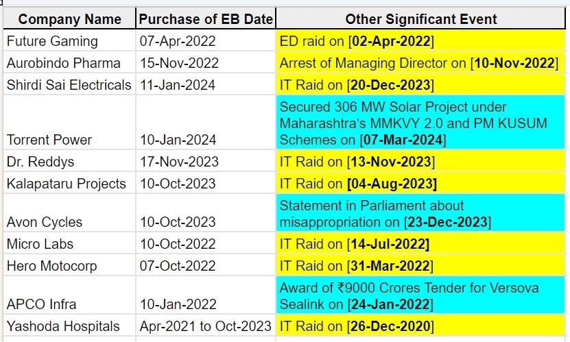

# What a fascist government does?

<video width="100%" controls controls preload="none" poster="../images/fascism.png" >
  <source src="https://com-ft-next-media-renditions.s3.eu-west-1.amazonaws.com/17050842428480/1280x720.mp4" type="video/mp4">
</video>

_[Democracy by Margaret Atwood | Democracy 2024](https://www.ft.com/video/bd19b92f-f0e5-4668-a9a8-33b3ed68ddde)_

Fascism is a far-right political ideology and system of government that emerged in the early 20th century, most notably in Italy under Benito Mussolini and in Germany under Adolf Hitler. It is characterized by authoritarianism, nationalism, and a belief in the superiority of one's own race or nation. While it's essential to understand that fascism is a deeply controversial and harmful ideology that has caused immense suffering and death, it's also important to recognize the tactics and strategies used by fascist leaders to gain and maintain power. Some of the key tricks and techniques of fascism include:

## Nationalism

Fascist leaders often exploit and promote extreme nationalism, emphasizing the importance of their nation or ethnicity and portraying it as superior to others. This can create a sense of unity and pride among their supporters while stoking hatred and mistrust toward perceived enemies or outsiders.

For example, anyone who criticizes the government will be labeled as anti-national. For instance, a teacher was [suspended for requesting an educated candidates in election](https://www.hindustantimes.com/india-news/unacademy-educator-sacked-for-asking-students-to-vote-for-educated-candidates-aap-congress-react-101692316014535.html).

[Anyone who does not support discrimination based on religion is considered anti-Hindu by fascist govt](../democracy/hinduism.md)

#### Ladakh autonomy protest
[Sonam Wangchuk](https://en.wikipedia.org/wiki/Sonam_Wangchuk_(engineer)), an Indian engineer, innovator, education reformist, and climate change activist, is protesting against China occupying Indian land in the last decade. He discusses being called an "antinational" for his stance as he works to protect the fragile ecosystem of Ladakh

<video width="100%" controls preload="none">
  <source src="https://42683ff2b1a2ac5ad2fef0ee01995d78.ipfs.4everland.link/ipfs/QmU6hJ5o6dsBoZC6d2FHGvrpRi5AMwBK715d8aruSqCLwn" type="video/mp4">
</video>

## Propaganda

Fascist regimes make extensive use of propaganda to shape public opinion. This can include controlling the media, spreading false information, and using emotionally charged rhetoric to manipulate the masses. The goal is to create a climate where dissent and criticism are suppressed, and the regime's agenda is unquestioningly accepted.

e.g. Propaganda, such as [Love Jihad](https://en.wikipedia.org/wiki/Love_jihad_conspiracy_theory) and promoting it [through movie](https://www.aljazeera.com/news/2023/5/4/kerala-story-film-on-alleged-indian-isil-recruits-gets-pushback) and [Godi Media](https://en.wikipedia.org/wiki/Godi_media), why Hindu festivals are only targeted.

There is a call to [ban loudspeakers in mosques](https://www.newindianexpress.com/nation/2021/Mar/24/pil-seeking-ban-on-loudspeakers-in-mosques-filed-in-jharkhand-high-court-2280984.html), despite the fact that Hindu temples contribute more than 70-80% of the noise. It's not about defending sound pollution; sound pollution is sound pollution. Religion is about [giving us peace](./hinduism.md#importance-of-spirituality), not noise and using it as a political tool. Such discrimination needs to be deemed unacceptable.

[How the Indian Government Uses Raids to Silence Critics](https://time.com/6255425/india-raid-bbc-modi-documentary/)

[Twitter accused of censorship in India as it blocks Modi critics](https://www.theguardian.com/world/2023/apr/05/twitter-accused-of-censorship-in-india-as-it-blocks-modi-critics-elon-musk)

[Hate crime tracker Hindutva Watch blocked in India ahead of national vote](https://www.aljazeera.com/news/2024/1/31/hate-crime-tracker-hindutva-watch-blocked-in-india-ahead-of-national-vote)

[On Wired.com This Website Tracked Hate Crimes in India. Then the Government Took It Offline](https://web.archive.org/web/20240302015318/https://www.wired.com/story/india-elections-right-wing-website-ban/)

[India ranks 1st in disinformation and misinformation](https://thewire.in/media/survey-finds-false-information-risk-highest-in-india)

**As they rely on propaganda, they also attack the researchers**.

[Researcher Arrested in India After Disclosing Problems With Voting Machines](http://web.archive.org/web/20230203033338/https://www.wired.com/2010/08/researcher-arrested-in-india/)

[Ashoka University is accused of stifling academic freedom after it distances itself from a professor’s research paper, ‘forcing’ his resignation.](https://www.aljazeera.com/news/2023/8/28/row-at-indias-premier-private-university-sparks-debate-on-academic-freedom)

[Researcher's twitter account @ashoswai has been withheld in India in response to a legal demand](https://en.wikipedia.org/wiki/Ashok_Swain)

[Professor Ashok Swain has 500,000 followers on Twitter](https://www.uu.se/en/news/archive/2023-03-31-professor-ashok-swain-has-500000-followers-on-twitter)

[Will India's Booker Prize-winning author Arundhati Roy face jail for 14-year-old remark?](https://www.bbc.com/news/articles/c3ggyz13m2po)

#### India's media being captured

<iframe width="560" height="315" src="https://www.youtube.com/embed/rHEgb8ZSA1c?si=HyVe-aVJSlzZpAzY" title="YouTube video player" frameborder="0" allow="accelerometer; autoplay; clipboard-write; encrypted-media; gyroscope; picture-in-picture; web-share" referrerpolicy="strict-origin-when-cross-origin" allowfullscreen></iframe>

## Cult of Personality

Fascist leaders cultivate a cult of personality, often portraying themselves as charismatic and infallible figures. They use mass rallies, public spectacles, and staged events to create an aura of strength and invincibility around themselves.

[Dehradun: Students reportedly fined for not listening to PM Modi's 'Mann Ki Baat'](https://www.newindianexpress.com/nation/2023/May/05/dehradun-students-reportedly-fined-for-not-listening-to-pm-modis-mann-ki-baat-2572343.html)

## Suppression of Opposition

Fascist regimes frequently employ violence, intimidation, and censorship to silence political opposition. They may imprison or execute political opponents, ban opposition parties, and suppress labor unions and civil society organizations.

e.g Arresting and harassing [strong opponents](https://www.thehindu.com/news/national/manish-sisodia-arrest-9-opposition-leaders-write-to-pm-modi-about-misuse-of-central-agencies/article66583183.ece) who are difficult to tackle, for example, either by arresting them or [removing them from the assembly](https://www.bbc.com/news/world-asia-india-67294799).

[Why were 141 India opposition MPs suspended from parliament?](https://www.aljazeera.com/news/2023/12/19/why-141-india-opposition-mps-suspended-from-parliament)

When you protest against unemployment, and dictatorship (tanashahi nahi chalegi), you are given electric shocks:

[Given Electric Shocks, Tortured To Implicate Political Leaders: Parliament Security Breach Accused Tell Delhi Court](https://www.livelaw.in/news-updates/delhi-court-parliament-security-breach-accused-tortured-to-name-political-leaders-248112)

### Even foreign citizens are not safe

[“Everyone is absolutely terrified”: Inside a US ally’s secret war on its American critics A foreign government is trying to silence US critics of its authoritarian turn — and it's succeeding.](https://www.vox.com/world-politics/24160779/inside-indias-secret-campaign-to-threaten-and-harass-americans)

### Govt attack on climate activists

[Disha Ravi’s Sedition Case Is Only Latest Without Evidence, Reason](https://www.article-14.com/post/disha-ravi-s-sedition-case-is-only-latest-without-evidence-reason)

### Curfew when people protest peacefully against EVM
[Maharashtra village plans a ‘re-election’ with ballot paper; police impose curfew](https://www.thehindu.com/elections/maharashtra-assembly/maharashtra-village-plans-a-re-election-with-ballot-paper-police-impose-curfew/article68939405.ece)

### State terrorism those who distrust evm

<video controls width="500">
    <source src="https://42683ff2b1a2ac5ad2fef0ee01995d78.ipfs.4everland.link/ipfs/bafybeiauxrpwmv2lhvxsp65bknxbdpmsg73fbdjsnuoww5tjuegyk3bcym" type="video/mp4">
    <!-- Add additional source elements for different video formats if needed -->
    Your browser does not support the video tag.
</video>

[Video link](https://42683ff2b1a2ac5ad2fef0ee01995d78.ipfs.4everland.link/ipfs/bafybeiauxrpwmv2lhvxsp65bknxbdpmsg73fbdjsnuoww5tjuegyk3bcym)

### Hiding Data and building Surveillance State

Our government is trying its best to hide information by introducing bills like the [Digital Personal Data Protection Act (DPDP Act)](https://filestorage.4everland.store/RTI-DPDP.mp4) to dilute the RTI and control online media by tabling bills like the [Broadcast Bill](https://iambrainstorming.github.io/opinionated_observer/information/broadcast_bill.html). Or amending income tax laws to transform India into a surveillance state, infringing on your right to privacy by [enabling the scrutiny of every person’s social media accounts, personal emails, bank accounts, online investment accounts, trading accounts](https://thewire.in/government/income-tax-officials-will-be-able-to-access-your-emails-and-social-media-accounts-from-april-2026), and more.

## Militarization

Fascist governments tend to heavily emphasize militarism and the expansion of their armed forces. This not only serves to strengthen their control over the population but also can be used to justify aggressive foreign policies and territorial expansion.

Fascist governments often use militarization to stop peaceful protests and maintain control over their populations. This is because fascist ideology prioritizes the state and its authority over individual rights and freedoms. By militarizing the response to protests, these governments can quickly and forcefully suppress dissent and opposition.

Here are some ways in which a fascist government might use militarization to stop peaceful protests:

- Deployment of armed forces: The government may send armed forces, such as the military, police, or paramilitary groups, to the protest site. The presence of armed personnel can intimidate protesters, discouraging them from participating in the demonstration.

- Use of force: Fascist governments may use excessive force to disperse peaceful protests, including the use of tear gas, water cannons, rubber bullets, and even live ammunition. This can result in injuries and even fatalities among protesters, sending a clear message that dissent will not be tolerated.

- Arrests and detentions: The government may arrest and detain protesters, even if they are participating in a peaceful demonstration. This can serve as a warning to others who might be considering joining the protest, as well as a means of silencing opposition voices.

- Surveillance and monitoring: Fascist governments often engage in surveillance of protesters, using technology and intelligence gathering methods to monitor their activities. This can include the use of facial recognition software, phone tapping, and undercover agents.

- Propaganda and misinformation: To justify their actions against protesters, fascist governments may use propaganda and misinformation to paint the protesters as violent or dangerous. This can help to garner public support for the government's actions and further discredit the opposition.

In summary, fascist governments use militarization to suppress peaceful protests as a means of maintaining control and reinforcing their authority. By deploying armed forces, using excessive force, making arrests, engaging in surveillance, and spreading propaganda, these governments can effectively silence dissent and discourage opposition.

#### Barricades to stop people and farmers from going to protest in Delhi.

<video width="100%" controls preload="none" poster="../images/militarization_protest.png">
  <source src="https://42683ff2b1a2ac5ad2fef0ee01995d78.ipfs.4everland.link/ipfs/bafybeiarizz6umrasw3fuhhn77jl333s6j4xu2rh2yr75qers5iw5ccbja" type="video/mp4">
</video>

#### The Delhi Police are blocking any entry of AAP volunteers to stop a democratic protest over chandigarh mayor election issue.

<video width="100%" controls preload="none" poster="../images/militarization_against_aap.png">
  <source src="https://42683ff2b1a2ac5ad2fef0ee01995d78.ipfs.4everland.link/ipfs/bafybeigtk3ylcodu7vvkkvk65rlgvat4cnjaideiuahnpqzywqiae4wb4e" type="video/mp4">
</video>

["He Should Be Prosecuted": Supreme Court Shown Video Of Chandigarh Poll Officer](https://www.ndtv.com/india-news/wont-allow-murder-of-democracy-supreme-court-on-key-chandigarh-polls-4998439)

## Farmers Protest

Security forces fired tear gas shells to disperse protesting farmers at the Punjab-Haryana Shambhu Border.

This is how our farmers, who supply us with food and fight for our nation and justice, are treated. They are attacked with tear gas, resulting in stampedes that are intended to kill them.

<video width="100%" controls preload="none" poster="../images/farmer_attack_tear_gas.png">
  <source src="https://42683ff2b1a2ac5ad2fef0ee01995d78.ipfs.4everland.link/ipfs/bafybeigrj7kdrm3jn7duvhmygyvfb6yo3oijvjxdoljk5kedokdagzafzu
  " type="video/mp4">
</video>

## Scapegoating and Discrimination

Fascist leaders often scapegoat minority groups, blaming them for economic or societal problems. This can lead to the persecution and discrimination of minority populations, sometimes culminating in mass violence and genocide.

[India: Government Policies, Actions Target Minorities](https://www.hrw.org/news/2021/02/19/india-government-policies-actions-target-minorities)

[4,786 houses were burnt and 386 religious structures including temples and churches were vandalized. The violence left more than 70,000 people displaced from their homes](https://www.thehindu.com/news/national/175-killed-over-1100-injured-in-four-months-of-manipur-violence-police/article67310428.ece)

## Manipulation of Legal Systems

Fascist regimes may manipulate legal systems to legitimize their actions. They pass laws that allow them to consolidate power, suppress opposition, and persecute targeted groups, all while maintaining a façade of legality.

[Modi surname case: Gujarat HC refuses interim protection to Rahul Gandhi](https://www.livemint.com/news/india/gujarat-hc-refuses-to-grant-interim-protection-to-rahul-gandhi-in-modi-surname-defamation-case-11683025810740.html)

[India court upholds Karnataka state’s ban on hijab in class](https://www.aljazeera.com/news/2022/3/15/india-court-upholds-karnataka-states-ban-on-hijab-in-class)

[2024 Sambhal violence: On 24 November 2024, violence erupted during a court-ordered Archaeological Survey of India (ASI) survey of the Shahi Jama Masjid, a 500-year old mosque in Sambhal, protected by ASI, in the Indian state of Uttar Pradesh.](https://en.wikipedia.org/wiki/2024_Sambhal_violence)

[The Supreme Court of India: Supreme Corruption Institution?](https://iambrainstorming.github.io/opinionated_observer/justice/supreme-court-corruption.html)

### The Indian Legal system

[The Atlantic Article: “Today the court seems to be aiding, not arresting, India’s descent into authoritarianism](https://www.theatlantic.com/international/archive/2024/02/what-has-happened-rule-law-india/677337/)\
[Link on web.archive.org](https://web.archive.org/web/20240203142305/https://www.theatlantic.com/international/archive/2024/02/what-has-happened-rule-law-india/677337/)

Unable to subdue the judiciary by legal means, the Modi government resorted to other measures. It began by delaying the appointment of judges: The convention had been for the government to accept the collegium’s recommendations as binding, but the Modi regime began to exercise an active veto. Once judges are appointed, the government uses the means at its disposal to cajole their loyalty. When supreme court justices retire, the government can offer those it prefers plum postings.

In November 2019, the supreme court issued a bizarre but unanimous decision that termed the destruction of the mosque by a Hindu-nationalist mob numbering in the tens of thousands “an egregious violation of the rule of law”—then proceeded to award the entirety of the ruined structure’s site to the Hindus. Much as the Kashmir verdict later would, the ruling rested on contradictory reasoning and ultimately aligned with the Hindu-nationalist agenda.

But these days, Chandrachud’s political independence has come under scrutiny. In December, he was revealed to have abruptly shifted eight politically sensitive cases to a bench that included a judge who had served under Modi while he was chief minister of the western state of Gujarat. And in early January, the chief justice made an unorthodox display of faith by paying a public visit to a temple in Dwarka, one of Hinduism’s holiest sites, situated in Gujarat.

### How have the Supreme Court and high courts become weak and promoted authoritarianism?

Mass protest by Supreme Court lawyers for EVM across the country

<iframe width="560" height="315" src="https://www.youtube.com/embed/q9Y0Dk-qzmA?si=ohXEBVGhA546TqKs" title="YouTube video player" frameborder="0" allow="accelerometer; autoplay; clipboard-write; encrypted-media; gyroscope; picture-in-picture; web-share" allowfullscreen></iframe>

[SC shifts seven cases to bench of former law secretary to Narendra Modi](https://www.nationalheraldindia.com/national/sc-shifts-seven-cases-to-bench-of-former-law-secretary-to-narendra-modi)

[From the Bench to the BJP: Justice Abhijit Ganguly’s Controversial Transition](https://www.thequint.com/opinion/bjp-justice-abhijit-ganguly-bjp-tmc-west-bengal-controversial-transition)

[The appointments of Justice Dinesh Maheshwari and Justice Sanjiv Khanna to the Supreme Court have triggered a controversy over the Supreme Court collegium’s apparent indifference to the principle of seniority of high court judges in the all-India list and to inter-se seniority within the high courts which they were serving before their elevation.](https://thewire.in/law/collegium-had-a-case-for-superseding-hc-judges-but-failed-to-articulate-it)

### Will new criminal bills to turn India into a police state?

[Will new criminal bills turn India into a police state?](https://www.aljazeera.com/news/2024/1/17/will-new-criminal-bills-turn-india-into-a-police-state-ahead-of-2024-vote)

## Weaken or Abolish as many Democratic Institutions

Fascism thrives on a mission to weaken or abolish democratic institutions, systematically dismantling the foundations of a participatory society. Through authoritarian rule, it seeks to concentrate power in the hands of a single leader, suppressing dissent and curtailing individual freedoms. The erosion of democratic checks and balances becomes a hallmark, paving the way for unchecked authority. In this pursuit, fascist regimes undermine the pillars of democracy, such as independent judiciary, free press, and representative governance, leaving citizens vulnerable to manipulation and repression. The fight against fascism necessitates safeguarding these institutions to preserve the essence of democratic values.

[Big money is choking India’s free press — and its democracy](https://www.aljazeera.com/opinions/2023/1/6/big-money-is-choking-indias-free-press)

[Indian government accused of rewriting history after edits to schoolbooks](https://www.theguardian.com/world/2023/apr/06/indian-government-accused-of-rewriting-history-after-edits-to-schoolbooks)

[Since 2014, 4-fold jump in ED cases against politicians; 95% are from Opposition](https://indianexpress.com/article/express-exclusive/since-2014-4-fold-jump-in-ed-cases-against-politicians-95-per-cent-are-from-opposition-8163060/)

[Bill introduced to remove CJI from panel to select Election Commissioners](https://www.thehindu.com/news/national/bill-moved-to-remove-cji-from-panel-to-select-election-commissioners/article67180873.ece)

[A Partisan Referee: The Speaker: This control is enabled by the fact that – much like Opposition rights – the Constitution also fails to guarantee the independence of the parliamentary “referee”](https://papers.ssrn.com/sol3/papers.cfm?abstract_id=4601145)

## Economic Policies

Fascist governments may implement corporatist economic policies that involve a close relationship between the state and big business. This serves to consolidate economic power and often benefits the ruling elite, while the general population may suffer from economic hardship.

[Demonetisation drive that cost India 1.5m jobs fails to uncover 'black money'](https://www.theguardian.com/world/2018/aug/30/india-demonetisation-drive-fails-uncover-black-money)

[India's Adani faced margin call on $1.1 bln loan before repaying in full](https://www.reuters.com/world/india/indias-adani-faced-margin-call-11-bln-loan-before-repaying-full-ft-2023-02-08/)

[‘Billionaire Raj’ Is Pushing India Toward Autocracy](https://archive.is/Pp8iO)

The super-rich have opened their wallets to Modi, and income inequality has soared over the past decade. With an election coming, ordinary voters need to ask, ‘What’s in it for us?’

[Faced with 90% drop in business, crypto exchanges are moving out of India, but with hopes of return](https://theprint.in/economy/faced-with-90-drop-in-business-crypto-exchanges-are-moving-out-of-india-but-with-hopes-of-return/1923496/)

**Fascist govt don't like crypto, so that they can block bank account**

[Government of PM Modi blocks the bank accounts of 8,975 NGOs, in a move critics say is aimed at stifling dissent.](https://www.aljazeera.com/news/2015/5/27/india-cracks-down-on-greenpeace-and-foreign-ngos)

### Civil society plays a crucial role in democracy by serving as a check on government power, while authoritarian governments are trying to eliminate it.

Civil society refers to the aggregate of non-governmental organizations, community groups, and individuals outside the realm of government and business who come together to pursue shared interests, goals, and values. It encompasses a diverse range of entities including advocacy groups, charities, religious organizations, labor unions, and grassroots movements. Civil society plays a crucial role in democracy by serving as a check on government power, promoting transparency, accountability, and the protection of human rights. It provides a platform for citizens to engage in civic participation, express their opinions, and hold authorities accountable. Moreover, civil society fosters social cohesion, facilitates dialogue, and channels citizen concerns into policy-making processes, thereby enriching democratic governance.

NGOs and other civil society organizations are particularly vital in safeguarding democracy and resisting dictatorship. They often serve as watchdogs, monitoring government actions and advocating for democratic principles and human rights. In autocratic regimes, NGOs can act as bulwarks against authoritarianism by mobilizing citizens, raising awareness about abuses of power, and advocating for political reform. Their independence from state control allows them to challenge oppressive policies, provide assistance to marginalized groups, and promote democratic values even in environments hostile to dissent. Through their grassroots efforts and international networks, civil society organizations contribute to building resilient democratic institutions and fostering a culture of civic engagement, ultimately strengthening the resilience of societies against authoritarian threats.

[The economist: Yamini Aiyar laments the damage done to Indian democracy under Narendra Modi](https://archive.is/olHjM)

The most striking evidence of this is the fact that the space for the political opposition, media, academia and civil society to freely express their views is fast shrinking. Genuine democracy requires the active, public contesting of ideas and policy. In its place, the government is systematically weaponising investigative agencies, tax laws, sedition laws, anti-terror laws and laws regulating foreign funding of NGOs to disproportionately target opposition politicians and criminalise dissent. The most brazen illustration of this is the arrest of Arvind Kejriwal, Delhi’s chief minister and a popular opposition figure, on March 21st, just as the election campaign was hotting up.

[In the 2023 Global Hunger Index, India ranks 111th out of the 125 countries with sufficient data to calculate 2023 GHI scores](https://www.globalhungerindex.org/india.html)

**16,518 crore rupees came to political parties in India through electoral bonds in the last 6 years. Of this, the BJP got a lion’s share.**
Modi govt also allowed foreign funding anonymously

<iframe width="560" height="315" src="https://www.youtube.com/embed/8yAILaS6Q1w?si=mRCvgwrMzNuyDTOV" title="YouTube video player" frameborder="0" allow="accelerometer; autoplay; clipboard-write; encrypted-media; gyroscope; picture-in-picture; web-share" allowfullscreen></iframe>

[30 firms facing ED, IT probe donated Rs 335 cr to BJP](https://www.thenewsminute.com/news/tnm-nl-investigation-30-firms-facing-ed-it-probe-donated-rs-335-cr-to-bjp)

## Analysis of electoral bond

Date: 16-03-2024 01:15:05 PM IST

[The data](https://github.com/amiyatulu/electoral_bond/tree/main/output)

Some data cleaning is still required, as some companies' donations are split due to slightly different names given in the PDF. For example, "FUTURE GAMING AND HOTEL SERVICES PR" and "FUTURE GAMING AND HOTEL SERVICES PRIVATE LIMITED." The balance need to be added together into a single company.

Total encashment all parties = 63871399000 (52.545209691352234 % of donations)  

Total company donations = 121555132000  

Amount of encashment by party missing = 57683733000  

#### Company Donations with percentage

12/Apr/2019 - 11/Jan/2024 as [given in pdf](https://github.com/amiyatulu/electoral_bond/blob/main/files/donors_list.pdf) 

[Company Donations with percentage](https://github.com/amiyatulu/electoral_bond/blob/main/output/company_donors_denominations_with_percentage.json)

#### Party encashment with percentage

12/Apr/2019 - 24/Jan/2024 as [given in pdf](https://github.com/amiyatulu/electoral_bond/blob/main/files/political_party.pdf)

[Party Encashment with percentage](https://github.com/amiyatulu/electoral_bond/blob/main/output/party_enchashment_denominations_with_percentage.json)

Only about [twenty people donated within the amount of 50,000](https://github.com/amiyatulu/electoral_bond/blob/main/output/company_donors_denominations_with_percentage.json). It's not wrong to say that our government is largely about corporate funding, which implies that our country is essentially ruled by the wealthy, making it a plutocracy.

Many of the companies had IT and ED raids before the donations, so it is not incorrect to say that money was extracted through extortion. Extortion is the practice of obtaining benefit (e.g., money or goods) through coercion. In most jurisdictions it is likely to constitute a criminal offence. 

#### More data on IT and ED raid:

<video width="100%" controls preload="none">
  <source src="https://42683ff2b1a2ac5ad2fef0ee01995d78.ipfs.4everland.link/ipfs/bafybeifd7ifmmifeonoc7o5dave4dbkqnnfmpihmbpfxe6646ii6qdedwm" type="video/mp4">
</video>

#### BJP Washing Machine

[Since 2014, 25 Opposition leaders facing corruption probe crossed over to BJP, 23 of them got reprieve (suspension of the execution of a criminal's sentence)](../images/washing_machine.jpg)

[List of Opposition leaders who crossed over to BJP](../images/washing_machine2.jpg)

## Militant Youth Movements

Fascist regimes often create youth organizations that promote loyalty to the state, indoctrinate young minds, and prepare them for future service to the regime.

[Hinduism, Weaponised: A Secular India Under Threat | In Bad Faith - Part 1 | CNA Documentary](https://www.youtube.com/watch?v=l1qvVp8XZg8)

<iframe width="560" height="315" src="https://www.youtube.com/embed/l1qvVp8XZg8?si=mhqA7uBOZhmr33uU" title="YouTube video player" frameborder="0" allow="accelerometer; autoplay; clipboard-write; encrypted-media; gyroscope; picture-in-picture; web-share" referrerpolicy="strict-origin-when-cross-origin" allowfullscreen></iframe>

[How RSS textbooks are reshaping Indian history and science under Modi. The chain of schools run by the BJP’s far-right ideological mentor also served as a laboratory for government changes to syllabuses.](https://www.aljazeera.com/news/2024/2/19/how-rss-textbooks-are-reshaping-indian-history-and-science-under-modi)

[Centre hands over 62% of new Sainik Schools to Sangh Parivar, BJP politicians and allies](https://www.reporters-collective.in/trc/centre-hands-sainik-schools-to-sangh-parivar-bjp-politicians)

[India Cuts Periodic Table and Evolution from School Textbooks](https://www.scientificamerican.com/article/india-cuts-periodic-table-and-evolution-from-school-textbooks/)

[NCERT deletes references to Mahatma Gandhi, post-Godhra riots beyond its 'syllabus rationalisation](https://www.indiatoday.in/india/story/ncert-textbooks-mahatma-gandhi-godhra-riots-removed-2356040-2023-04-05)

## Expansionism and Imperialism

Some fascist regimes seek territorial expansion and may pursue aggressive foreign policies to achieve their goals. This can lead to conflicts and wars with other nations.

It's essential to recognize the dangers of fascism and to be vigilant against its tactics, as it has resulted in some of the most destructive and devastating episodes in human history. Promoting democracy, human rights, and open, informed public discourse is a crucial defense against the rise of fascist ideologies and their destructive practices.

## Saam, Dan, Danda, and Bhed

Fascist governments often employ various tactics to maintain control and manipulate the population. Saam, Dan, Danda, and Bhed are four tools of persuasion used by these regimes. Saam refers to persuasion through conciliation, which involves using diplomacy and compromise to achieve desired outcomes. Dan represents persuasion through money, where the government provides financial incentives or rewards to encourage specific behaviors or compliance. Danda signifies persuasion through force, where the government uses coercion, threats, or violence to enforce its will. Lastly, Bhed, or persuasion through exploitation, involves manipulating the population by dividing them based on factors like race, religion, or class, and playing on their fears, insecurities, or prejudices to maintain power.

[Desperate to join BJP to keep ED, I-T raids away](https://indianexpress.com/article/cities/pune/ashok-chavan-was-desperate-to-join-bjp-to-keep-ed-i-t-away-sanjay-raut-9158942/)

## Is India becoming a DICTATORSHIP? | Chandigarh Elections | Farmers Protest | Dhruv Rathee 

<iframe width="560" height="315" src="https://www.youtube.com/embed/Y9253_M38Xk?si=rD3PvtoswAjvu8Af" title="YouTube video player" frameborder="0" allow="accelerometer; autoplay; clipboard-write; encrypted-media; gyroscope; picture-in-picture; web-share" allowfullscreen></iframe>

## Why are autocrats popular? - Assault on democracy | DW Documentary 

<iframe width="560" height="315" src="https://www.youtube.com/embed/jWOlugUj4Qk?si=g3OjdoQB8n7V3KSH" title="YouTube video player" frameborder="0" allow="accelerometer; autoplay; clipboard-write; encrypted-media; gyroscope; picture-in-picture; web-share" referrerpolicy="strict-origin-when-cross-origin" allowfullscreen></iframe>

## The Project: Cookbook of Modi govt explained

<iframe width="560" height="315" src="https://www.youtube.com/embed/DLy3YOJeogA?si=i3Rzb2VKv-SMSSGz" title="YouTube video player" frameborder="0" allow="accelerometer; autoplay; clipboard-write; encrypted-media; gyroscope; picture-in-picture; web-share" referrerpolicy="strict-origin-when-cross-origin" allowfullscreen></iframe>

## Camden Conference about the Indian government's crackdown on journalists

[Emily Schmall, a former South Asia correspondent for The New York Times, spoke at the 2024 Camden Conference about the Indian government's crackdown on journalists and advocates of free speech.](https://www.newslaundry.com/2024/04/13/ib-minister-called-for-tea-read-headlines-with-sarcasm-nyt-journo-recalls-her-time-in-india)

  <video controls width="400" poster="../images/emily.png">
    <source src="https://42683ff2b1a2ac5ad2fef0ee01995d78.ipfs.4everland.link/ipfs/bafybeici56hpjpzodtrhp3jae2ikijpit4twvcumcpdmqf3habb3l3ijgq" type="video/mp4">
    <!-- Add additional source elements for different video formats if needed -->
    Your browser does not support the video tag.
  </video>

