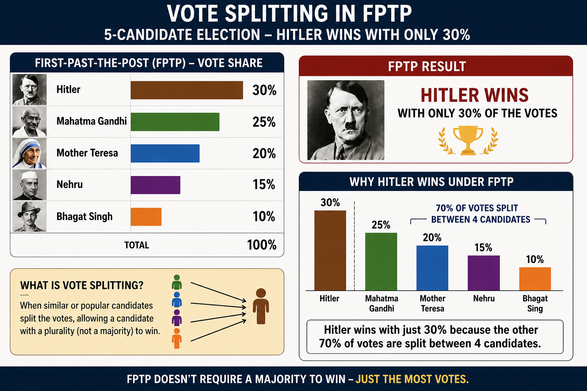
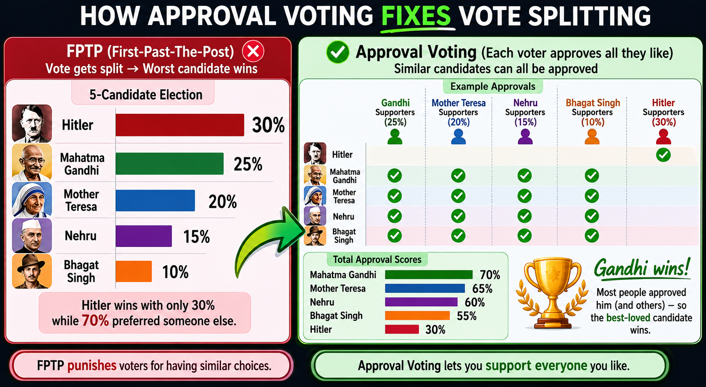

# New Modified Cockroach Janta Party (NM-CJP) Manifesto

Date: 25-05-2026

[Manifesto Pdf Download](ppt/cjp-manifesto.pdf)

## 1. Raise Minimum Wage for Every Worker

Whether someone is an IT professional, factory worker, delivery worker, or daily labourer, every worker deserves dignified pay.

* Minimum wage of ₹30,000 for daily labourers
* Minimum wage of ₹40,000 for graduates and skilled workers

Workers are not machines. Higher wages increase purchasing power, keep money circulating in the economy, and boost demand for local businesses. An economy grows when ordinary people can afford to spend, not when wealth remains concentrated at the top.

[The Economic Experiment That Upended Reality](https://www.theatlantic.com/ideas/2026/05/minimum-wage-experiment-worked/687255/?gift=b7K1gSjKiytZPf1RDre0o6aKdXXQ9Im0oO6hmv4Bjf4)

### Bonus Reform

Create a **National Job Registry** where all companies must list job openings in one public platform so citizens can easily find jobs without middlemen, scams, or hidden recruitment systems.

---

## 2. Universal Basic Income (UBI)

Start with:

* ₹5,000 per month for women and unemployed citizens
* Gradually increase to ₹10,000 per month

UBI gives people survival security so they can take risks, learn skills, start businesses, or escape exploitative jobs. It reduces desperation and creates entrepreneurship.

Even if some prices rise temporarily, new entrepreneurs and competition will reduce costs through innovation and efficiency.

Both minimum wage and UBI can increase economic activity by increasing money circulation among ordinary citizens.

With modern technology and automation, society rarely faces pure supply-side shortages unless production creates harmful negative externalities. Today’s larger economic problem is weak demand and low purchasing power among ordinary citizens.

We must eliminate exploitative low-paying jobs through minimum wages and encourage entrepreneurship to create more efficient systems through automation and innovation.

Negative externalities are often policy failures, and sometimes economic ones, because environmentally friendly alternatives are initially more expensive.

For example:

* Instead of depending heavily on disposable plastic bottles, cities can promote reusable bottles with public water and cold-drink refill counters.
* Instead of centralized AI monopolies consuming massive amounts of water and energy in data centers, we can encourage decentralized P2P open-source AI models running on home servers powered by solar energy.

The goal is not just economic growth, but efficient, sustainable, and citizen-driven growth.

[17 Key Variables That Determine UBI’s Inflationary Impact](https://www.scottsantens.com/17-key-variables-that-determine-ubis-inflationary-impact/)

### UBI doesn't cause Inflation

<iframe id="odysee-iframe" style="width:100%; aspect-ratio:16 / 9;" src="https://odysee.com/%24/embed/%40silicology%3A5%2FUBI-price-rise%3Ac?r=BEsJ6JBAL1rMYyPpp7KrFF7aQy2rRTZJ" allowfullscreen></iframe>

### UBI is Political

<iframe id="odysee-iframe" style="width:100%; aspect-ratio:16 / 9;" src="https://odysee.com/%24/embed/%40silicology%3A5%2Fubi_is_political%3A6?r=BEsJ6JBAL1rMYyPpp7KrFF7aQy2rRTZJ" allowfullscreen></iframe>

---

## 3. Remote Work Rights

Make remote work compulsory wherever physically possible.

Remote work can save youth from being forced to migrate to overcrowded metro cities where they struggle with expensive room rent, costly food, and daily travel expenses.

Millions waste hours in traffic, pollution, and overcrowded cities every day. Remote work saves fuel, reduces pollution, improves mental health, and gives workers more flexibility and family time.

It also helps smaller towns and villages grow economically instead of concentrating all opportunities in a few mega cities.

---

## 4. Six-Hour Work Day

Reduce the standard work day to 6 hours.

Human productivity does not increase endlessly with longer hours. Overwork destroys mental health, creativity, and family life. A shorter work day can improve productivity, employment, and quality of life.

---

## 5. Approval Voting Reform

Implement approval voting in elections.

Citizens should be able to support multiple acceptable candidates instead of being trapped into choosing only one. Approval voting reduces hyper-partisanship and encourages consensus politics.

---

## 6. 100% VVPAT Counting

Mandatory 100% verification of VVPAT slips.

Democracy depends on trust. Every vote must be transparently auditable to protect confidence in elections.

---

## 7. Structural Reform of Examination System

We are not demanding resignations. We demand structural reform.

### Reform Plan

* Create large national question banks with high-quality questions that promote critical thinking and transfer of learning
* Randomized selection of questions
* Print question papers only 3–5 hours before exams
* High-security decentralized printing centers

India’s exam system rewards memorization and is vulnerable to paper leaks. Education should test understanding, reasoning, creativity, and problem-solving — not just rote learning.

Large randomized question banks and last-minute secure printing can drastically reduce leaks and corruption while improving educational quality and fairness for students.

---

## 8. Non-Partisan Movement

Anyone who supports this manifesto is welcome to join — whether from BJP, Congress, Left, Right, or independent backgrounds.

The movement is issue-based, not personality-based. Citizens matter more than party labels.

---

## 9. Protect Voting Rights

No deletion of legitimate voters from electoral rolls.

Strict action against ECI who illegally remove citizens’ voting rights.

Voting is a fundamental democratic right. Bureaucratic negligence or political manipulation must never silence citizens.

---

## 10. 50% Reservation for Women

* 50% reservation for women in Parliament
* 50% reservation in all cabinet positions
* No waiting for delimitation exercises

Women are half the population. Representation should reflect reality, not tokenism.

---

## 11. No Post-Retirement Rajya Sabha Rewards for Chief Justices

No Chief Justice should receive Rajya Sabha seats or political rewards after retirement.

Judicial independence must remain unquestionable. Courts should never appear politically influenced.

---

## 12. Reduce Political Hostility

With approval voting, punitive anti-defection measures become less necessary because politics becomes less polarized.

The goal is cooperation, not permanent political warfare.

---

## 13. Release Protestors

Free all protestors jailed for dissent against the government.

Democracy cannot survive if criticism is treated as a crime. Peaceful dissent is a democratic right.

---

## 14. Decentralized and Open Media

No domination of media by billionaires or oligarchs — whether through TV channels, newspapers, or control over our internet spaces.

NM-CJP supporters are encouraged to:

- Create a fair playing field where independent and community media can access television broadcasting
- Boycott disinformation-driven media monopolies that can be pressured or censored for questioning those in power
- Support and join open-source, decentralized online media platforms that continuously adapt to community needs and feedback
- Build community-driven communication systems that respect freedom of speech, transparency, user rights

Open-source decentralized media **is resistant to capture by billionaires, corporations, or political interests** because control is distributed across communities instead of being concentrated in a single company or owner. The source code remains open, and anyone is free to run servers, clients, or alternative versions of the platform.

Unlike centralized closed-source platforms, decentralized systems cannot be easily taken over, bought out, or controlled through money and monopoly power.

[Why Open Source Resists Billionaire Capture](../philosophy/open_source_resists_billionaire_capture.md)

Information power should not belong to a handful of corporations or politically connected billionaires. Both traditional television media and internet platforms must remain accountable to citizens, not controlled by concentrated wealth or political influence.

A healthy democracy requires diverse, independent, and decentralized media where communities can participate, criticize, organize, and innovate freely.

---

## 15. 15-Minute Car-Free Cities

Build cities focused on:

* Walking
* E-cycles
* Public transport
* Pedestrian lanes

Cities should be designed for humans, not traffic congestion. Car-free urban planning improves health, reduces pollution, and makes cities more livable.

---

# Final Message

The new manifesto of the Cockroach Janta Party stands for ordinary citizens who continue surviving despite unemployment, corruption, economic pressure, rising living costs, and political neglect.

The “cockroach” symbolizes resilience — people who continue struggling, adapting, and surviving even when the system ignores them.

This manifesto is not about blind outrage or empty slogans. It is a real test for Gen Z and millennials — whether they can bend the system through perseverance, organization, advocacy, and democratic pressure while holding political parties accountable to public demands.

The goal is not chaos, but structural reform.
Not hatred, but accountability.
Not hopelessness, but citizen empowerment.

This manifesto stands for economic dignity, democratic transparency, technological decentralization, sustainable development, freedom of expression, and a system designed to serve ordinary people instead of concentrated power.
