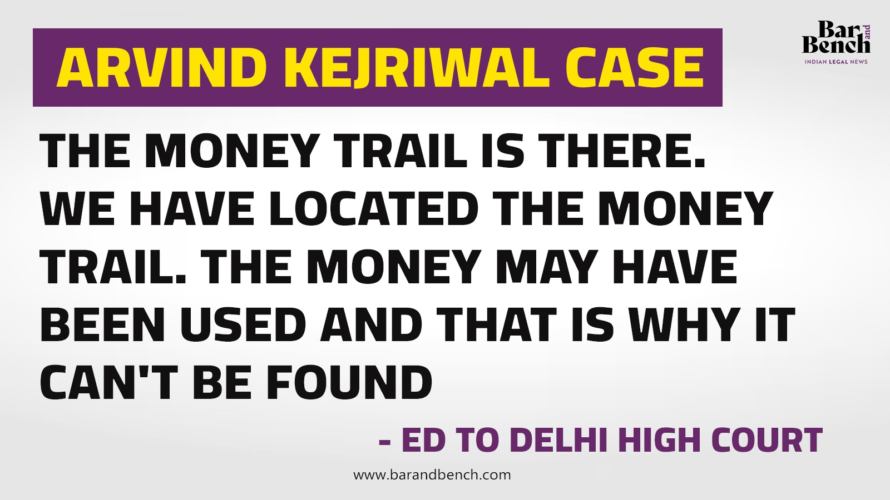

# Draconian and unconstitutional PMLA and UAPA provisions

The PMLA law places the burden on suspects to prove their innocence rather than requiring the Enforcement Directorate (ED) to prove them guilty.

<video width="100%" controls preload="none" poster="../images/pmla_newslaundry.png">
  <source src="https://42683ff2b1a2ac5ad2fef0ee01995d78.ipfs.4everland.link/ipfs/QmaEnSqvqji1GznaiMGhsVN7C9DWwtGoQa47ahAYaUjPnL" type="video/mp4">
</video>

To understand this, we need to grasp the concept of the burden of proof.

## Burden of Proof

[Burden of Proof](../reasoning/fallacies.md)

The burden of proof is a concept in logic and argumentation that addresses the responsibility one has to provide evidence or support for a claim they make during a debate or discussion. It establishes which side in an argument is required to present evidence to justify or validate their assertions.

In simple terms, the burden of proof asks: Who needs to provide evidence to support their claim?

There are generally two position in an argument:

- **The Affirmative (or Positive) Claim**: This is the side making an assertion, proposing something new, or making a claim about reality.

- **The Negative (or Skeptical) Position**: This is the side that questions or rejects the affirmative claim.

The burden of proof usually rests on the party making the affirmative claim. The basic idea is that if you're asserting something new or making a claim, the responsibility is on you to provide evidence to support that claim. The other side is not required to prove the claim false; they can simply point to a lack of evidence or logical flaws in the argument.

For example:

- Affirmative claim: "This herbal tea can cure insomnia."
  
  Burden of proof: The person making this claim is responsible for providing evidence, such as scientific studies or testimonials, to support the idea that the herbal tea is an effective cure for insomnia.

- Negative position: "I don't believe that herbal tea can cure insomnia."
  
  Burden of proof: The person in the negative position doesn't necessarily have to prove that herbal tea cannot cure insomnia; instead, they can highlight the lack of evidence or flaws in the argument presented by the affirmative side.

In legal contexts, the burden of proof may shift based on the nature of the claim or the type of case. However, in everyday discussions and debates, the general principle is that the person making a claim is expected to provide evidence to support it.

> So, as you can see, it is the responsibility of the ED to prove and provide evidence, rather than the suspect having to prove innocence. The defense is not required to prove the claim false; they can simply point out a lack of evidence or logical flaws in the argument.

## Lack of falsifiability

[Pseudoscience](../reasoning/pseudoscience.md)
 
Additionally, one needs to understand pseudoscience and its lack of falsifiability.

As you can see, the ED is exploiting the lack of falsifiability. One cannot prove whether money has been used or not.

> It is the duty of the [Supreme Court to protect the constitution](../the-lok-sabha-election-is-about-regional-parties-vs-one-party-dictatorship.md#role-of-courts). They need to remove such unconstitutional provisions through suo motu action. Laws are not intended to be abused or manipulated for wrongful purposes.

## Reverse Burden of Proof

There is no good justification for jail with the reverse burden of proof. Yes, you can jail someone for a month or two (e.g.,in case of dowry or domestic violence, to protect the victim and give some time for the victim to collect and provide evidence). But a year or six months of jail with reverse burden of proof is a **violation of fundamental rights**. Trials can run with bail. What is the fear if the suspect stays outside? What is the danger? Is there any evidence that they will commit some heinous crime like killing someone? 

We need a system of quicker trials; for that, courts need to scale, not shift dates for years or decades. By reducing the backlog of cases and streamlining court procedures, the justice system can deliver swifter resolutions while upholding the rights of the accused and also victim.

Additionally, assist victims or plaintiffs (the party initiating a lawsuit) in gathering the necessary evidence and provide them with protection if there is a threat to their safety. This could involve providing resources and support to help gather evidence, such as forensic analysis or witness testimony. By empowering victims and plaintiffs in this way, the justice system can ensure that cases are built on solid foundations of evidence rather than relying on incarceration of suspect.

