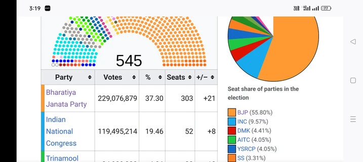
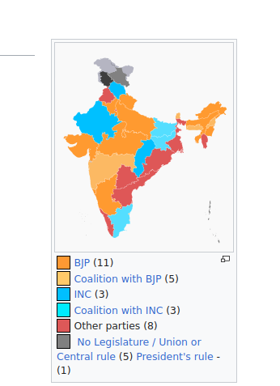
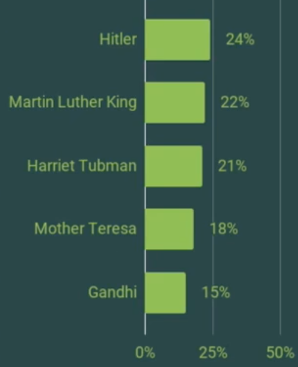
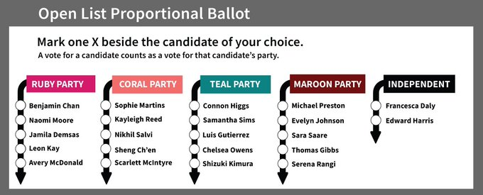

# Do we need a supreme leader? How can we share power between parties?

## date: "2023-03-30"  

---
categories:   
  - "democracy"
  - "electoral-reform"
  - "policies"
  - "politics"
---

India is currently in a risky predicament or situation. Judiciary is manipulated and attacked like never before in my lifetime. The CBI, ED, Income Tax department and courts are being used to try and silence any dissident opposition views.

> The judiciary is never independent. Govt can coerce judges or help in the appointment of corrupt judges. Or can pass law, compromising the fundamental rights and using law to abuse opposition or suppress dissent. To have a strong justice system we need to have strong democracy first.  
> Countries with inferior democracy always have an inferior judiciary.

Despite the central govt getting just 37% of votes, their power is far-reaching and autocratic.



The BJP only has 37% of the vote. Why does it have 100% control over the ministry and why does it possess 55% of the seats?

Voter turnout of [2019 election was 67%](https://www.ndtv.com/india-news/general-elections-2019-record-voter-turnout-of-67-11-per-cent-in-lok-sabha-polls-2041481), so 37% of 67% voted to BJP, which is equal to 24% of people.

> In other words, only 24% of total voters in India supported BJP. Why should it have 100% control?




Center in India controls the media, center controls the ministry to attack opposition or regional parties, despite about 50% of the country belongs to opposition. This is not possible with Open List Proportional Representation or PR Approval Voting.  
Because of the ministry, India needs a coalition. It's very hard to collate with different ideologies.

After FPTP(First-past-the-post voting) or choose one voting there are so many option, PR, Approval, Star, Rank choice, Rank Robin. Yes, you can discuss merits and demerits of each one but put an end to FPTP/Plurality.

> FPTP is the most terrible method, which the majority of electoral scientists agree on.

Why would the Modi government have complete control over minister selection when 50% of the nation is made up of regional parties?

**[Parliamentary or Presidential form of government? What’s in the name?](./parliamentary-or-presidential-form-of-government-whats-in-the-name.md)**

In contrast, in India, the Prime Minister has the authority to appoint ministers at their discretion, which can lead to a potential conflict of interest. For example, ministers may serve as mere marketing agents for the Prime Minister, aiming to enhance the Prime Minister’s image. It’s worth noting that, even though laws are meant to be the same for everyone, there can be discrimination in their execution by ministers based on their interests. One example of this can be selective enforcement of corruption laws, with a bias towards opposition parties, while members of their own party may go unpunished for similar violations.

## The solution: Proportional Representation and Approval Voting

OLPR can have most of the advantages such as inclusiveness, lack of wasted votes, promoting diversity in parties and candidates, and promoting multi party system. Some countries, such as Belgium and Denmark, combine both elements.

Voters can vote for a list or for a candidate or candidates. Its #ApprovalVoting. Voters are sometimes given further choices and powers. In countries such as El Salvador, Honduras and Switzerland, voters can vote for candidates from different candidate lists (panachage), while in those such as Luxembourg and Switzerland, voters can also vote against as well as for candidates.

**You can read about open list proportional representation here.**  
[Open List Proportional Representation: The Good, the Bad and the Ugly](https://www.idea.int/publications/catalogue/open-list-proportional-representation-good-bad-and-ugly)

And difference between open list proportional representation and mixed member proportional representation here:

Open list PR is about voter choice in selecting individual candidates, Mixed Member Proportional (MMP) is a system that retains the constituency element.

## [Open-list proportional representation vs. Mixed-member proportional representation](./open-list-proportional-representation-vs-mixed-member-proportional-representation.md)

> India is becoming increasingly divided and polarized, and hate speech is so pervasive. With approval voting, politicians are not incentivised for hate speech.

**You can read about approval voting here.**  
[https://electionscience.org/library/approval-voting/](https://electionscience.org/library/approval-voting/)

**Ten Critiques of Approval Voting**  
[https://electionscience.org/voting-methods/ten-critiques-and-defenses-on-approval-voting/](https://electionscience.org/voting-methods/ten-critiques-and-defenses-on-approval-voting/)

**Critique #2: Approval voting degenerates to bullet voting (choosing only one candidate).**

What we tend to see is that the average number of votes per ballot increases as the number of candidates increase. That is, fewer candidate options tends to mean that voters choose fewer candidates, and more candidate options tends to mean that voters choose more candidates. This is intuitive.

In fact, in many cases where there’s an approval voting election, a large number of people do tend to bullet vote. The important part is that voters have the option to support multiple candidates when they need it—even when it’s only a fraction of voters who need it. And it only takes a fraction of voters who support multiple candidates to change the outcome of an election. Even in an extreme situation where 90% of people bullet vote, those 10% choosing multiple candidates can sway the election (most often for the better).

Being able to support multiple candidates is a rather big deal for third parties and independents. As those candidates’ support grows, it’s essential that voters be able to support them to give their ideas credibility when it’s warranted. It’s preposterous to suggest that the same third-party sympathizers who hold their nose while voting for a major party wouldn’t support both a major party and a third party if given the chance. There is nothing to lose for them and everything to gain.

## How many countries around the world use proportional representation?

  
There are 109 countries which use either a Proportional Representation or a mixed system across the world.  
Only 47 countries use the First Past The Post system, a minority of countries globally, one of which is the United Kingdom.  
Those that still use First Past the Post tend to have it as a result of being former British colonies.  
WHY WILL INDIA FOLLOW THE OLD BRITISH COLONIAL RULE?
[How many countries around the world use proportional representation?](https://www.electoral-reform.org.uk/how-many-countries-around-the-world-use-proportional-representation/
)

## **PR for women**

  
The research community is united in declaring that PR elects more women. One of the most widely accepted theories is that multi-member districts allow more women to be elected because parties will want to put forward a diversified slate of candidates to reach a wider range of voters.  
[https://www.fairvote.ca/women/](https://www.fairvote.ca/women/)

Proportional representation helped women get elected in 2022

In 2022, countries with either proportional representation (PR) or mixed electoral systems collectively elected 29% women to their parliaments, whereas countries with majority or plurality systems like First Past the Post only elected 22.4% women to their parliaments. The electoral system used also influences the likelihood of applying gender quotas.

Of those countries holding elections in 2022, nearly three-quarters (73%) of countries with PR or mixed electoral systems had either a voluntary or legislated gender quota in place, whereas in majority or plurality systems nearly three-quarters of countries (73%) did not have any type of quota in place.

The representation of women in the Lok Sabha in India stands at a mere 14%, while in the Rajya Sabha, it is even lower at 11%. **It is essential for every woman in India to advocate for #ProportionalRepresentation.**

[Proportional representation helped women get elected in 2022](https://www.electoral-reform.org.uk/proportional-representation-helped-women-get-elected-in-2022/)


## **PR for climate change**

As evidence from around the globe shows, proportional representation creates a virtuous cycle for the environment. Voters who care about environmental protection elect candidates who agree. Those representatives introduce new ideas about renewable energy and clean air, they work together to pass durable policies, and they act quickly on important issues like climate change. Cascadian voters care about clean air, clean water, and climate action. ProRep can turn their values into reality.

https://www.sightline.org/2018/10/29/proportional-representation-delivers-stronger-environmental-solutions/

## **PR for Minorities**

With the current govt hatred towards Muslim minorities increasing, govt has also shown a far-right homophobic stand towards LGBTQA+ community. Proportional representation gives more representation and negotiation power to minorities, which is hardly possible in winner take it all system.

## India: Government Policies, Actions Target Minorities

[https://www.hrw.org/news/2021/02/19/india-government-policies-actions-target-minorities](https://www.hrw.org/news/2021/02/19/india-government-policies-actions-target-minorities)

## Modi’s Power to Sideline Challengers Is Only Growing  

[https://www.nytimes.com/2023/03/29/world/asia/modi-india-gandhi-judiciary.html](https://www.nytimes.com/2023/03/29/world/asia/modi-india-gandhi-judiciary.html)

## **PR to reduce corruption**

Approval voting and proportional representation are fully effective, in the sense that all equilibria exclude corrupt parties from legislative seats.

Effectiveness of Electoral Systems for Reducing Government Corruption: A Game-Theoretic Analysis

[https://www.sciencedirect.com/science/article/abs/pii/S0899825683710067](https://www.sciencedirect.com/science/article/abs/pii/S0899825683710067)

You can check out countries with least corruption have Proportional Representation

Corruption Perceptions Index

[https://www.transparency.org/en/cpi/2022](https://www.transparency.org/en/cpi/2022)


## How can we use proportional representation with Approval voting without any complicated algorithm?

How can we use proportional representation with Approval voting without any complicated algorithm like seq phragmen, and allowing selecting candidates based on ward or district. Seq phragmen is ok to be used in blockchain but not practical for paper ballots.

Instead of giving the number of seats as proportional, we can make voting power/weightage proportional. For example, the party with 33% votes will have 33% weightage for votes, no matter how many seats or candidates vote from the party. It applies to the district assembly, state assembly or country assembly (Lok sabha) The second winner or third winner of approval voting can also vote without creating any problems because of the weightage system.

Here is the complete algorithm:

```python

# Ward 1
party_green_candidate_1 = 70 
party_red_candidate_1 = 51
party_yellow_candidate_1 = 31
#Ward 2
party_red_candidate_2 = 81
party_yellow_candidate_2 = 62
party_green_candidate_2 = 31
# Ward 3
party_green_candidate_3 = 60
party_red_candidate_3= 50
party_yellow_candidate_3 = 40
total_votes_green_party = party_green_candidate_1 + party_green_candidate_2 + party_green_candidate_3
print(total_votes_green_party)
total_votes_red_party = party_red_candidate_1 + party_red_candidate_2 + party_red_candidate_3
print(total_votes_red_party)
total_votes_yellow_party = party_yellow_candidate_1 + party_yellow_candidate_2 + party_yellow_candidate_3
print(total_votes_yellow_party)
# As there are three candidates, vote weightage for each candidate = total votes for party/3
weightage_green_candidate = total_votes_green_party/3
print(weightage_green_candidate)
weightage_red_candidate  = total_votes_red_party/3
print(weightage_red_candidate)
weightage_yellow_candidate = total_votes_yellow_party/3
print(weightage_yellow_candidate)
# Policy passing
# 2 candidate of green party gave yes, one gave no
# 2 candidate of red party gave no, one gave yes
# 3 candidates of yellow party gave yes
yes_votes = 2* weightage_green_candidate + 1 * weightage_red_candidate + 3 * weightage_yellow_candidate
print(yes_votes)
no_votes = 1* weightage_green_candidate + 2 * weightage_red_candidate + 0 * weightage_yellow_candidate
print(no_votes)
```

It makes all candidates powerful with the amount of voting power they have, without winner-take-all system.

Feedback are welcome.

## Is open list proportional representation without approval voting sufficient?

> The article says,  
> Like all electoral frameworks, none of the OLPR variants are perfect. All have advantages and disadvantages in achieving the objectives required of an electoral system in a specific country environment.
> 
> While there are critics of OLPR, many of the criticisms are based either on specific elements of its configuration in a specific country or on elements that are external to the system itself (e.g. poor implementation of controls on political financing in Indonesia). While there have certainly been ugly configurations of OLPR, such as in Colombia before 2003 (see Albarracin and Milanese 2012), if configured sensibly and with adequate controls on political behavior, OLPR can facilitate a wider range of electoral system objectives than many other electoral systems.

[Open List Proportional Representation: The Good, the Bad and the Ugly](https://www.idea.int/publications/catalogue/open-list-proportional-representation-good-bad-and-ugly)

Let's take India as an example and assume what can change in India if we implement open list proportional representation.  
India already has a multi-party system. It's not like the US with two parties. Last election (2019) BJP won by 37% votes. With proportional representation, BJP will get 37% seats rather than 55% seats, so it will empower the opposition more.

But still, there is a problem. Specific elements of its configuration part of OLPR. Will it eliminate the need for a coalition govt? If even after proportional representation they move to a coalition, the problem of partisanism and "winner-take it all" arises again. The coalition govt with more votes will control the nation and ministry.

Let's look at another problem.  
Here is a plurality voting example.



Now, a open-list ballot.



Now candidates are replaced with parties (with candidates). Will it end polarization? Polarization happens because of the center squeeze effect and vote splitting. Candidates with similar ideologies split their votes, but here in the party list, parties with similar ideologies will split their votes. **In FPTP more than 50% of the vote gets wasted. But the benefit of PR is even if Hitler gets the highest votes, more than 50% of power remained with the opposition, with no vote wastage.** So yes it decreases polarization but doesn't eliminate the benefits of polarization.

> But with approval voting, Matin Luther King, Tuban, Mother Terasa, Gandhi will get about equal but more votes and votes for Hitler will further decrease.

Furthermore, without Approval voting, the chance for new parties is still lower but PR alone (without approval voting) do helps new parties by eliminating wastage of votes and decreasing tactical voting.

We can look at the Sri Lanka election with PR (no approval voting). Sri Lanka People's Freedom Alliance has 59.09% of the seats, Samagi Jana Balawegaya 23.90% of the seats, whereas other parties' strengths are negligible despite proportional representation.

PR with Approval Voting brings more competition, in other words, it provides more choices and also collaboration and corporation of representatives as there are no incentives for polarization.

## Top 5 Ways Plurality Voting Fails

[https://electionscience.org/voting-methods/spoiler-effect-top-5-ways-plurality-voting-fails/](https://electionscience.org/voting-methods/spoiler-effect-top-5-ways-plurality-voting-fails/)

## **Critiques of Proportional Representation**

### PR generates weak, ineffective, and unstable governing coalitions  

PR governments are not unstable, rather a coalition of majoritarian govt with FPTP is unstable. In FPTP parties have a high chance of getting out of coalitions whenever their interests are not met. Defection of MLAs and MPs from parties is so common in politics. This breaks the majority, hence breaking the government. In PR even if you stop participating or if you don't vote in decision-making, nothing happens, other parties together can make the decision. Changing the party or defection has no impact on decision making due to the weightage-based voting system, which is based on the number of votes won.

### It's difficult to assign clear responsibility and decision-making is slow in the PR  

PR is better at assigning responsibility. It hardly takes an hour to vote and take decisions. Yes, draft preparation can time, but it's a good thing because the inputs of all parties are taken. Ministers of the department can be selected by voting like based on their party vote weightage. As all parties are involved, ministers and bureaucrats are selected by consensus, and they are not partisan. Ministers will care about all parties' interests rather than the majoritarian party. For example, in India, media freedom has gone to its lowest, and hatred and conspiracy theories are at peak, this won't have happened if ministers are selected by consensus. President too will no more a rubber stamp, a person of integrity will be selected.

### PR legitimizes extremist parties

  
FPTP legitimizes extremist parties, as they have incentives to polarize and split votes. Further extremist parties get more seats than votes in FPTP. In PR they won't get more power than the number of votes. We can also reduce the extremist parties' votes by using approval voting or negative votes.

Proportional representation promotes collaboration and energy is used on development politics and calling out and eliminating the bad candidates/parties rather than fighting with each other even if they have shared values to win seats. For example here Gandhi, Martin Luther King, Tubman and Mother Teresa would have collaborated and would have called out Hitler instead of fighting with each other to win seats due to FPTP. Hitler decisions will be ineffective as he will not get enough votes to take decision.

### PR causes you to lose the constituency

There are different versions of PR that can be adapted to various forms. PR, in its fundamental principle, means that the percentage of seats should be equal to the percentage of votes the party receives. In other words, power aligns with the number of votes a candidate or party receives. To maintain a constituency element, one can consider options such as [Mixed Member Proportional (MMP)](./open-list-proportional-representation-vs-mixed-member-proportional-representation.md) representation or power weighting equal to the amount of votes the candidate receives, as explained in the algorithm above.

## **How can we transition from FPTP to Proportional Representation?**

**States can implement PR**:

States can implement Proportional Representation (PR) in their State Legislative Assemblies. Our constitution does not explicitly specify whether to use First-Past-the-Post (FPTP) or Proportional Representation. Nevertheless, it's worth noting that FPTP does not align with constitutional principles such as inclusivity and equality.

Implementing PR at the national level can be challenging. Therefore, individual states have the opportunity to experiment with PR, potentially sparking a broader movement towards electoral reform.

FPTP often provides an advantage to incumbents, or those who are already in power. Incumbents might resist changing the electoral system because FPTP makes it relatively easier for them to maintain their positions due to the concentrated nature of the voting.

Parties are made out of representatives (Sarpanch, MLAs, MPs, Council members, etc). Representatives need to understand that it causes no harm at the individual representative level. There is no mention of parties in our constitution. Larger parties can split into smaller parties, and individual representatives don't have to maintain a partisan stance. This leads to a more fairer and level playing field for representatives or parties in elections.

There are ways smaller parties can overcome the resistance to change. They can simply collaborate and share the seats to avoid vote splitting.

**Nominee Selection:**

Nominee can be selected from parties that collaborate through Approval voting or Score voting. Voting can be done by citizens and party members.

Parties can use sms or apps to vote, or getting feedback from surveys to select best candidates. The problem with voting through apps or SMS is without kyc electoral fraud is likely. The locality or constituency of the voter can be faked, and multiple votes can be submitted by a single user. A better approach is to establish polling booths organized by the parties to obtain authentic and accurate data. While the voter turnout might be low, it would provide a reliable sample for making inferences about the population.

A good sample is one that is randomly selected from the population, aiming to reduce bias by encompassing everyone—nonpartisan, opposition and loyal voters—without favoring loyal voters.

About 3 to 5 nominees from different parties can be selected. These 3 to 5 nominees will participate in the election for a single seat. Diverse types of nominees can be selected to appeal to a broader range of communities.

As single seat is shared by 3 to 5 members, it attracts more voters, thereby increasing the chances of winning. It also increases decentralization of decision making. Helps to prevent vote splitting, which can be detrimental to smaller parties under FPTP. Choosing nominees through approval voting and surveys enhances the likelihood of victory by incorporating the people's preferences into the selection process.

**Seat sharing Agreement:**

Seat sharing agreement can be made by the nominees to share power after they win. The power weightage of nominees can be based on the count of approval votes cast by citizens prior to the election, or they can possess equal weightage.

Such weightage is used in decision-making within citizen assemblies. Seat-sharing agreements are established to prevent winners from defecting.

In this manner, different parties can unite in the FPTP system, significantly enhancing their chances of winning by multiple folds by eliminating vote splitting. After they win, they can transition from FPTP to proportional representation.

**What if the opposition challenges the seat-sharing contract in court, for example, MPs seats, or if the Supreme Court doesn't allow it?**

A written agreement can be made public along with the signatures of those involved; it's not necessary for it to be legally binding. Based on this declaration, people will vote. Simply making a public declaration can reduce the chances of defection. Among the 3-5 nominees, award the MP seat to the individual with the highest approval votes. After MPs win, they can change the law accordingly.

[Sketch to build a agreement or contract.](https://42683ff2b1a2ac5ad2fef0ee01995d78.ipfs.4everland.link/ipfs/bafkreib3fws5fphrlmheutkicksi7g5ffwcuy5vsu4kf32zekqont3tjoq)

> Overthrowing the government is only a good idea if there is a robust plan for what comes next, to ensure that history doesn't repeat itself. The new government should have approval voting and proportional representation, with 30-50% of seats reserved for women.
> One shouldn't replace one evil with another.
