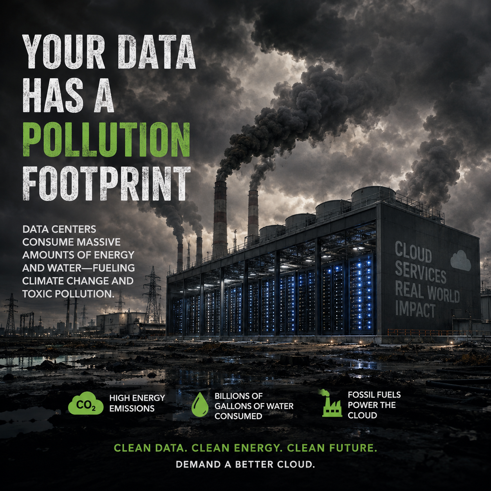

# The Data Center Delusion: Why AI Should Run on Your Rooftop, Not in a Corporate Fortress

Date: 20-06-2026

**An argument that the trillion-dollar rush to build monolithic data centers is neither necessary nor just — and that decentralized, peer-to-peer AI infrastructure offers a path toward equity, resilience, and survival.**

---

## The Cathedral of Control

Drive through the outskirts of Phoenix, Ashburn, The Dalles, or now, the industrial corridors of Gujarat and Andhra Pradesh, and you will find them: windowless concrete monoliths stretching across hundreds of acres, humming with a sound like a hive of electric wasps. Inside, row upon row of GPUs churn through the mathematical architecture of artificial intelligence. Outside, the land grows hotter. The aquifers grow emptier. The profits grow more concentrated.

We are told these data centers are inevitable — that AI *requires* them, that scale demands centralization, that there is simply no alternative. This is a lie. And it is a lie being told by the same handful of corporations who stand to become the most powerful entities in human history if we believe it.

The truth is that AI models can run peer-to-peer. The infrastructure for decentralized computing already exists. And the case against the unchecked expansion of data centers is not merely technical or economic. It is ecological, democratic, and existential.

---

## The P2P Alternative Is Already Here

Networks like **[RunOnFlux](https://runonflux.com/)**  and [Akash](https://akash.network/) have demonstrated that distributed computing is not a futuristic fantasy. They allow individuals to run compute nodes on their own hardware — a desktop in a spare room, a rig in a garage, a rack in a community co-op. Your machine joins a decentralized network, contributes processing power, and earns rewards in return.

Critics dismiss this as hobbyist tinkering, but they are fighting yesterday's war. The architecture of modern AI inference — the actual *running* of models once trained — is increasingly amenable to distribution. Model quantization, sharding, and collaborative inference frameworks mean that workloads once requiring warehouse-scale clusters can now be decomposed and executed across networks of consumer-grade machines.

This is not a marginal technical curiosity. It is a fundamentally different paradigm: **AI as a public utility, powered by the public.**

---

## Who Profits? Who Pays?

Under the current model, the economics of AI are brutally simple. A small number of corporations spend billions building and operating data centers. In return, they capture virtually all the economic value generated by AI — charging rent on intelligence itself. Your data trains their models. Their models run in their buildings. Their shareholders collect the returns. You get a subscription fee.

A decentralized P2P model inverts this relationship entirely:

- **Profits are shared.** When your home server participates in running an AI workload, you earn for your contribution. Compute becomes a distributed livelihood, not a centralized monopoly.
- **Costs are shared.** The capital expenditure of AI infrastructure is distributed across millions of participants rather than concentrated in the balance sheets of a few firms.
- **Energy is democratized.** A home computer running on rooftop solar contributes to AI computation with a near-zero marginal carbon footprint. There is no need for a dedicated power plant feeding a single facility when the grid's edge — millions of homes with solar panels and batteries — can collectively provide the same compute.

This is not charity. This is *economics as it should function* in a networked world.

---

## Data Sovereignty Is Not Optional

Centralized data centers are, by their nature, centralized points of failure and centralized points of control. When a corporation houses the compute infrastructure for AI, it also houses the data. It decides who accesses what, who is surveilled, and who is excluded.

Governments know this. It is no coincidence that authoritarian regimes court data center investment — a single facility is far easier to tap, regulate, or seize than a million home servers distributed across jurisdictions. The surveillance state does not need to hack your device if it can simply request logs from the facility where your AI interactions are processed.

Peer-to-peer infrastructure restores **data sovereignty** to the individual. When computation happens on your machine, your data does not leave your possession. There is no central repository to breach, no corporate intermediary to subpoena, no single point where a government can install a backdoor. Privacy becomes structural rather than aspirational.

---

## The Ecological Indictment

If the democratic case against data centers is urgent, the ecological case is an emergency.

### Water

Large data centers — some now the size of small towns — can require **up to 5 million gallons of water per day** for cooling. That is the equivalent daily water consumption of up to **50,000 people**, evaporated into the atmosphere to keep arrays of humming processors from melting down.

Across the United States, the multiplying footprint of data centers is projected to demand as much as **73 billion gallons of water annually by 2028**, up from approximately 17 billion gallons in 2023. That is more than a quadrupling in five years — during the worst sustained megadrought in the American West in over a thousand years.

Communities near data centers in Arizona, Georgia, and Oregon have already reported declining water tables, restrictions on residential water use, and conflicts between municipal drinking supplies and corporate cooling systems. We are, in the most literal sense, drinking less so that machines can think more.

[Majority of US’s new AI datacenters to be built on drought-hit land](https://www.theguardian.com/us-news/2026/jun/08/datacenter-ai-drought-water)

### Heat Islands

Beyond water, new research reveals a consequence that has received far less attention: data centers are creating measurable **heat islands**, warming the land around them by **up to 16 degrees Fahrenheit**. This is not a localized curiosity. The thermal output of these facilities, combined with their energy demands, is making life hotter for more than **340 million people** in surrounding regions.

We are building machines to solve climate change while constructing infrastructure that accelerates it.

[Scientists have found an alarming environmental impact of vast data centers](https://edition.cnn.com/2026/03/30/climate/data-centers-are-having-an-underrported) 

### Watch The PBS video

[We Saw What AI Data Centers Don't Want You to See](https://www.pbs.org/video/we-saw-what-ai-data-centers-dont-want-you-to-see-n1ewcf/
)

Our thermal drones exposed pollution from a massive AI data center powering the AI boom.

### The Solar Counterfactual

Now consider the alternative. A million home servers, each drawing modest power from rooftop solar, contribute compute to a decentralized AI network. The energy is generated at the point of consumption. The heat is distributed across a continent rather than concentrated in a zip code. The water stays in the aquifer. The carbon stays in the ground.

The environmental argument is not that home computing has zero impact. It is that **distributed impact is survivable in a way that concentrated impact is not.**

---

## The Power Question

Let us be direct about what is at stake. This is not merely a debate about computational architecture. It is a debate about **who holds power in the age of artificial intelligence.**

Data centers are not neutral infrastructure. They are instruments of concentration — of wealth, of data, of political leverage, and of technological dependency. Every facility built deepens the moat around a handful of corporations and makes it harder for communities, nations, and individuals to operate autonomously.

The phrase "AI safety" has been co-opted to mean safety *from* AI. But we must also ask: safety from whom *controls* AI? A world in which the infrastructure of intelligence is owned by five companies is a world in which those five companies have more structural power than most governments. That is not a hypothetical risk. It is the trajectory we are on right now.

Decentralized, peer-to-peer AI infrastructure is the only model that distributes this power rather than concentrating it. It turns every citizen into a stakeholder rather than a subject.

---

## The Global South is Not a Sacrifice Zone: The Indian Data Center Rush

This monolithic data center model is not just an American problem; it is rapidly colonizing the Global South. **India** is currently experiencing a massive, unchecked expansion in data center infrastructure, driven by the insatiable global and domestic demand for AI and cloud computing. But we must ask: who is this infrastructure actually for, and at whose expense?

The scale of the corporate land grab is staggering. **Google and AdaniConneX** are pouring **$15 billion** into a **1 GW** capacity AI hub in Visakhapatnam—planned to be Google’s largest AI hub outside the US. **Meta has partnered with Reliance Industries** to lease capacity at a 168 MW AI data center in Jamnagar, Gujarat. **Microsoft** is rushing to bring its largest Indian facility online by mid-2026, while **CtrlS** is constructing a 612 MW hyperscale campus in Hyderabad. Meanwhile, **Yotta** is deploying over $2 billion to install 20,000 Nvidia Blackwell Ultra chips in Greater Noida, and **Sify** is expanding its footprint with a 50 MW facility in Visakhapatnam. Finally, **Adani Group** has announced a breathtaking **$100 billion** AI infrastructure plan targeting **5 GW** of capacity by 2035.

This is not development; it is the construction of a digital plantation.

First, look at the concentration of wealth and power. These projects are not empowering local communities; they are cementing the dominance of massive global tech giants in lockstep with domestic oligopolies. When a foreign tech monopoly partners with a local conglomerate to build a 1 GW fortress, the profits are siphoned to the top, leaving the local population with the externalities: strained power grids, land acquisition pressures, and ecological degradation. Mumbai already accounts for **52%** of India’s total data center capacity, creating massive localized strain.

Second, do not be fooled by the greenwashing. Proponents will point to the Meta-Reliance facility being "powered by renewable energy and cooled by desalinated seawater." But desalination is intensely energy-intensive and produces toxic brine that devastates marine ecosystems. Furthermore, dedicating 5 GW of national capacity to AI compute will place an unbearable strain on India's power grid—power that could be used to provide reliable electricity to millions of citizens. A 1 GW data center running 24/7 requires a dedicated, baseload power supply that will inevitably pull from the same grid as hospitals, homes, and industries.

Third, consider data sovereignty. By building these massive centralized nodes, the digital footprint of 1.4 billion Indians is being locked into the centralized servers of foreign corporations and local monopolies. This creates prime, centralized targets for surveillance, data breaches, and corporate exploitation.

**This expansion in India must be stopped by tooth and nail.** The narrative that India needs to become a "data center hub" to be a modern economy is a trap. True technological sovereignty for India does not come from hosting Microsoft's or Google's servers in Hyderabad or Jamnagar. It comes from building decentralized, peer-to-peer AI infrastructure where Indian developers, students, and citizens can run nodes on their own hardware, earn compute rewards, and maintain control over their data.

India should not become the physical hosting ground for Silicon Valley's AI ambitions. The expansion of these corporate monoliths on Indian soil must be resisted with the same ferocity as anywhere else in the world.

---

## The Employment Mirage: The "Jobs" Lie

Every time a tech giant announces a new billion-dollar data center, politicians stand beside them at ribbon-cutting ceremonies and promise a windfall of local jobs. This is the oldest trick in the corporate playbook, and it is a flat-out lie. 

Hyperscale data centers are the absolute antithesis of job creation. By design, they are engineered to be as automated, remote, and labor-free as physically possible. A billion-dollar, 1 GW facility might employ a few hundred construction workers for 18 months. But once the doors are locked and the servers are humming, it requires a skeleton crew of perhaps 50 to 100 people — mostly security guards, HVAC technicians, and a handful of network engineers. 

In places like **India**, where youth unemployment is a severe and growing crisis, the narrative that massive data center campuses will solve the job market is a cruel deception. The Adani, Reliance, or Microsoft data centers will not employ the thousands of local graduates they implicitly promise. They will extract massive amounts of local water and power, employ a tiny fraction of the local workforce, and send the vast majority of the profits to shareholders and multinational partners. They are capital-intensive fortresses, not labor-intensive engines of prosperity.

Compare this to a decentralized, peer-to-peer AI network. P2P infrastructure is inherently distributive and creates a massive, localized micro-economy. It means local computer repair shops thriving as people upgrade and maintain their home nodes. It means a new class of independent node operators earning a living wage. It means software developers building tools for the edge, and community network administrators managing local mesh networks. 

Data centers concentrate capital; P2P distributes livelihoods. One creates a few dozen permanent jobs while hoarding billions in profit; the other creates millions of micro-livelihoods, keeping wealth in the communities that actually host the hardware.

---

## A Call to Stop the Expansion

The data center buildout must be confronted globally — not with polite regulatory suggestions, but with the urgency it deserves. Every new facility permitted without environmental impact review, every water right granted to a corporate cooling system in a drought-stricken region, every tax abatement given to a company building infrastructure that could instead be distributed to communities — these are choices. And they are the wrong choices.

We should demand:

- **Moratoriums on new hyperscale data center permits** until comprehensive environmental and social impact assessments are completed.
- **Investment in decentralized compute infrastructure**, including subsidies for home and community servers powered by renewable energy.
- **Open-source AI frameworks** designed from the ground up for peer-to-peer operation.
- **Data sovereignty legislation** that recognizes the right of individuals to control where and how their data is processed.
- **Water and grid protections** that categorically prohibit industrial water consumption and baseload power hoarding for compute cooling in resource-stressed regions.

---

## The Public Good

Artificial intelligence will be the most consequential technology in human history. The question is not whether it will transform civilization. The question is whose civilization it will transform, and who will own the transformation.

If AI runs in data centers owned by corporations, it will be a tool of corporate control — profitable, efficient, and fundamentally antidemocratic. If AI runs on a peer-to-peer network powered by millions of individuals, it can be what it should have been from the beginning: **a public good, a shared resource, a commons.**

Your home computer can run on solar. Your rooftop can power intelligence. Your participation can earn you a share of the value you help create. The technology for this future exists today.

What is missing is not the hardware. It is the political will to choose a different path — to stop the monoliths, distribute the power, and refuse to let the architecture of the future be built as a fortress.

The data center is not the future of AI. It is the past of the industrial age, dressed in silicon, reaching for the water table.

**Let it go.**
