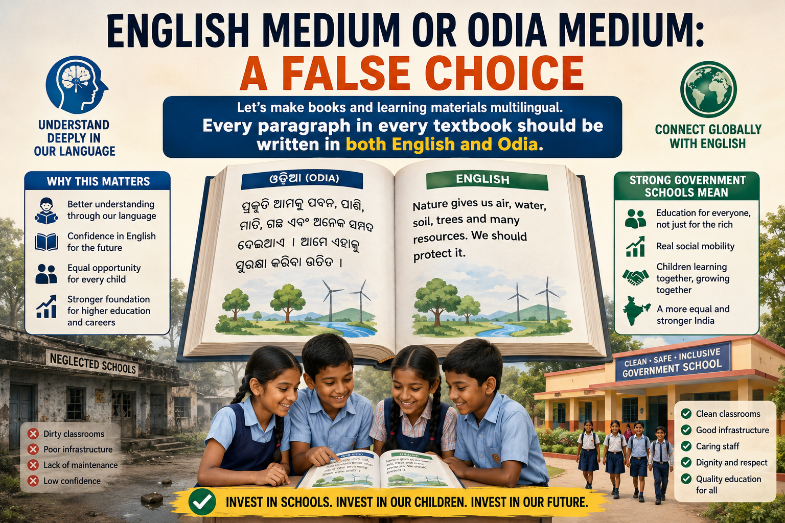

# English Medium or Odia Medium: A False Choice

One of the biggest questions in Indian education is why many middle-class parents choose private schools over government schools. Whenever you ask them, the answers are usually the same:

1. They want their children to study in English medium.
2. They are dissatisfied with the hygiene and cleanliness of government schools.

Both concerns are valid. More importantly, both can be addressed.

## 1. English Medium or Odia Medium?

For decades, parents have been forced to choose between English-medium and Odia-medium schools. I believe this is a false choice.

Neither a fully English-medium system nor a fully Odia-medium system is ideal.

**When education is entirely in English, many children struggle to understand concepts because English is not the language they speak at home. Instead of understanding, they often memorize.**

**On the other hand, teaching everything only in Odia creates another problem. English is the language of higher education, science, technology, business, and global communication. Students who are not comfortable with English may face unnecessary barriers later in life. A completely Odia-medium approach limits students’ ability to communicate and compete globally, since English remains the dominant international language.**

The solution is simple.

**Let’s make books and learning materials multilingual.**

Every paragraph in every textbook should be written in both English and Odia.

Students first understand the concept in Odia and immediately see the same explanation in English. As they continue learning, they naturally become comfortable with both languages without sacrificing understanding.

Parents would no longer have to choose between English or Odia medium, as they could utilize the benefits of both worlds.

### This Is Easier Than Ever

Until recently, preparing textbooks in two languages required enormous effort.

Today, AI has become remarkably good at translation. Human review is still necessary, but creating textbooks with every paragraph written in both English and Odia is now practical and affordable.

This makes it possible to improve government school education without dramatically increasing costs.

### Teachers Do Not Need Extensive Retraining

Another advantage is that teachers do not need special training to adopt this approach.

Since every lesson is already written in both English and Odia, teachers can explain concepts naturally while gradually helping students become familiar with English. The transition becomes smooth for both teachers and students.

### Why Parents Still Choose Private Schools

Many private English-medium schools charge fees that are difficult for middle-class families to afford.

Budget private schools charge less, but they often pay teachers very little and operate with limited resources.

Government school teachers generally receive much higher salaries, yet many parents still avoid government schools.

Although learning quality is similar in private and government schools, parents still prefer private schools **because** they want English medium education.

### From Spectator to Participant: Leveraging Multilingualism to Boost English Learning at Home

We have already achieved 90% literacy rates, but these metrics reflect proficiency in regional languages, not English. The reality is that low levels of English language use at home diminish parental support. This often relegates parents to the role of grade monitors rather than active learning mentors when children attend English medium schools. Introducing **multilingual content** is a strategic solution that equips parents with the necessary tools and confidence to become truly active participants in their child's learning journey.

## 2. Hygiene and Cleanliness Matter

The second major reason parents avoid government schools is poor hygiene and infrastructure.

Many schools suffer from **dirty classrooms, damaged buildings, inadequate maintenance, and students wearing dirty clothes**

As government schools increasingly become schools attended mainly by poorer families, many communities simply do not have the resources to maintain cleanliness properly. 

It is an investment problem.

If governments invest in school infrastructure, government schools can become places where every family is proud to send their children.

That means:

* Clean classrooms and toilets.
* Regular painting and building maintenance.
* Adequate cleaning staff.
* Safe drinking water.
* Better uniforms and support for poor families.
* Attention to hygiene and cleanliness every day.

A clean school is not a luxury. It is part of quality education.

## Government Schools Should Be Schools for Everyone

Government schools should not become schools only for the poor.

They should be places where children from every economic background learn together. When families from all sections of society send their children to government schools, expectations rise, accountability improves, and education becomes stronger for everyone.

## Why Strong Government Schools Matter 

Education should be one of the greatest engines of social mobility. A child born into a poor family should have the same opportunity to receive a high-quality education as a child born into a wealthy family. When education becomes segmented by income, social divisions become harder to overcome. Children from different economic backgrounds grow up separately, reducing interaction, shared experiences, and mutual understanding.

## Conclusion

The debate should not be "English medium or Odia medium."

The real question is how children can understand every lesson while also becoming confident in English.

Writing every paragraph in both English and Odia gives students the opportunity to understand deeply without falling behind in English.

Combined with clean schools, better infrastructure, and good teaching, this can make government schools a place where parents choose to send their children—not because they have no alternative, but because they offer the best education.
