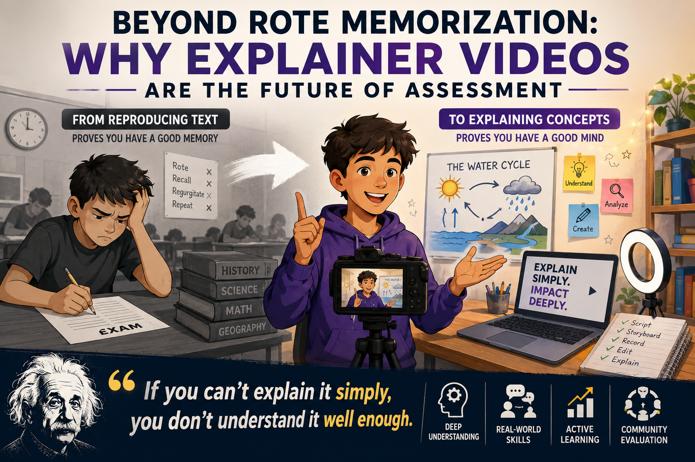

# Beyond Rote Memorization: Why Explainer Videos Are the Future of Assessment

Date: 21-06-2026

*"If you can't explain it simply, you don't understand it well enough."* 

This principle, closely associated with the **Feynman Technique** and often attributed to Albert Einstein, highlights the massive difference between mere memorization and true comprehension. For over a century, the education system has relied on asking students to reproduce textbook text in exams. But shouldn't we be grading students on their ability to create explainer videos instead? 

From a pedagogical standpoint, the argument for replacing rote memorization with video-based assessment is incredibly strong. Here is a breakdown of why this shift is necessary, the practical hurdles we must overcome, and how we can actually implement it.

### Why Explainer Videos Are a Superior Assessment
If a student can create a 3-minute video explaining the water cycle, the causes of the French Revolution, or how fractions work to a 10-year-old, they have achieved the highest levels of learning.

1. **Moving Up Bloom’s Taxonomy:** Traditional exams usually test the bottom of Bloom’s Taxonomy: *Remembering* and *Understanding*. Creating an explainer video forces students into the top tiers: *Analyzing*, *Evaluating*, and *Creating*. 
2. **Exposing Knowledge Gaps:** When a student just regurgitates a textbook, they can hide behind big vocabulary words. When they have to explain a concept to a child, they are forced to strip away jargon and actually understand the mechanics of the idea. If they stumble, the gap in their knowledge is immediately exposed.
3. **Fostering Metacognition and Iteration:** Unlike a high-stakes, one-shot written exam, video creation allows for drafting, re-recording, and editing. This iterative process teaches students *how* to think about their own thinking (metacognition) and fosters a growth mindset, as they learn to refine their work rather than just surviving a test.
4. **Real-World Skill Stacking:** Making an explainer video doesn't just test subject knowledge. It tests digital literacy, scriptwriting, public speaking, visual design, and time management. These are the exact skills needed in the modern workforce.
5. **Student Engagement:** Students rarely get excited about writing a standard essay. Giving them the agency to create a YouTube-style video, use props, or edit footage taps into the media they already consume and enjoy.

### Addressing the Practical Hurdles
If this is such a better way to test understanding, why are we still relying on reproducing book text? The resistance isn't because the idea is bad; it's because of systemic, logistical hurdles. However, none of these hurdles are insurmountable.

#### 1. The Grading Bottleneck (Scalability)

**The Hurdle:** A teacher with 150 students can grade a multiple-choice test in a weekend. Watching and evaluating 150 individual 5-minute videos takes an immense amount of time. Teachers are already overworked.

**The Solution:** We must democratize the evaluation process. We can upload videos and use decentralized, specialized peer-to-peer (P2P) apps (like Nostr) to ask peers to evaluate them. Is it perfect? No. But we shouldn't let the pursuit of perfection paralyze progress. For low-stakes grading, it is highly effective. The real purpose of assessment is to make students learn, not just to sort them like apples and vegetables based on quality. Furthermore, evaluating others is a fantastic way for students to solidify their own understanding.

#### 2. The "Presentation Bias"

**The Hurdle:** There is a risk of grading the *performance* rather than the *knowledge*. A charismatic student might make an entertaining video that glosses over details, while an introverted student might struggle on camera despite having a masterful understanding.

**The Solution:** No system is perfect; there are trade-offs in every assessment model. However, "teaching to the test" and rote memorization are far bigger problems than presentation bias. Furthermore, video creation actually *helps* introverts. Unlike a live oral exam, a video allows a student to rehearse, script, and use video editing to pace their thoughts perfectly. The key is in the rubric: evaluation guidelines must strictly focus on the depth of understanding and clarity of the concept, not the charisma of the performance.

#### 3. The Digital Divide

**The Hurdle:** Not all students have access to a quiet place to record, a reliable device, or high-speed internet, which can inadvertently penalize lower-income students.

**The Solution:** The digital divide is rapidly decreasing. Even in remote parts of India, mobile phone penetration is nearly ubiquitous. If a teenager has the capability to shoot and edit an Instagram Reel, they have the hardware to create an explainer video. The barrier is no longer just hardware; it's culture. We simply have not incentivized educational content creation or built a system of scale that treats learning with the same appeal as social media apps.

#### 4. Foundational Knowledge and Teacher Ratios

**The Hurdle:** You can't "explain" your way out of needing to know foundational facts, and guiding students through video creation is highly time-consuming for teachers.

**The Solution:** Foundational facts are still required, which is why a hybrid approach is necessary (see below). As for the time commitment, teachers will need to act more as facilitators and assistants in the creation process. To make this viable, we need to advocate for smaller cohort ratios—such as 1 teacher to 6 students—allowing for the hands-on guidance that video production requires.

### The Middle Ground: A Hybrid Approach
The future of education shouldn't necessarily throw away all exams, but it should drastically reduce their weight. A balanced, modernized approach would look like this:

* **Micro-Assessments for Practice:** Use quick, low-stakes quizzes to ensure students have memorized foundational vocabulary and facts. However, these shouldn't just be for grading; well-designed questions can also help students practice higher-order knowledge in a low-pressure environment.
* **Explainer Videos for Concepts:** Replace the heavy mid-term and final essays with projects where students must teach a concept to a specific audience. 
* **Democratized P2P Grading:** To solve the teacher's time crunch, grading must be democratized. By utilizing P2P networks, we can involve a wider community—including other teachers, parents, and university graduates—to evaluate student learning through standardized rubrics. This not only saves teacher time but builds a community around the student's education.

### Conclusion
Reproducing text proves a student has a good memory; creating an explainer video proves they have a good mind.
