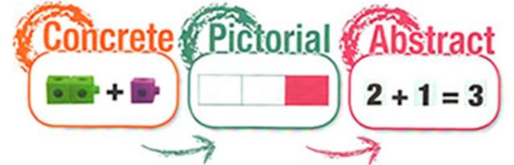
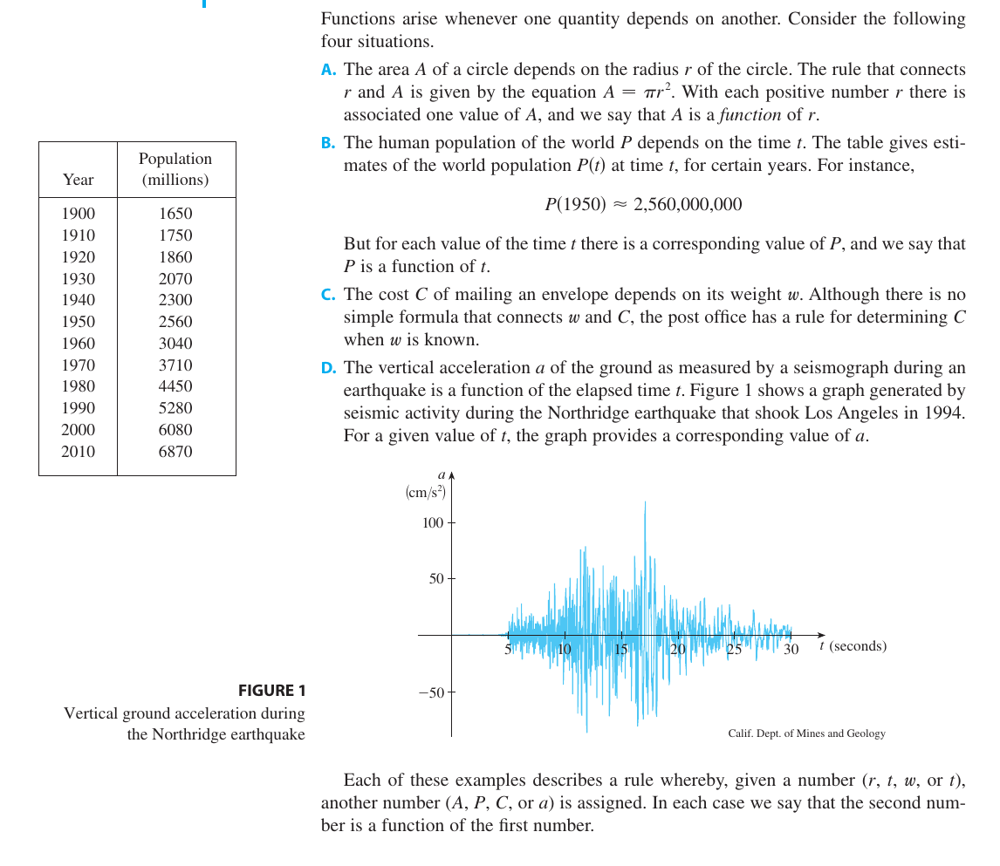
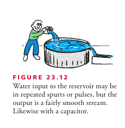
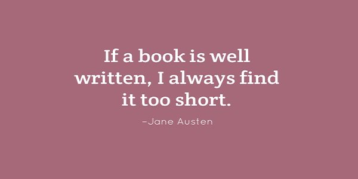

# Features of good books or curriculum

**Learning About Learning Resources**  
**[https://github.com/amiyatulu/teacher\_resources](https://github.com/amiyatulu/teacher_resources)**

Textbook must cover six fundamental instructional strategies while presenting the information, defined by rigorous research.

1) [Pairing graphics with words](http://www.learningscientists.org/blog/2016/9/1-1)  
2) [Linking abstract concepts with concrete representations](http://www.learningscientists.org/blog/2016/8/25-1)

Why we face difficulty to remember abstract concepts?

[https://iambrainstorming.wordpress.com/2017/03/08/why-we-face-difficulty-to-remember-non-concrete-information/](https://iambrainstorming.wordpress.com/2017/03/08/why-we-face-difficulty-to-remember-non-concrete-information/)

3) [Posing probing questions](http://www.learningscientists.org/blog/2016/7/7-1)

[http://mrkempnz.com/2014/06/questioning-the-most-powerful-tool-in-the-classroom-an-action-research.html](http://mrkempnz.com/2014/06/questioning-the-most-powerful-tool-in-the-classroom-an-action-research.html)

"What Makes a Great Question?" rubric  
Why, how, what if, how do you know, what are the evidences

**What if and why not  
helps you to find alternatives to a solution**

4) Repeatedly alternating problems with their solutions provided and problems that students must solve.

Solved example and unsolved problem   
with steps of problem-solving strategy: 1) sort 2)strategize 3) solve and 4) check.   
\- Chemistry, A Molecular Approach by Nivaldo J. Tro

  
[Interleaving](https://3starlearningexperiences.wordpress.com/2018/09/18/interleaving-variety-is-the-spice-of-learning/) and [Component Practice](https://iambrainstorming.blogspot.in/2017/10/practicing-one-component-in-one-time-to.html) can be used for better transfer of learning with appropriate cognitive load.

5) Distributing practice  
6) Assessing to boost retention

Detailed explanation of the strategies is given here, [NCTQ learning about learning](https://github.com/amiyatulu/teacher_resources/blob/master/NCTQ_Learning_About_Learning_1-16.pdf)     
and [http://www.learningscientists.org/](http://www.learningscientists.org/)

The problem with our education system:  
**Most (99%) books referred by our teachers (whether its schools or higher education), not even meet a single criterion, most importantly posing probing questions and linking abstract concepts with concrete representations, which are the foundation for learning and comprehension/understanding.**   
The result is the student just try to score marks by repeating facts without being critical about it.  
The bad books are the main reason why we have bad teachers and bad students. It's not that teacher doesn't work hard, they just don't teach which meet the criteria, so that learning happens.  
It's not even fault of the **administration**, they **put the books in the library what teacher recommend to them**, and also naive students prefer books recommended by teachers.

#### **Some of the books that meets all the criteria and can be used as a reference to identify the patterns of good books:**

_(You can skip this section for later analysis and jump to the patterns and features of good books)_

Conceptual Physics, by Paul G. Hewitt  
The book is very well written, the book almost unraveling everything in physics with real-world examples. You will understand physics with concrete examples rather than just with abstract formulas and equations. Also, it has a practice book equally important. This book is right for understanding physics at the undergraduate and high school level.

Chemistry a Molecular Approach,  Nivaldo J Tro  
Books with lots of diagrams, probing questions, all abstract concepts are represented with concrete examples and analogy, repeatedly alternating problems with their solutions provided and problems that students must solve, regular assessments with right questions.

Organic Chemistry as a Second Language, David Klein (First and Second Semester)  
Author has terrifically written the book on organic chemistry. You will understand organic chemistry like never before, and no need to memorize just the equations and reactions day and night which are just a junk for students.

Campbell Biology, Reece, Urry, Cain et. al.  
In India, biology is taught in most horrible manner. Biology means how much memory you have, how much memorization you can do, not how much you understand the subject.  
This book addresses the problem. You will understand biology and connect it to the real world. The diagrams in it are also wonderful. The questions in it promote inquiry and critical thinking.

Genetics A Conceptual Approach, Benjamin Pierce  
Even though it's not for high school students, but a must for undergraduate teachers. Teachers should follow the book and come for an inquiry-based lecture.

Molecular Biology of the Cell, Alberts  
A must for undergraduate and high school teachers. It has also got a problems book which contains gem like questions, which needs to be discussed among the students at the undergraduate and higher secondary level.

Lehninger Principles of Biochemistry  
It's another book, which lazy teachers are scared of. But without making an effort to understand biology, how will a teacher promote understanding among students?

Fundamentals of Anatomy and Physiology, Martinin, Nath  
Meticulously well-written book of anatomy and physiology, which an undergraduate teacher must follow.

## **Here are some of the more features and patterns that a good book should contain:**

  
1) Statements or ideas or concepts should be **backed by adequate examples and research data as evidence**. Formulas should be provided with its implementation examples in physical situations.  
e.g.  
Have you ever heard the phrase “form follows function?” It’s a philosophy practiced in many industries. In architecture, this means that buildings should be constructed to support the activities that will be carried out inside them. For example, a skyscraper should be built with several elevator banks; a hospital should be built so that its emergency room is easily accessible.

> **One example is not enough, provide as many as you can to explain its use in a different context and situations**

Function and Limits from book Essential Calculus by James Stewart

**Give example questions to classify from several antagonistic observations.**

e.g. In probability, a simple event is an outcome that cannot be further broken down into simple components. So its example can be:  
Roll one die: 5 **(simple event**)  
Rolling one die has 6 simple events: 1, 2, … 6  
Roll two dice: 7 **(not a simple event)**  
Rolling two dice have 36 simple events: 1-1, 1-2,….., 6-6, and 7 is NOT a simple event because it CAN BE broken down into simpler events, such as 3-4 or 6-1.

A classification Problem

2) **Diagrammatic representation of text** with proper labeling and caption containing enough description should be provided.  
e.g.

Molecular Biology of the Cell, Alberts

3) Books should have **analogies with the diagram** in **abundance** to convert all abstract, new and tough concepts into concrete. It's an important feature, that makes a book exceptionally great and boosts learning

> Analogies can be misleading if it's not too close to the model you are explaining. Always provide contrasting characters of analogy in comparison to the real model.

Example of an analogy: Converting AC to DC

The converter uses a diode, a tiny electronic device that acts as a one-way valve to allow electron flow in one direction only. Since alternating current changes its direction each half-cycle, current passes through a diode only half of each period. The output is a rough dc, and it is off half the time. To maintain continuous current while smoothing the bumps, a capacitor is used. The capacitor acts as a storage reservoir for a charge.  
Diagram with **analogies**:

Conceptual Physics, by Paul G. Hewitt

4)After the text has explained a concept, it must give few questions on the particular concept in the same place. The questions should be prepared in a manner that, it checks the understanding of the concept, not just recall of the concept.  
5) Questions should be **probing**, also many questions should be **graphics/diagrams with texts**. Most books that are recommended usually don't contain visual questions. For example, if you look our books of biology, very less visual, and almost no probing questions are present, do compare with questions of Campbell Biology, Molecular Biology of the Cell, how they bring probing questions with visuals in them.

Question from Campbell Biology

6) Length of the book should respect the time of students. It doesn't mean book can't be long or elaborative. Being elaborative is not about giving lots of different concepts or topics, it means explaining a few topics elaborately so that it requires least effort to grasp. A narrow but precise statement can take more time to comprehend than elaborative explanations with examples, images, and analogies.  Each sentence should have a purpose of being in the book.

> Don't make it (the content) simple, teach the complexity by simplifying it. The curriculum should cover the depth of a concept and breadth of the subject without the clutter.

7) Books should be written in a manner that they talk with the students, not throwing information like short notes.

8) A book should also provide memory assistance for hard to remember information.

“**K**araoke **p**layers **c**an **o**rder **f**ree **g**rape **s**oda” 

Kingdom–phylum–class–order–family–genus–species

9)Questions should have relevance to real problems, concrete situations, application based, not all hypothetical questions detached from reality.

10) Questions and distractor in the case of MQCs should be very clear, that checks the comprehension, without creating confusion. Many times questions are written in a way that is just difficult to understand, you can't even know what the question is actually asking, so how can you even try to solve it even if you understood the concepts.  
11) Each question in the textbook should have its purpose, **problems shouldn't be designed just for the sake of doing it**, it should **improve** the understanding of the concept at a deeper level, eliminate **misconceptions** and fix concept into memory.

A formula from NCERT Book

> **Why are our books filled with unnecessary short cut formulas?**
> 
> [https://iambrainstorming.wordpress.com/2017/06/01/why-are-our-books-filled-with-unnecessary-short-cut-formulas/](https://iambrainstorming.wordpress.com/2017/06/01/why-are-our-books-filled-with-unnecessary-short-cut-formulas/)

12) Real photograph and funny cartoons with explanations and questions (e.g. in case of representing resistance as zigzag wire, it can be represented as bulbs)

_Conceptual Physics, by Paul G. Hewitt_

13) Scientists interview or how they discovered a particular phenomenon along with their real photographs  

_Venkatraman Ramakrishnan interview: Nobel prize for chemistry for work on **ribosome** structure_

_Venkatraman Ramakrishnan_

_"I remember reading a Scientific American article about the use of new physical techniques – including neutron scattering – as a method for unraveling the structure of the ribosome. I was fascinated. I knew ribosomes were a big fundamental problem in science and this was a method for chipping away at it."_

_Proteins carry oxygen in our blood, form antibodies that fight microbes, and even sense light inside our eyes – and each protein that makes up a human is manufactured in a ribosome inside our cells. Each of our genes codes for a particular protein and the ribosome takes that piece of DNA code and uses it to assemble chains of amino acids until a protein is formed. "That is the central dogma which explains how information stored in our DNA is transformed into the proteins that make up a living being," says Venki._

14) Posing a probing question before explaining the topic.

_Conceptual Physical Science by Hewitt, Suchocki, Hewitt_

15) Books should include questions that address life skills like collaboration, and 21st-century skills like the ability to analyze and interpret data. It must have questions with a **section for data interpretation and analysis and questions for group work** along with conceptual, mathematical and review questions. 

Chemistry a Molecular Approach,  Nivaldo J Tro

An example of question that promotes critical thinking. Critical thinking questions are hard to develop and require a lot of time for research and effort:

> Questions should be brain friendly. Memory is reconstructive not reproductive.

[https://iambrainstorming.wordpress.com/2018/02/17/question-designing-should-be-brain-friendly-cue-based/](https://iambrainstorming.wordpress.com/2018/02/17/question-designing-should-be-brain-friendly-cue-based/)

16) Each section should give a **message or lesson about big ideas** that help to make a judgment or **transfer of learning** in different situations.  The essence of the message should be in the title that is descriptive and a further descriptive subtitle. 

A descriptive title  
from book Molecular Biology of the Cell, Alberts

A descriptive subtitle  
from book Inorganic Chemistry  
by Shriver, Weller, Overton, Rourke and Armstrong

> Is the content clever?  
> It's not adequate to have a comprehending content, its more to do with smart content (big ideas, learning it to apply in the real world thinking, building connections to link ideas to get the complete picture, encourage critical thinking and inquiry) for smart teaching and smart learning. 

17)Engaging style of telling is essential in scientific writing. A chapter may begin with a narrative/storytelling of scientific experiences of researchers and their comments, history and progression in the discussed field or example events relevant to the subject matter. Even narratives can be used in a separate text box to discuss example events or how researchers reach their conclusions.

> The narrative technique provides a deeper meaning for the reader and helps the reader to use imagination to visualize situations.

Colonization of Plants in the barren landscape  
Campbell Biology, Reece, Urry, Cain et. al.

> But narratives should be used with caution as "the plural of anecdote is not data"  
> 
>  [http://www.pnas.org/content/111/Supplement\_4/13614.full](http://www.pnas.org/content/111/Supplement_4/13614.full)

Anecdotal evidence (evidence collected in a casual or informal manner and relying heavily or entirely on personal testimony) are not reliable evidences.

**How to make stories with ABT (And, But, Therefore)?**

> There are three main forces involved in creating a story — agreement, contradiction, consequence.
> 
> ABT: All you need to know to tell stories
> 
> I WONDER Magazine [http://www.azimpremjiuniversity.edu.in](http://www.azimpremjiuniversity.edu.in/SitePages/resources-iwonder-issue4.aspx)  
> [https://github.com/amiyatulu/teacher\_resources/raw/master/Stories:AndButTherefore.pdf](https://github.com/amiyatulu/teacher_resources/raw/master/Stories:AndButTherefore.pdf)  
>   

ABT: All You need to know to tell stories by Randy Olson  
i wonder

> **The conclusion should be supported by the premises and the arguments with contradictions, inconsistencies, and exceptions mentioned in the arguments.**

> Extremely simplified models are useful to anyone who understands the assumptions, understands how the assumptions drive outcomes, understands how violation of assumptions affects outcomes, and understands how this defines the scope of the original model and its extensions.

There are three parts to any [proposition](http://www.yitsplace.com/Programming/prop_parts.htm):

  The premises – i.e. facts which are already known or assumed.  
  The argument – i.e. the logical chain of reasoning that leads from the premises to the conclusion.  
  The conclusion - i.e. that which must be true if the premises are true and the argument is valid.

> The conclusion must be true IF the premises are true AND the argument is valid.
> 
> [http://www.yitsplace.com/Programming/prop\_parts.htm](http://www.yitsplace.com/Programming/prop_parts.htm)

A concise Introduction to Logic  
by Patrick J. Hurley, Lori Watson

Without logic, your working long hours will make things even worse

**18) Topics can have connection boxes containing discussion about situations that are surprising, nonintuitive or widely-held false ideas.**

Why do males exits? Why bdelloids have completely abandoned sex?  
Biology, the unity and diversity of life, by Starr, Taggart, Evers et al.

**19)** **The author should have the liberty to include new relevant chapters, innovate in their subjects and shouldn't be hitched by the syllabus of the board. Students learning according to recent technology is most important. The author should only take that into consideration, not preparing them for syllabus or entrance.** 

_e.g. Writing mathematics book linking with programming._  
Students should be taught according to the availability of quality material not according to the syllabus. A syllabus without quality material is meaningless.

20) Content must be designed to accord with **cognitive load theory**. Cognitive load theory is built upon two commonly accepted ideas. The first is that there is a limit to how much new information the human brain can process at one time. The second is that there are no known limits to how much-stored information can be processed at one time.

Cognitive overload occurs when the total cognitive load exceeds the working memory capacity of the learner.

e.g. This material creates a **high** intrinsic **cognitive load** because of use of too many technical terminologies (many times hard to imagine and comprehend)  in a single sentence or paragraph.

NCERT Biology

Cognitive load theory in detail:  
[https://github.com/amiyatulu/teacher\_resources/raw/master/cognitive\_load\_theory\_report\_AA1.pdf](https://github.com/amiyatulu/teacher_resources/raw/master/cognitive_load_theory_report_AA1.pdf)

Education Centre for Education Statistics & Evaluation

> New information should be presented slowly after the previous one is mastered by elaboration and practice.
> 
> [https://iambrainstorming.blogspot.in/2017/10/practicing-one-component-in-one-time-to.html](https://iambrainstorming.blogspot.in/2017/10/practicing-one-component-in-one-time-to.html)

21) Books should have learning outcomes or objectives at the beginning or end of each chapter. Examples, practice, and exercises that test your confidence and expertise in each learning objectives must be provided.

An example of learning outcomes design in the textbooks:

Learning outcomes can have checkboxes, for pre-check, post-check.  
Students may mark the checkboxes with the following symbols  
❌ : Novice  
⭕: Developing  
►: Forgotten  
▣ : Expert

It checks the level of confidence in the topics before and after learning. Students can use a pencil to mark the checkboxes, erase and reuse the checkboxes.  
The preface of the book can have guidelines about "How to use the learning outcomes?" Learning outcomes can include **_each small components_** of learning in the checklist.

Key Learning Outcomes from Book: Chemistry A Molecular Approach, Nivaldo J. Tro  
  

Blog on the importance of sharing learning outcomes:  
[Should I share my learning outcomes with students?](http://www.learningscientists.org/blog/2017/10/4-1)

22) End of the chapter can provide references to the texts. [Referencing is a way to provide evidence to support the assertions and claims in the content.](https://student.unsw.edu.au/why-referencing-important) It also helps the reader to dig deeper into the scientific methodology that validates the assertions and claims.

The Psychology of Human Sexuality by Justin J. Lehmiller

23) Test what you write with students.

> Test the comprehension of every paragraph or section you write with a diverse group of students without previous knowledge about the subject. Ask students to explain the content you write and check whether they understand the text. Obtain feedback from them and improve the writing that answers their confusions and questions.

> **the curse of knowledge bias**
> 
> Once you understand something you presume it to be obvious to everyone.
> 
> [https://en.wikipedia.org/wiki/Curse\_of\_knowledge](https://en.wikipedia.org/wiki/Curse_of_knowledge)

24) And last, books should have least mistakes, in texts as well as questions.

_**Lecture of the teacher reflects the book they follow.**_ So it's most important they know which criteria a book should meet, and how learning happens.  
Students should also be made aware of it, how learning happens.  

> _**Books should be concise (giving a lot of information clearly and in a few words; brief but comprehensive) with precise, specific and explicit (no room for confusion or doubt) wording without unnecessary repetition yet elaborative to assist students in learning and should also be a guide for teachers that instruct them how they will explain the concepts to students in the class.**_

The guidelines are biased towards science, not all points are applicable to arts and literature.

_One can identify such books with 15 mins of reading and turning pages.  
But after you have learned all these attributes, and investigated these patterns by reading a few chapters of the given reference books._

**The best, urgent and topmost thing our education ministry can do is take away and stop referring all the books and resources that don't meet these criteria.**

**Why NCERT and other state board books are just toxic junk for our students?**  
[http://technoperiod.blogspot.in/2016/04/critical-analysis-of-12th-chemistry.html](http://technoperiod.blogspot.in/2016/04/critical-analysis-of-12th-chemistry.html)

[https://iambrainstorming.wordpress.com/2017/06/08/comparative-analysis-of-openstax-biology-and-ncert-biology/](https://iambrainstorming.wordpress.com/2017/06/08/comparative-analysis-of-openstax-biology-and-ncert-biology/)

**International books are expensive, what the solution?**  
There are open access books such as [https://openstax.org/](https://openstax.org/) that are written with effective learning standards. All pdf of the books are freely available under [Creative Commons Attribution 4.0 International License](https://creativecommons.org/licenses/by/4.0/) in which you are free to Share — copy and redistribute the material in any medium or format or Adapt — remix, transform, and build upon the material for any purpose, even commercially as long as you are providing attribution.  
Also, the author of other international books can be asked for low price edition.
