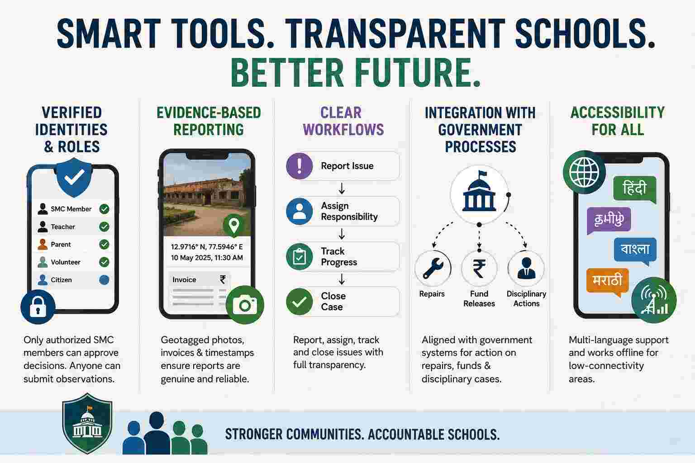

# Same Government, Similar Funding—Why Do Some Schools Thrive While Others Don't?


Why are some schools very well maintained while others are in terrible condition in India? What's the reason, despite being under the same government with similar funding?


There isn't a single reason. Even under the same state government, government schools can perform very differently because many important decisions are made at the district, block, and school levels.

Some of the biggest reasons are:

### 1. **Leadership of the headmaster**

   * A motivated headmaster can keep the campus clean, ensure teachers attend regularly, involve parents, and use available funds effectively.
   * A weak administration can result in poor maintenance even if the school receives similar funding.
### 2. **Local administration**

   * District and Block Education Officers differ in how closely they monitor schools.
   * Some conduct regular inspections and quickly address problems, while others do not.

### 3. **Community involvement**

   * Schools with active School Management Committees (SMCs), parents, and local volunteers are often cleaner and better maintained.
   * When the community expects high standards, schools tend to perform better.

### 4. **Teacher culture**

   * In some schools, teachers take ownership beyond teaching by organizing cleanliness drives, maintaining gardens, and encouraging students to care for the campus.
   * In others, maintenance is viewed as someone else's responsibility.

### 5. **Student enrollment**

   * Schools with higher enrollment often receive more attention and resources.
   * Schools with very few students may receive less priority and gradually deteriorate.

### 6. **Infrastructure age**

   * Some schools have recently been renovated under government schemes.
   * Others may have buildings that are 30–50 years old and need major repairs that exceed routine maintenance budgets.

### 7. **Use of available funds**

   * Government schools usually receive grants for maintenance, but the effectiveness of spending varies.
   * Delays, poor planning, or administrative inefficiency can leave schools in poor condition.

### 8. **Political and bureaucratic attention**

   * Schools visited by senior officials, elected representatives, or local media often receive quicker repairs.
   * Remote schools may be overlooked for long periods.

### 9. **Socioeconomic conditions**

   * Schools in wealthier or more organized communities often benefit from donations, alumni support, or corporate social responsibility (CSR) initiatives.
   * Schools in poorer areas may lack these additional resources.

### Why this happens despite the same government

Think of it like two hospitals under the same health department. They have the same policies and similar funding rules, but one may have excellent management while another struggles due to poor administration and oversight. The same principle applies to schools.

In India, education is **highly decentralized**. State governments set policies and budgets, but implementation depends on district officials, school leadership, teachers, local governments, and communities. As a result, two schools just a few kilometers apart can have dramatically different outcomes.

If the goal is to improve government schools, one lesson from these differences is that **governance and accountability often matter as much as funding**. Many well-maintained government schools succeed not because they receive vastly more money, but because they have strong leadership, active community participation, and effective oversight.

## Open Source Decentralized Governance App for School Management Committees

What we need is an open-source, decentralized governance app for School Management Committees (SMCs) that registers all parents and community leaders in the locality.

> **This is important.**
>
> **We need a decentralized, open-source app for parents and volunteers, perhaps built on Nostr, to hold school management accountable and enable regular fund audits with full transparency.**
>
> **School Management Committees (SMCs)** could use it to improve accountability and public oversight.


A decentralized, open-source platform could help by:

* Increasing **transparency** through public records of maintenance issues, budgets, and repairs.
* Enabling **community participation**, allowing parents, SMC members, teachers, and volunteers to report problems and track progress.
* Creating an **audit trail** so fund utilization and procurement decisions are easier to review.
* Reducing dependence on a single organization to host or control the platform.

That said, decentralization alone won't solve accountability. A successful system would also need:

### Verified Identities and Roles

Only authorized School Management Committee (SMC) members should be able to approve budgets, spending, or official decisions. At the same time, anyone—parents, students, teachers, or community members—should be able to submit observations, report issues, and provide feedback.

### Evidence-Based Reporting

Every report should be backed by evidence, such as geotagged photos, invoices, receipts, and timestamps, to reduce false or misleading reports.

Photos taken on most modern smartphones are automatically geotagged by default, embedding GPS coordinates (latitude, longitude, and often altitude) into the image's EXIF metadata. This helps verify where and when a photo was taken.

### Clear Workflows

The system should provide clear workflows for reporting issues, assigning responsibility, tracking progress, approving completed work, and closing cases. Every step should be transparent and auditable.

### Integration with Government Processes

Repairs, fund releases, teacher transfers, disciplinary actions, and other administrative decisions ultimately require action by education authorities. The platform should integrate with existing government processes rather than attempting to replace them.

### Accessibility

The platform should support regional languages and work reliably in offline or low-connectivity environments, since many government schools have limited or unreliable internet access. It should be simple enough for parents, teachers, and community members with varying levels of digital literacy to use.

## Why Decentralized App SDK like Nostr?

Using **Nostr** could make sense for publishing transparent, censorship-resistant updates and community discussion. However, sensitive information (such as personal data or financial documents containing private details) would need appropriate privacy protections rather than being publicly broadcast.

Overall, the core principle—using open technology to strengthen the role of **School Management Committees (SMCs)** and increase transparency—is a reasonable and practical direction. The effectiveness would depend more on the governance model and adoption than on the choice of technology itself.




## How functional are School Management Committees?

[According to a 2012 study](https://old.ccs.in/internship_papers/2012/271_how-functional-are-school-management-commitees-in-the-present-context_sijan-thapa.pdf), School Management Committees (SMCs) were often ineffective in practice. While we require the most recent data, I don’t believe the situation has significantly improved by 2026. In many places, SMCs appear to exist more as a formal requirement or in paper than as an active institution of school governance.

The study found that many parents were not fully aware of the challenges facing their schools. Out of 20 parents interviewed, only 2 could identify the most basic and visible problems, such as teacher shortages or inadequate infrastructure like desks and benches. Only 6 out of 20 parents could clearly describe how their children were performing academically. These findings suggest that parental engagement and awareness were limited, making it difficult for SMCs to function effectively as accountability mechanisms.

### The Authority Gap: Why SMCs Cannot Spearhead Transformation

A deeper issue is that SMCs are often expected to identify and report problems, but are given very limited authority to solve them. If a school lacks teachers, the committee can usually only escalate the issue to higher authorities and wait for action. If student attendance is poor, or if a teacher is absent for extended periods beyond approved leave, the committee's role is often limited to reporting the matter rather than addressing it directly.

For SMCs to become meaningful governance institutions, they may need greater authority, clearer responsibilities, and stronger accountability mechanisms, and **better governance design**, like **approval voting or reputation based system** to select robust leadership. Members are more likely to take ownership of school outcomes when they have both responsibility and the power to act. A governance system that combines transparency, community participation, and practical decision-making authority could make SMCs far more effective than they are today.


## Building Transparent Online School Governance with Nostr, Decentralized Identity, and Verifiable Online Voting

One way to make School Management Committees (SMCs) more effective is to move governance and elections online using open, verifiable protocols.

[Nostr](https://nostr.org/) already provides a foundation through cryptographically signed messages. Every action, proposal, comment, vote, and audit record can be signed by a user's private key, creating a transparent and tamper-evident record of governance activities.

The missing piece is a [decentralized identity layer](https://crates.io/crates/ssi). A network of decentralized DID validators could issue credentials that prove three important things:

1. **Proof of Personhood** — ensuring that each participant represents a real individual and preventing duplicate or fake accounts.
2. **Proof of Locality** — ensuring that only parents, guardians, teachers, or community members associated with a particular school can participate in its governance.
3. **Proof of Expertise** — ensuring that participants who claim specialized knowledge have their qualifications, portfolio, work history, achievements, publications, certifications, or other evidence evaluated. Once verified, they receive one or more specialization tags (such as Education, Child Psychology, Civil Engineering, Finance, Public Health, Agriculture, or Information Technology). These tags allow the community to identify subject-matter experts, create expert councils, and provide informed recommendations on technical matters.

Once identities are verified, communities could use [approval voting](https://electionscience.org/education/approval-voting), score voting, or other [reputation-based voting systems](../computer/algorithm/bayes-reputation.md)) to elect SMC leaders, prioritize projects, allocate budgets, and make collective decisions.

Unlike traditional elections, all votes would be publicly auditable. Anyone could independently verify the vote count and election outcome using cryptographic signatures, eliminating many opportunities for manipulation, tampering, or opaque decision-making. Transparency would not depend on trusting a central authority but on publicly verifiable records.

This approach does involve a trade-off: votes would be open rather than secret. While secret ballots are important in high-stakes political elections, community governance within a school context may benefit from greater transparency. Because decisions are local, participation is ongoing rather than one-time, and elections can use multi-winner and consensus-oriented voting systems, the risk of coercion are lower than in traditional political contests.

The goal is not merely to digitize existing committees but to create a governance system where participation, accountability, elections, budgeting, and audits are transparent, verifiable, and accessible to every member of the school community.


## Solving the Vote Tally Problem with Federated Trusted Relays

One of the hardest problems in decentralized voting is not counting votes, but determining **whether a vote was submitted before the election closed**.

In a Nostr-based system, every vote is cryptographically signed by the voter, making it easy to verify both the identity of the voter and the integrity of the vote. However, digital signatures alone do not solve the timing problem. A voter could attempt to submit a vote before the election officially begins or after it has already closed. Since users control their own devices and system clocks, client-side timestamps cannot be considered reliable evidence of when a vote was actually cast. As a result, the system requires an independent mechanism to determine whether a vote was received within the valid voting period.

The simplest solution is to **rely on relay timestamps**, but in a decentralized network there may be many relays, each with different clocks and policies. If one relay accepts a vote before closing and another accepts it after closing, which relay should be trusted for the final tally?

A practical solution for School Management Committee (SMC) governance is to use a federation of trusted relays.

#### Trusted School Relays

Instead of trusting a single relay, the election relies on multiple independent relays representing different stakeholders:

* School Relay
* District Relay
* Parent Association Relay
* Teacher Association Relay
* More trusted relays.

**A vote is considered valid only if it is received and acknowledged by at least two-thirds of the trusted relays before the election closes.** This federated approach prevents any single relay from unilaterally influencing the outcome while ensuring that the election can continue to operate reliably even if some relays are temporarily offline, misconfigured, or acting maliciously.


After the election closes, each relay independently collects all valid votes and produces an identical deterministic tally.

```rust
let votes = collect_votes();

votes.sort_by_key(|v| v.id);

let root = merkle(votes);
```

Each relay then publishes a signed election result containing the Merkle root of all accepted votes:

```json
{
  "kind": 30055,
  "election_id": "school-budget-2026",
  "merkle_root": "..."
}
```

Because the vote list is sorted deterministically before hashing, every honest relay should compute the same Merkle root. Any participant can independently download the votes, recompute the Merkle tree, and verify the published result.

This approach does not eliminate trust entirely. Instead, it distributes trust among multiple stakeholders—schools, parents, teachers, and district authorities—making manipulation significantly more difficult. The result is a voting system that remains transparent, auditable, and cryptographically verifiable while still supporting election start and end periods.

### A synchronization window (like a week) after the election closes

In a distributed network, internet lag and slightly unsynchronized server clocks mean different relays might record slightly different arrival times for votes right at the deadline. If the system forces an instant tally the exact second the election closes, these minor delays cause relays to compute conflicting results.

A synchronization window fixes this by adding a buffer period—such as one week—between the voting deadline and the final tally. Instead of rushing to count votes instantly, the relays use this time to communicate and share their logs. 

During this window, relays can easily resolve delayed messages, correct minor clock differences, and recover from any temporary internet drops. By the time the sync week ends, every relay has reconciled their data and holds the exact same complete list of valid votes. (A vote is considered valid only if it is received and acknowledged by at least two-thirds of the trusted relays before the election closes.) When they finally sort the votes and compute the Merkle root, they are guaranteed to produce one identical, unified result.


### The "Proof of Receipt" Problem (The Oracle Problem)

Let’s say you fix the math and use a simple majority (3 out of 5). Now, 3 honest relays can successfully count a vote. But what if a colluding relay decides to lie during the 1-week sync phase?

**The Attack**: A parent sends a vote. The malicious School Relay receives it at the TCP/IP layer, but decides to drop it from its internal database. During the sync week, the School Relay tells the network: "I never received that vote."

**The Defense Failure**: Because standard Nostr relays do not share a public, cryptographic mempool, the other 4 relays have no cryptographic proof that the School Relay actually received the packet. The honest relays cannot prove the School Relay is lying; they just have to accept its word that the vote never arrived.

In a distributed system, if a node can lie about its local state without cryptographic proof, the system is not secure against collusion.

#### Solution to "Proof of Receipt" Problem

In a local, known-stakeholder environment like a school, the design leverages **redundancy** and **social accountability** to effectively neutralize the threat of a malicious relay. 

*   **Redundancy Exposes Lies:** Because a voter's client publishes the vote to multiple relays simultaneously, the honest relays hold copies of the vote. If the School Relay lies during the sync week and says, "I didn't get it," the other relays can simply say, "We got it, and we know you were online." The lie is immediately exposed.
*   **Social Slashing as a Deterrent:** In a school community, the entities running the relays (the administration, the district board, the PTA) are known, real people. If a relay is caught dropping votes, the community can publicly expose them and remove them as a trusted node. The reputational and professional damage is a massive deterrent.
*   **Approval Voting Raises the Attack Cost:** Its hit the nail on the head regarding the math. In a multi-winner approval voting system, dropping 2 or 3 votes does almost nothing to change the final outcome. To actually flip an election, a malicious relay would have to censor a massive percentage of the total votes. But censoring hundreds of votes would be instantly detected by the other relays, triggering the social consequences mentioned above.

**The Takeaway:**
One don't necessarily need heavy, complex cryptography (like Zero-Knowledge Proofs) if your threat model relies on **social accountability**. 

For a School Management Committee, a transparent federation where lies are easily caught by redundant nodes—and heavily punished by the community—is a highly practical and realistic architecture.


### Reliable Vote Delivery Using Iroh Gossip Between Trusted Relays

In standard Nostr, relays do not forward events to each other. This means a voting client must individually push every vote to each trusted relay (School, District, PTA, etc.). If a parent's phone has poor connectivity or the app closes early, the vote might only reach one relay out of five. Since the system requires a two-thirds quorum to validate a vote, a perfectly legitimate vote can be silently dropped simply because the client device failed to deliver it to enough relays.

To solve this, the trusted relays form an [Iroh gossip swarm](https://docs.iroh.computer/connecting/gossip). Iroh gossip is a peer-to-peer broadcast protocol where nodes automatically propagate messages to all subscribers of a topic using epidemic broadcast trees. Instead of the client struggling to maintain connections to multiple relays, it pushes the vote to any single relay in the swarm. Iroh then reliably spreads that vote to all other relays, automatically retrying and routing around failures.

This means the client device only needs to successfully reach one relay to guarantee the vote reaches the entire federation. The relays themselves handle the redundancy, ensuring every vote is replicated across all trusted nodes before the synchronization window begins. This removes the weakest link—the voter's phone—from the reliability chain while keeping the system fully decentralized among the trusted stakeholders.
