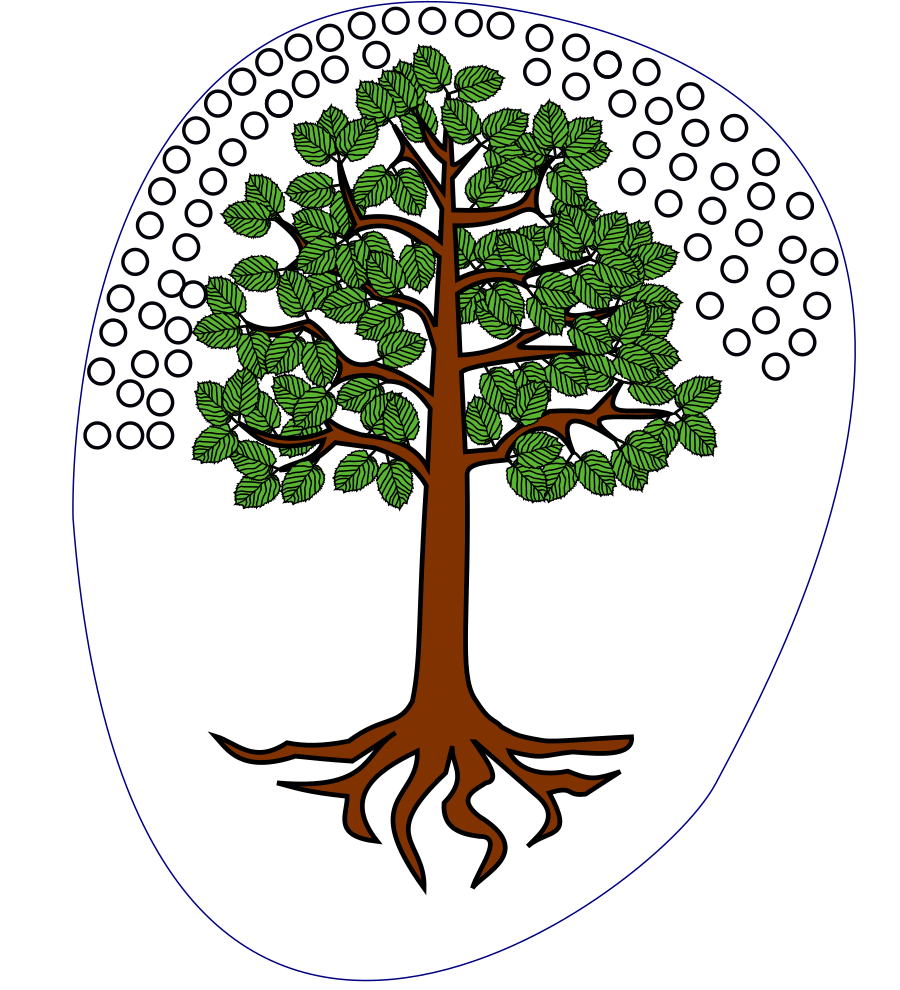
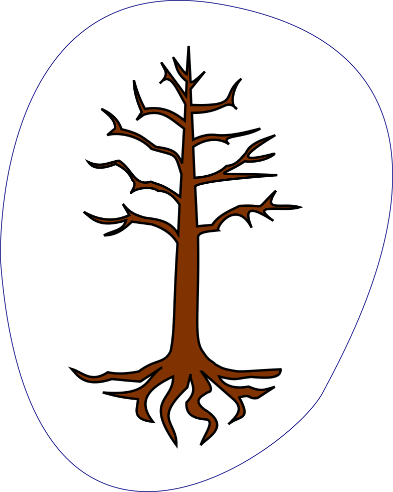
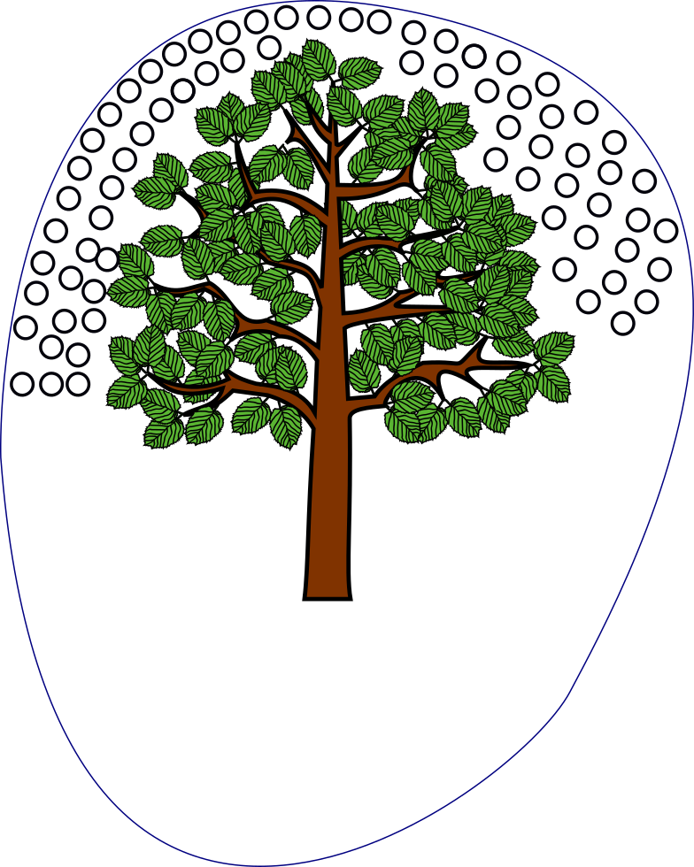
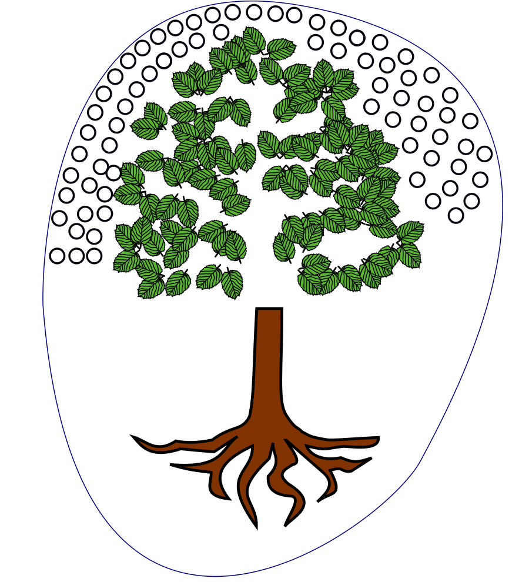

**Let's start with a Twitter Joke:**  
Conversation over breakfast.  
ME: Whoa, you lost another tooth?  
A: Yes!  
ME: Why didn't you tell me?  
A: I'm conducting an experiment. If I lose a tooth and don't tell anyone, will the tooth fairy still come? If not, then I know the tooth fairy isn't real.  
ME: ...  
HUSBAND: 😮  
  

### A small introduction to true experiments

#### True experiments involve changing one variable and then measuring another.

A variable is any factor, trait, or condition that can exist in differing amounts or types.  
  
The two main variables in an experiment are the independent and dependent variable.  
  
An independent variable is a variable that is changed or controlled in a scientific experiment to test the effects on the dependent variable.  
  
A dependent variable is a variable being tested and measured in a scientific experiment.  
  
Independent variable: Cause  
Dependent variable: Effect  
The researcher is looking for the possible effect on the dependent variable that might be caused by changing the independent variable.  
  
Only one change is made at a time, and results are checked.  

  

### The Experiment

**Hypothesis:**  
  
**_Test whether the reason for water droplets in polythene bag containing a plant is: leaves_**  
  

  
  
Here two variables are:  
1) Dependable variable: Formation of water droplets in a polythene bag.  
2) Independent variable:  Cutting out different parts of a plant (leaves, stem, root).  
  
Collect different kinds of herbaceous plants with its root attached, such are a rose, basil (tulsi), marigold, croton etc.  
  
**Why is control group used?**  
**_The presence of a control group helps scientists rule out alternate causes for any observed results._**  
Negative control groups **exhibited no effects** when compared to the treatment group.  
Positive control group **exhibits a specific expected effect.**  
  
We take a positive control group with polythene bag containing the real whole plant.  
And a negative control group with polythene bag containing a fake plastic plant.  
  
Now we modify the independent variable, i.e. **remove** a part of a plant, and check what happens to the dependant variable, that is whether water droplets in the polythene bag are formed or not.  
  
The experiment gave the following results.  
  

<table align="center" cellpadding="0" cellspacing="0" style="margin-left:auto;margin-right:auto;text-align:center;"><tbody><tr><td style="text-align:center;"></td></tr><tr><td style="text-align:center;">No leaves, no water droplets</td></tr></tbody></table>

  

<table align="center" cellpadding="0" cellspacing="0" style="margin-left:auto;margin-right:auto;text-align:center;"><tbody><tr><td style="text-align:center;"></td></tr><tr><td style="text-align:center;">No root with water droplets</td></tr></tbody></table>

<table align="center" cellpadding="0" cellspacing="0" style="margin-left:auto;margin-right:auto;text-align:center;"><tbody><tr><td style="text-align:center;"></td></tr><tr><td style="text-align:center;">No stem with water droplets</td></tr></tbody></table>

  
  

### **Inquiry and Argumentation:** 

Does the experiment supports your hypothesis i.e. is your hypothesis true?  
**How do you know** leaves contributed to most of the water droplets in polythene bag?  
  
Do you think other parts of the plant also contributed to the production of water droplets in the polythene bag?  
  
**How do you know** stem is not the reason for the production of water droplets?  
  
**Imagine**, it was root, not the leaves that produced water droplets. What will be the results of the experiment? Modify the diagram, showing that root was producing water droplets.  
  
**How do you know** it was a part of a plant that was producing water droplets, and water droplets didn't come from the air? Explain it using the importance of positive and negative control group.  
  
**What if** water produced in polythene bag was much more or much less than the water produced in the positive control group?  
  
If the experiment has failed to produce the water droplets, what conclusion will you draw and why?
