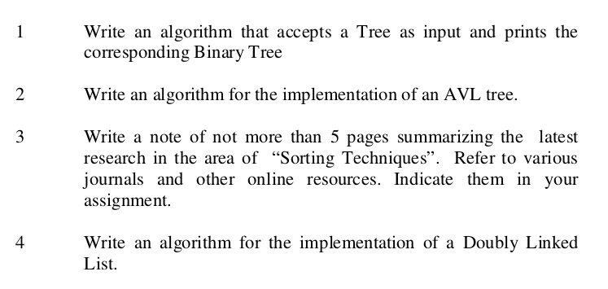

**Study material covers the latest developments on the subject**  
No, seems it is not updated since 2010. e.g.  It talks about popular browser of Linux are Netscape Navigator.  
  
**The contents of the study material are well organized**  
Yes, the organization of content is too good. Learning objectives, then content based on learning objectives, practice questions after each section. Space at the margin to take notes.  
  
**Aim and objectives of the courses are clearly explained in study materials**  
No, Even though it uses narration techniques, it does a good job in introduction sections, but it fails to explain intelligibly for concepts that are hard to understand and are abstract. Also, the text is ambiguous, confusing without precise definitions and language.  
  
**The study materials provided a broad overview in the field of knowledge**  
Yes. The learning objectives cover broad overview. But MCA lacks choice and diversity.  
Programming languages like python and R should be introduced in MCA. Version controlling git must also be taught. Other advanced elective subjects like cryptography, blockchain can be added.  
  
**Instructional materials made the subject interesting**  
Same answer that of 3rd point.  
  
**Self-assessment activities in study materials encourage for critical analysis of contents**  
The answer is mixed. Some questions are good, but in some units, questions have completely ambiguous answers. In order to attempt these questions, one needs a thorough comprehension of the text, but material fails to do it. It leads to rote memorization of answers.  
  
**The study load is too heavy**  
Nope, with enough support from the teacher and right content quality, it will not take much time to finish. Also one has to be supported from first semester itself, as all subjects of later semester are linked with the previous semesters. e.g. Students not knowing about pointer (first-semester topic) can't do programming of a linked list (second-semester topic) in C.  
  
**Syllabus tries to cover too many topics**  
No, The same answer that of the 4th point  
  
**Numbers of counseling sessions adequately cover the theoretical aspects**  
No, classes can be conducted on both Saturdays and Sundays. It's important that classes are productive. Some teachers only try to finish the curriculum, knowledge transfer to students are almost zero. It is completely a time wasting work for both students and teachers.  
  
**Counseling schedule was convenient**  
Yes, counseling schedule is done on Sundays and holidays and is completely convenient. But one can add Saturdays to it.  
  
**Counselors demonstrated mastery of the subject matter**  
Yes, some counselors demonstrated mastery of the subject, not all. All counselor must use effective study strategies. ([http://www.learningscientists.org/](http://www.learningscientists.org/)) Counselors need not have to be expert but must show excellent leadership and provide correct resources. Should inquire the understanding of each component of topics by questioning and discussion.  
  
**Required software were made available during the practical sessions**  
Yes, but still better software can be used e.g. use of Linux is rare or no use of ide such as sublime text.  
  
**Regarding Assignment:**  
Students should submit assignment every week, instead of the end of the semester. Online platform can be created for submission. All most all students finish the assignment in last hours, through copy paste.  
  
Assignment should be divided based upon learning objectives of modules. The present assignment system requires knowledge of complete semester to attempt even a single question, and students has only a week to complete these assignments.  
  

  

  
Submitting assignment weekly or biweekly causes spacing of learning, will also decrease the malpractice, provided the questions are doable in given time, and are sync with the classroom lectures. Quality of questions also matter a lot and should be relevant and worthful, allowing to learn one component at a time.  
  
  
**Retrieval practice**  
15 mins no stake exams can be conducted during every class for retrieval. To make it easier for teachers, questions can be designed and given to them based on the content by experts.
