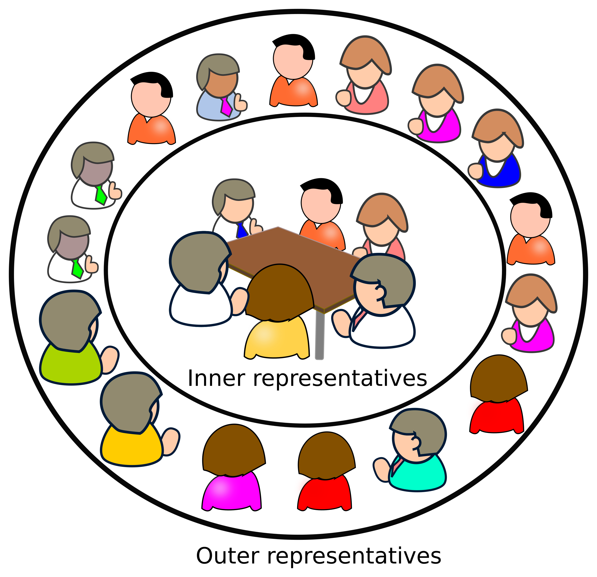
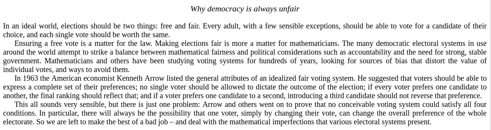
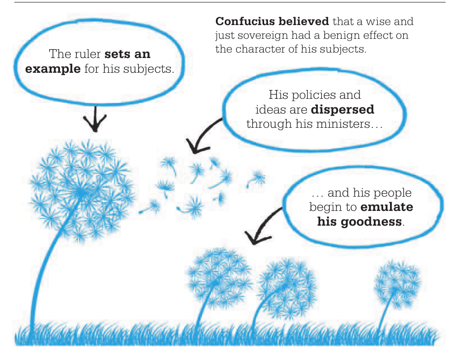
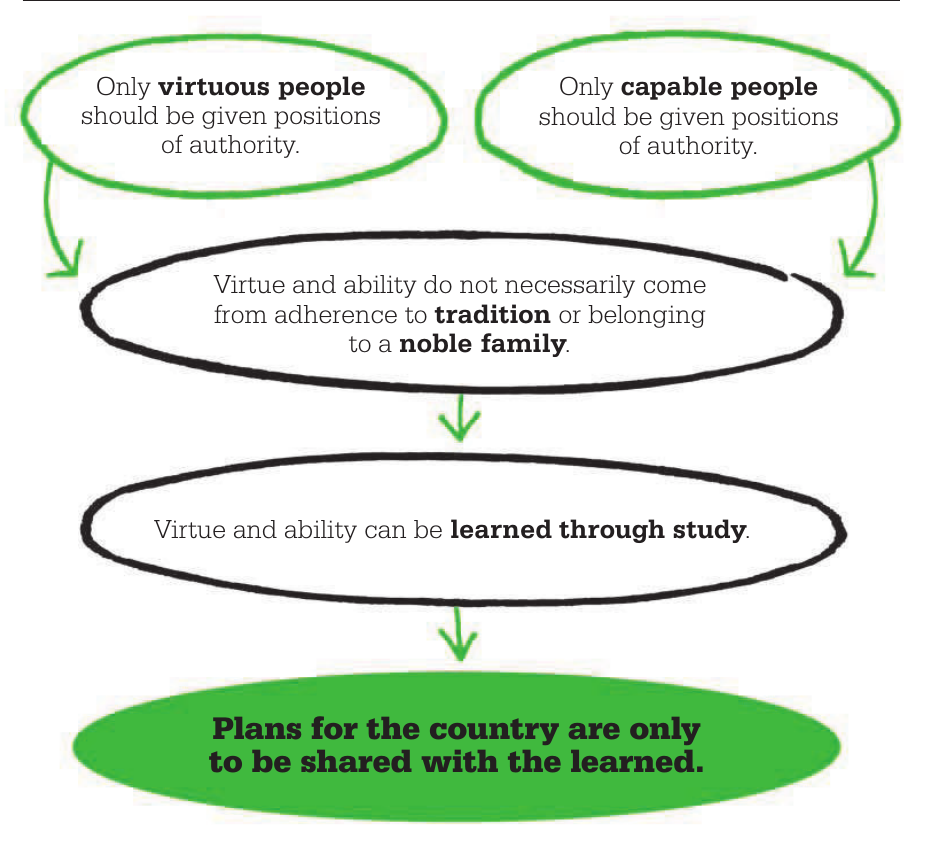

Preprint link: [https://osf.io/82mpk/](https://osf.io/82mpk/)

**dem·oc·racy** \[democracy democracies\]

1) fair and equal treatment of everyone in a country or organization, etc, and their right to take part in making decisions

2) a system of government in which all the people of a country can vote to elect their representatives

Yes, most democratic countries fulfill the second definition of democracy, but none to the first definition.

**Abstract:**

> Democracy is about fair and equal treatment of everyone in a country. But it becomes unrealistic to achieve when political parties have their **conflict of interest**, and leaders don't have the expertise to make **evidence-based policies** and neither have the skill and manpower for solving problems that surround our society and ecosystem. The new fair democracy provides an elegant way of governance that separates the representative responsibility according to their specialization and can grow into any complexity. The governance is divided into various departments, and each department is supervised by representatives with expertise in the field. Voters need to have enough knowledge about the departments and their problems, in order to vote for the selecting representatives of a department. The selection process of representatives is “_difficult in and easy out_”, which allows only **utilitarian actors** to hold the responsibility, weeding out frivolous ones.

**Why Democracy is always unfair?** 

In an ideal world, elections should be two things: free and fair. Every adult, with a few sensible exceptions, should be able to vote for a candidate of their choice, and each single vote should be worth the same.

Ensuring a free vote is a matter for the law. Making elections fair is more a matter for mathematicians. The many democratic electoral systems in use around the world attempt to strike a balance between mathematical fairness and political considerations such as accountability and the need for strong, stable government. Mathematicians and others have been studying voting systems for hundreds of years, looking for sources of bias that distort the value of individual votes, and ways to avoid them.

In 1963 the American economist Kenneth Arrow listed the general attributes of an idealized fair voting system. He suggested that voters should be able to express a complete set of their preferences; no single voter should be allowed to dictate the outcome of the election; if every voter prefers one candidate to another, the final ranking should reflect that; and if a voter prefers one candidate to a second, introducing a third candidate should not reverse that preference.

This all sounds very sensible, but there is just one problem: Arrow and others went on to prove that no conceivable voting system could satisfy all four conditions. In particular, there will always be the possibility that one voter, simply by changing their vote, can change the overall preference of the whole electorate. So we are left to make the best of a bad job – and deal with the mathematical imperfections that various electoral systems present.

\-- [How Numbers Work, New Scientist](https://www.amazon.in/How-Numbers-Work-beautiful-mathematics-ebook/dp/B072FVMJP4)

[Electoral dysfunction: Why democracy is always unfair](https://www.newscientist.com/article/mg20627581-400-electoral-dysfunction-why-democracy-is-always-unfair/)

**But there is a way where we can meet too close to the first definition.**  
Its called Delegated Proof of Stake or DPoS algorithm used to run decentralized blockchain.

> **Game theory** is about all kinds of strategic interactions among self-interested agents including those frivolous ones but also much more serious ones.

To know more about DPoS please go through the link:

**Explain Delegated Proof of Stake Like I’m 5**  
[https://hackernoon.com/explain-delegated-proof-of-stake-like-im-5-888b2a74897d](https://hackernoon.com/explain-delegated-proof-of-stake-like-im-5-888b2a74897d)

Explanation of what we can achieve with DPoS in Hindi:

https://soundcloud.com/amiya-behera-256954375/properties-of-fair-democracy

**What we can achieve with DPoS?**

1) Fair (treating people equally without favoritism or discrimination) and equal opportunity to succeed for each and everyone.

2)_Decentralized Democracy_, No authoritarian regime or no anarchical regime (leaderlessness or ignorant leaders lacking knowledge or good judgment) and no concentration of power, because the ability to approve policy is limited only to the concerned department who have the required expertise to make a decision.

3) _Evidence-based democracy_, Only evidence based policies are allowed, and representatives need to be experts in the field and each statement they make in the policy has to be backed by evidence and sound reasoning.

4) _No catch22 paradox_, that is people have true freedom to select their nominee for the election, and is not decided by political parties, voters have a very large pool of nominee out of which representatives can be selected and also people have true freedom to remove their representatives easily without the involvement of vested interest or party politics

> A catch-22 is a paradoxical situation from which an individual cannot escape because of contradictory rules or limitations..

5)_Collaborative democracy_, Collaborative problem solving, not by competition.  
As all representatives have almost an equal chance of getting remove if the behave frivolously (not having any serious purpose or value), they have to collaborate in order to solve a problem, not compete for each other.

7) __Infinitely Stable Democracy_,_ Indefinitely stable government, voting will continue in short intervals like 6 months, but the government will remain stable infinitely.

8) No nepotism (the practice among those with power or influence of favoring relatives or friends, especially by giving them jobs), frivolous one just can't stay.

9) _No conflict of interest democracy_, No in-group or out-group bias, representatives can take their individual stand, without considering the profit and loss of their alliance and opponent. Democracy design where conflict of interest is not plausible. Not a don't be evil design, but a can't be evil design.

> As there are no opponent parties with their self-interested goals, and representatives are experts in their respective fields, consensus to reach a decision will be more objective (not influenced by personal feelings or opinions; considering only facts) and justifiable.

  
10) _Evolutionary democracy_, that gets adapted and refined with an increase in efficiency and productivity of representatives with each election every 6 months, as bad candidates are removed by voters.

11) _Blockchain democracy_, without any middleman or brokers such as politicians (MPs, MLAs, PM, CM) and bureaucrats, who delay the implementation. People will transact directly with their service provider departments.

12) _Mega participation democracy_, with a massive number of expert representatives per department, who can implement policies collaboratively within a limited extent of time as it makes a decent ratio between population versus a department. Representatives will also assign tasks to voters, common citizens, and students to quickly get the job done by volunteering.

13) __Mobile and global democracy__, where boundaries between countries become obscure with time, the expertise of representatives matter, not the origin.

14) _Inclusive democracy_, people are not discriminated because of origin, color, gender, sexual orientation, type of job, culture, age, legacy, ethnicity, generation, genetic characteristics and disability.

If a leader's desire is for good, the people will be good.  
\-The Politics Book, Big Ideas Simply Explained

Virtue and Ability can be learned through study.  
Plans for the country are only to be shared with the learned.  
_\-The Politics Book, Big Ideas Simply Explained_

**How can we rebuild democracy with the present catch22 democratic system?**

A quarter of the world's population lives in countries that are not free. How do you bring down a dictator?

https://www.youtube.com/watch?v=utW1F-QuYq8

Video URL:  
[https://youtu.be/utW1F-QuYq8](https://youtu.be/utW1F-QuYq8)

## **The whole process of voting and how it can be done?**

## **[https://iambrainstorming.wordpress.com/the-whole-process-of-voting-in-a-dpos-country/](https://iambrainstorming.wordpress.com/the-whole-process-of-voting-in-a-dpos-country/)**

References:  
[https://en.wikipedia.org/wiki/Game\_theory](https://en.wikipedia.org/wiki/Game_theory)  
[https://en.wikipedia.org/wiki/Proof-of-stake](https://en.wikipedia.org/wiki/Proof-of-stake)  
[https://www.coursera.org/learn/game-theory-1](https://www.coursera.org/learn/game-theory-1)  
[https://en.wikipedia.org/wiki/Catch-22](https://en.wikipedia.org/wiki/Catch-22)

Explanation in Hindi:

Playlist:  
[https://www.youtube.com/playlist?list=PLzE\_RgoaLpqfYiBbSP7Z16Gg09GFJVMYs](https://www.youtube.com/playlist?list=PLzE_RgoaLpqfYiBbSP7Z16Gg09GFJVMYs)

https://www.youtube.com/watch?v=wvhtkTamTYw
