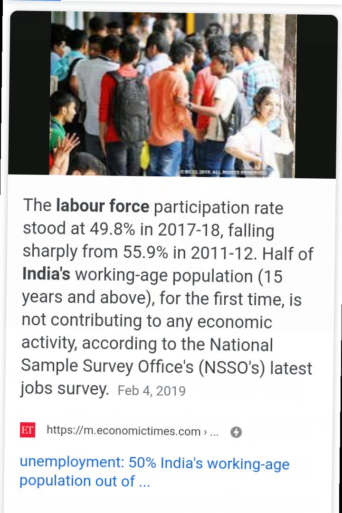
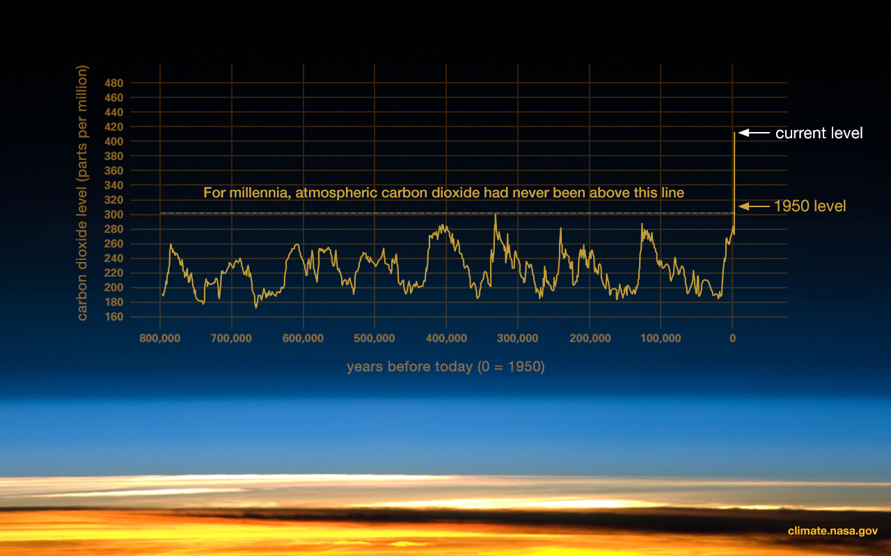
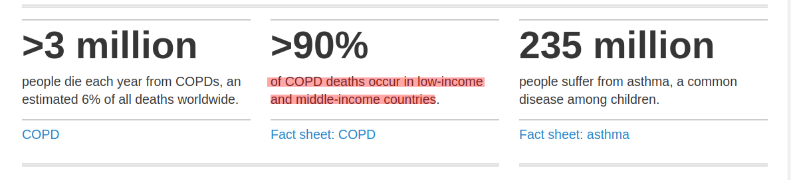
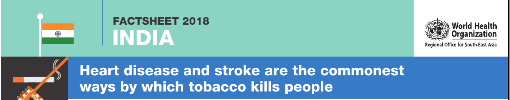
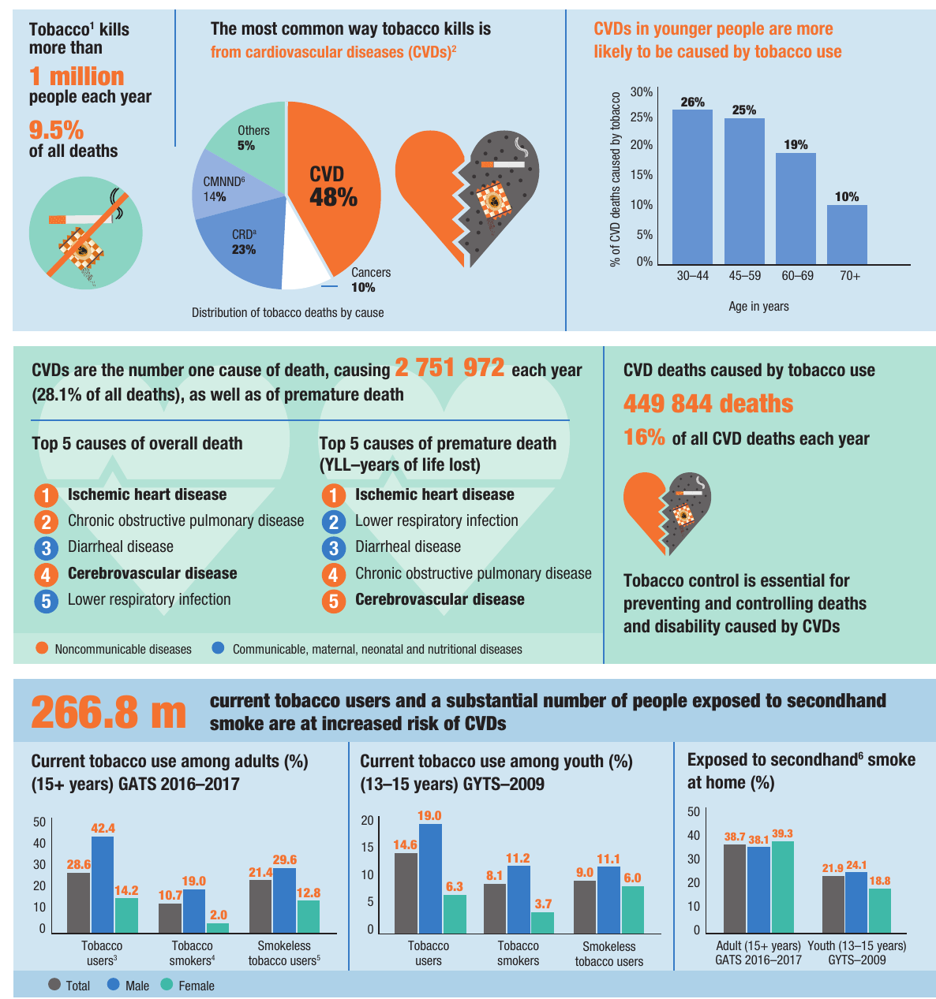
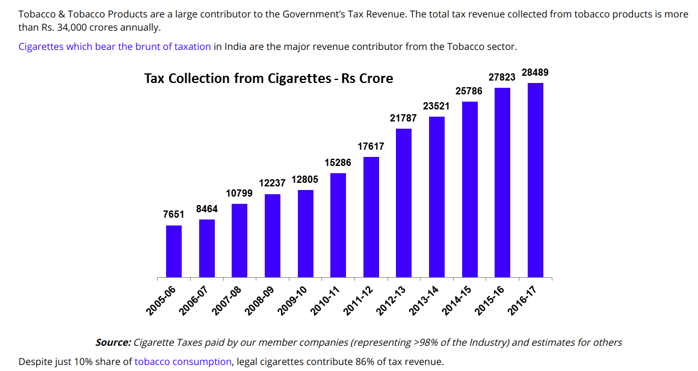
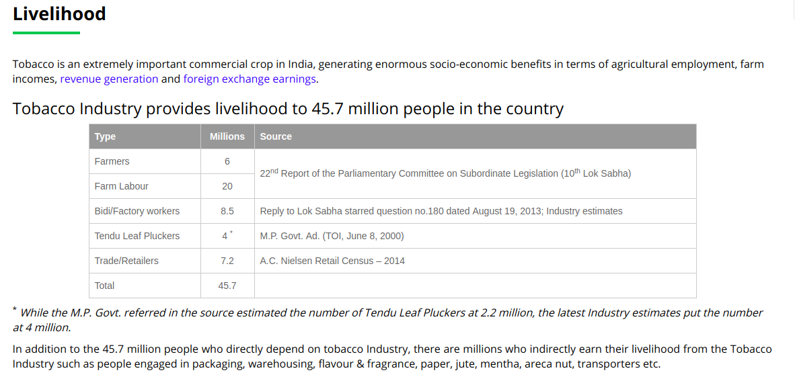

Generation Z will outnumber millennials in a year. By 2019, the third of planet will be 18 and under.

**How's their future in hypocritical democracy?**

https://www.youtube.com/watch?v=5IM-iw1KovE

## [**What is hypocritical democracy?**](https://iambrainstorming.blogspot.com/2019/01/from-hypocrisy-to-democracy-this-way.html) 

Also knows as baby eater democracy.

[https://iambrainstorming.blogspot.com/2019/01/from-hypocrisy-to-democracy-this-way.html](https://iambrainstorming.blogspot.com/2019/01/from-hypocrisy-to-democracy-this-way.html)

## **Unemployment**

Half of India’s working-age population (15 years and above), is not contributing to any economic activity 

[https://economictimes.indiatimes.com/jobs/50-indias-working-age-population-out-of-labour-force-says-report/articleshow/67830482.cms](https://economictimes.indiatimes.com/jobs/50-indias-working-age-population-out-of-labour-force-says-report/articleshow/67830482.cms)

#### [Insect (pollinators) population is in decline, but not the human population, disruption of the ecosystem.](https://www.scientificamerican.com/article/as-insect-populations-decline-scientists-are-trying-to-understand-why/)

[https://www.scientificamerican.com/article/as-insect-populations-decline-scientists-are-trying-to-understand-why/](https://www.scientificamerican.com/article/as-insect-populations-decline-scientists-are-trying-to-understand-why/)

UNSUNG HEROES

Many people tend to think of animals as large, furry, likeable creatures. In reality, insects are the dominant form of animal life. Close a million species have been described to date—compared with a paltry 5,416 mammals. And depending on who you ask, entomologists suspect there could be two to 30 times as many actually out there.

Not only that, but insects are linchpins of the living world, carrying out numerous functions that make life possible.

Insects pollinate a spectrum of plants, including many of those that humans rely on for food. They also are key players in other important jobs including breaking dead things down into the building blocks for new life, controlling weeds and providing raw materials for medicines. And they provide sustenance for a spectrum of other animals—in fact, the Puerto Rico study showed a decline in density of insect-eating frogs, birds and lizards that paralleled the insect nosedive.

#### [Climate Change](https://climate.nasa.gov/evidence/)

[https://climate.nasa.gov/evidence/](https://climate.nasa.gov/evidence/)

#### [THE EXTINCTION CRISIS](https://www.biologicaldiversity.org/programs/biodiversity/elements_of_biodiversity/extinction_crisis/)

It's frightening but true: Our planet is now in the midst of its sixth mass extinction of plants and animals — the sixth wave of extinctions in the past half-billion years. We're currently experiencing the worst spate of species die-offs since the loss of the dinosaurs 65 million years ago

#### **Plastic, plastic and more plastic in oceans**

> 6.5 million tons of litter enter the world’s Ocean each year. 50% is long-lasting plastic that will drift for hundreds of years before it is degraded.
> 
> [Ocean Pollution](https://www.worldoceannetwork.org/won-part-6/carem-wod-2014-4/thematic-resources-pollution/facts-figures-pollution/)

#### Air pollution

Expensive air purifiers in homes who can afford.

> Air pollution in India is estimated to kill 1.5 million people every year; it is the fifth largest killer in India. India has the world's highest death rate from chronic respiratory diseases and asthma, according to the WHO. In Delhi, poor quality air irreversibly damages the lungs of 2.2 million or 50 percent of all children.
> 
> https://en.wikipedia.org/wiki/Air\_pollution\_in\_Delhi  

#### Chronic respiratory diseases

\>90% of COPD deaths occur in low-income and middle-income countries. What's special in low-income countries?

[https://www.who.int/respiratory/en/](https://www.who.int/respiratory/en/)

## Tobacco kills more than 1 million people each year, but govt fails to ban tobacco.

## 42.4% of male adults are tobacco users.

**Revenue collection**

**[THE TOBACCO INSTITUTE OF INDIA](https://www.tiionline.org/facts-sheets/revenue/)**

Revenue collection increases every year. **But is it to be called as trade or economy?**

**An Economics Definition:**

> Economy in general \[is\] the art of providing for all the wants of a family, \[so the science of political economy\] seeks to secure a certain fund of subsistence for all the inhabitants, **to obviate every circumstance which may render it precarious**; to provide every thing necessary for supplying the wants of the society, and to employ the inhabitants ... in such manner as naturally to create reciprocal relations and dependencies between them, so as to supply one another with reciprocal wants
> 
> Sir [James Steuart](https://en.wikipedia.org/wiki/James_Steuart_(economist)) (1767) 

Politicians can give data about agricultural employment, but there are alternatives to tobacco agriculture, and these people can be trained in new areas of farming. But yes, it does require experts in responsibility.

### Bacteria and Competition: How it's similar to human?

**Why bacterial growth curve is so important?**  
It gives the idea to learn about the impact of competition in the simplest way. **It gives the answer what happens to a population when resources are limited.**

**Thrive, Survive, and Deteriorate**

[https://technoperiod.blogspot.com/2016/09/bacteria-and-competition-how-its.html](https://technoperiod.blogspot.com/2016/09/bacteria-and-competition-how-its.html)  

_**What policies should we make for family planning?**_

Education with content creation that promotes critical thinking a **must** to students and adult.

But are our boards doing any little for teaching rules of universe and rules of life?

**All books that don't meet the learning criteria must be taken off**

[https://technoperiod.blogspot.com/2017/01/all-books-that-dont-meet-learning.html](https://technoperiod.blogspot.com/2017/01/all-books-that-dont-meet-learning.html)

> Forget mars, we are bound to extinct in earth itself, if we don't stop all these nuisance.

> All these can only be solve by collaboration, not through competition. One's profit shouldn't be others loss. Its already too late, a little further late will accelerate the closeness to extinction.
> 
> [Collaborative Democracy](https://iambrainstorming.blogspot.com/2019/01/from-hypocrisy-to-democracy-this-way.html)
