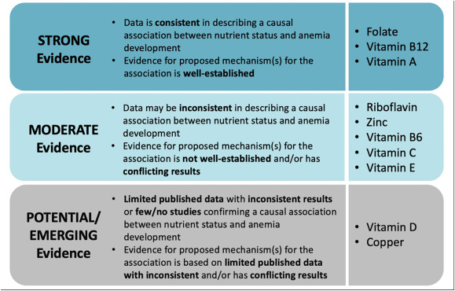

# Beyond Iron: Why India Needs a Holistic Approach to Tackle Anemia and Micronutrient Deficiencies

Date: 10-08-2026

India is currently grappling with a massive public health challenge that extends far beyond simple iron deficiency. According to the National Family Health Survey (NFHS-5), a staggering 67.1% of children and 59.1% of adolescent girls in India are anemic. Furthermore, 3 in 4 Indian women suffer from low dietary iron intake. 

The [geographical disparities in this crisis are stark](https://pmc.ncbi.nlm.nih.gov/articles/PMC10436448/). A recent study on the prevalence of anemia among children aged 6–59 months showed Mizoram with the lowest prevalence at 19.3%, while Haryana reported the highest at 71.7%. However, NFHS-5 data presents an even grimmer picture in certain regions, with Gujarat recording the highest prevalence at 79.7%, followed closely by Jammu & Kashmir and Madhya Pradesh (both at 72.7%), while Kerala reported the lowest at 39.4%.

Yet, focusing solely on anemia obscures a deeper, more complex issue: widespread micronutrient deficiencies. [A comprehensive study involving 11,237 children revealed](https://journals.plos.org/globalpublichealth/article?id=10.1371%2Fjournal.pgph.0002095) that while 40.5% were anemic, an alarming 60.9% suffered from micronutrient deficiencies with or without anemia. Furthermore, 30.0% of the children battled both anemia and concurrent micronutrient deficiencies. This data underscores a critical realization: treating iron deficiency alone is no longer enough.

### The Root of the Problem: Dietary Gaps and Coexisting Deficiencies
In developing countries like India, women and children often consume inadequate amounts of essential micronutrients due to a limited intake of animal products, fruits, vegetables, and fortified foods. This lack of dietary diversity leads to multiple coexisting deficiencies. 

The adverse effects of missing out on vitamin A, iron, and folic acid—ranging from night-blindness in pregnant and lactating women to severe iron-deficiency anemia—are well documented. However, low intakes of other vital nutrients, including zinc, calcium, riboflavin, vitamin B6, and vitamin B12, also have profound consequences for women's health, pregnancy outcomes, and the nutritional status of breastfed children. 

Compounding this issue is the economic reality of the Indian diet. Fruits, a crucial source of vitamins and antioxidants, have become prohibitively expensive—almost unaffordable for the middle class, leaving the poor disproportionately affected. Because multiple deficiencies coexist, the benefit of moving beyond single-nutrient interventions to multiple micronutrient supplements is becoming increasingly apparent.

[The Case for Promoting Multiple Vitamin And Mineral Supplements for Women of Reproductive Age in Developing Countries](https://journals.sagepub.com/doi/10.1177/156482659902000401)

### Why Iron-Folic Acid (IFA) Alone is Not Enough
Under the government's Anemia Mukt Bharat (AMB) strategy, Iron-Folic Acid (IFA) supplementation is tailored by age group and physiological needs. While this is a step in the right direction, just providing IFA supplements is insufficient. We must provide holistic multivitamin tablets alongside iron supplements.

For individuals who cannot afford a nutritious, diverse diet, multivitamins serve as an inexpensive form of "nutritional insurance" to prevent deficiencies in under-consumed nutrients like vitamin A, iron, calcium, and vitamin D. Research indicates that even in high-income countries, poor diets leave many at high risk of deficiency. For those with the poorest diets, taking a daily multivitamin can reduce the risk of deficiency from 70% to 30%. While supplements cannot replicate the full health benefits of a balanced diet—such as dietary fiber and phytonutrients—they provide a critical safety net for those with limited access to diverse, nutrient-rich foods.

### The Science of Treatment 
Treating anemia effectively depends entirely on identifying and addressing the underlying cause. This typically involves dietary changes, targeted supplements, or medical procedures:
*   **Iron-Deficiency Anemia:** Treatment centers on oral iron supplements (like ferrous sulfate) paired with iron-rich foods like lean meat, beans, and leafy greens. 
*   **Vitamin Deficiencies:** If the cause is a lack of specific vitamins, treatment involves Vitamin B12 shots or folic acid supplements. 

Notably, the Comprehensive National Nutrition Survey found that 63.5% of anemia cases in Indian children aged 1–4 y were not caused by iron deficiency, but rather by inflammation or deficiencies in folate and vitamin B12.

[The Role of Micronutrient Deficiencies in Nutritional Anemia Beyond Iron: An Expert Perspective on the Scope and Strength of the Current Evidence](https://www.sciencedirect.com/science/article/pii/S2161831326001110)

A 2020 Cochrane review of 26 studies involving ∼27,000 children in LMICs found that fortification with multiple micronutrient powders (MNPs) containing iron, zinc, and vitamin A reduced anemia risk by 18% and iron deficiency by 53%.

The risk of anemia was reduced with iron alone, iron-folic acid,  multiple micronutrient (MMN) supplementation, micronutrient powders (MNPs), targeted fortification, and large-scale fortification. Stunting and underweight, however, were improved only among children who were provided with lipid-based nutrient supplementation (LNS), though MMN supplementation also slightly increased length-for-age z-scores. Vitamin A supplementation likely reduced all-cause mortality, while zinc supplementation decreased the incidence of diarrhea. Importantly, many effects of LNS and MNPs held when pooling data from effectiveness studies. 

[Micronutrient Supplementation and Fortification Interventions on Health and Development Outcomes among Children Under-Five in Low- and Middle-Income Countries: A Systematic Review and Meta-Analysis ](https://www.mdpi.com/2072-6643/12/2/289)

### Bridging the Gap: From Documentation to Implementation
The Indian government has heavily documented its strategies to fight anemia, but on-the-ground implementation remains scarce. To truly combat this hidden hunger, systemic changes are required:

1.  **Subsidized Multivitamins:** Multivitamins containing iron, vitamin C, and B12 need to be heavily subsidized and made widely available to the public.
2.  **Revamping Janaushadhi Kendras:** Currently, Janaushadhi Kendras often lack stock of comprehensive multivitamins and do not provide specific multivitamin formulations for children. This supply chain gap must be urgently addressed to make nutritional insurance accessible to the masses.
3.  **Empowering Anganwadi Workers:** Anganwadi workers are the backbone of rural child and maternal health. They need to be equipped and mandated to distribute holistic multivitamins, rather than relying solely on standard IFA tablets.
4.  **Dietary Reforms:** Meat and eggs must be actively incorporated into daily meals and dietary guidelines to provide high-quality bioavailable iron and B12. 
5.  **Agricultural Expansion:** To address the high cost of fruits, India needs to massively expand its fruit cultivation. This dual-purpose initiative would not only lower the cost of essential vitamins for the middle class and the poor but also help fight climate change through increased tree cover.

### The Fruit Economics: A Nutritional Necessity Priced Out of Reach
Fruit prices are almost unaffordable for the middle class, and the poor are worse hit: in most low-income households, fruit has simply vanished from the plate. The numbers are shocking — [surveys have found per capita household fruit intake of just 15 grams per day in rural India and 29 grams in urban India](https://pubmed.ncbi.nlm.nih.gov/29459786/), a fraction of the [WHO's recommendation of at least 400 g/day of fruits and vegetables combined (excluding tubers)](https://pmc.ncbi.nlm.nih.gov/articles/PMC7063694/).

**Why are fruits so expensive?** It is a classic supply-side failure. Demand has risen with urbanization and nutrition awareness, but marketable supply is constrained by limited orchard area, seasonal gluts and shortages, and heavy post-harvest losses — India loses roughly 6–15% of its fruit across the chain due to poor handling, inadequate storage, and the absence of cold chains and temperature-controlled transport. Every crate that rots and every layer of middlemen margin is added to the retail price the consumer pays. The result is an equilibrium price that puts fruit beyond the reach of ordinary families.

**The solution is expansion, not exhortation.** Telling people to "eat more fruit" is meaningless while prices stay high; the only durable way to lower prices is to shift the supply curve outward. India must massively expand fruit cultivation — bringing wastelands, marginal lands, farm bunds, schoolyards and Anganwadi compounds under fruit trees, and promoting fruit-based agroforestry on farmland. The country has done it before: the area under fruit cultivation grew from 28.74 lakh hectares in 1991–92 to 70.49 lakh hectares in 2021–22, with production now around 114.5 million tonnes. But that expansion has clearly not kept pace with population and demand growth, which is why prices remain high. A deliberate, mission-mode push — more trees, higher productivity, and cold-chain investment to stop post-harvest waste — would increase marketable supply, intensify competition between producing regions, smooth seasonal price spikes, and bring retail prices down to a level where the middle class can eat fruit daily and the poor can eat it at all. Cheaper fruit means more dietary vitamin C, which means better absorption of whatever iron a person consumes — directly attacking anemia at the dietary level.

While traditional fruits like mango and guava are highly beneficial, India’s fruit-tree mission should not stop there. We should expand cultivation to include a much wider diversity of native and well-adapted fruits, such as amla, citrus, pomegranate, papaya, native berries,, sapeta (chikoo), jackfruit,, Bael, Jamun, Ber, Tamarind, Mahua, Karonda,, Ambada, Kokum, Palmyra, Cashew, Kamranga.

A more diverse fruit canopy can provide a broader spectrum of essential micronutrients and phytochemicals while improving dietary diversity. Promoting locally adapted fruit trees can also strengthen food security, support biodiversity, and make nutritious foods more accessible to communities across India.

The goal should not simply be to plant more fruit trees, but to build a diverse, resilient, nutrition-rich fruit ecosystem suited to India’s different climates and regions.

**The climate dividend.** Fruit expansion is not just a nutrition policy; it is a climate policy. Unlike annual crops, fruit trees are perennial woody plants that lock carbon away for decades in trunks, roots, and soil — reviews estimate that above- and below-ground biomass of fruit trees can sink more than 40% of carbon, and argue that agroforestry should adopt all suitable fruit species. Studies of mango and guava agroforestry systems show they store significant carbon while being up to five times more profitable than conventional cropping, and high-density orchards such as apple have demonstrated especially strong mitigation potential. At the national scale, expanded agroforestry in India could sequester roughly 134 million tonnes of CO₂ per year by 2050. Orchards also green wastelands, stabilize soil, improve water retention, and support pollinators. In short, planting fruit trees is a rare triple win: cheaper nutrition for the masses, higher incomes for farmers, and a measurable contribution to India's climate commitments.

### Conclusion
India's battle against anemia cannot be won with iron tablets alone. The high prevalence of coexisting micronutrient deficiencies demands a holistic, multi-pronged approach. By shifting our focus from isolated iron supplementation to comprehensive multivitamin distribution, subsidizing essential nutrients, and reforming our agricultural and dietary frameworks, we can provide true "nutritional insurance" to millions. It is time to move beyond documentation and ensure that the right nutrients reach the right people, securing a healthier future for India's women and children.
