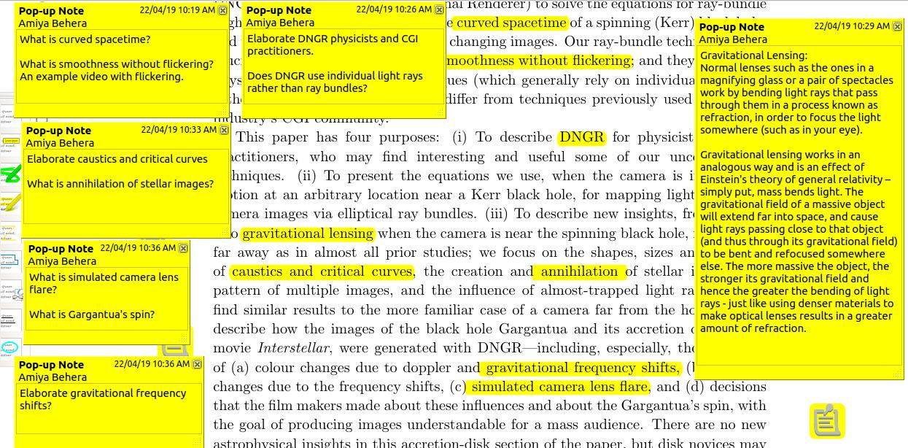
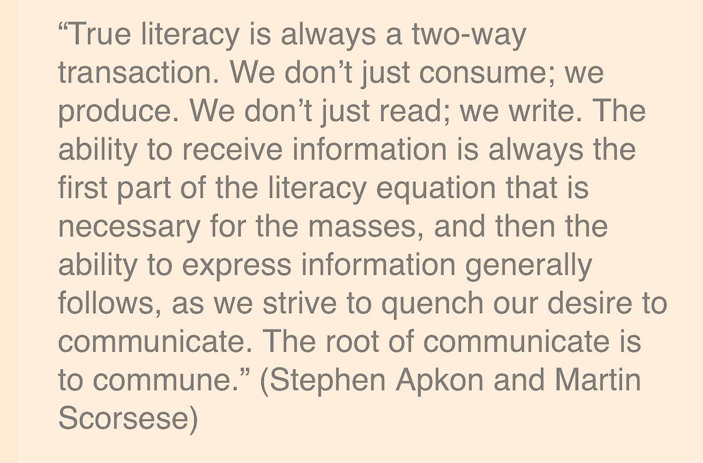

Higher education must immediately stop obsolete blackboard teaching. **Higher ed requires mentor and collaboration.**

**What is obsolete blackboard teaching?**

\[Lecturing is the\] best way to get information from teacher’s notebook (mouth)  
to student’s notebook without touching the student’s mind.

                                                                                        — George Leonard

Patterns for bad practices of teaching, what is done in higher education, even best colleges.  
[https://iambrainstorming.blogspot.in/2017/11/patterns-for-bad-practices-of-teaching.html](https://iambrainstorming.blogspot.in/2017/11/patterns-for-bad-practices-of-teaching.html)

**So, how this can be solved?**  
This is how colleges must run when there is the shortage of skilled teachers:  
1) Give students compilation of pedagogically right content (such as videos, MOOCs, books, magazines etc.)  
**What it means to be pedagogically right content?**  
[https://iambrainstorming.wordpress.com/all-books-that-dont-meet-the-learning-criteria-must-be-taken-off/](https://iambrainstorming.wordpress.com/all-books-that-dont-meet-the-learning-criteria-must-be-taken-off/)  
**How learning can be more personalized with a decentralized syllabus that takes account of student pace, allows diversity and interdisciplinary connections?**  
[https://iambrainstorming.wordpress.com/personalized-learning-goals-new-information-is-built-over-reusing-of-previous-information/](https://iambrainstorming.wordpress.com/personalized-learning-goals-new-information-is-built-over-reusing-of-previous-information/)

2) Let students come with their laptops or provide them computers, and teacher can act as a mentor to maintain discipline in learning.  
**Importance of mentoring, why mentors are required:**  
[https://iambrainstorming.wordpress.com/importance-of-educational-videos-and-solving-its-limitation-by-teachers-assistance/](https://iambrainstorming.wordpress.com/importance-of-educational-videos-and-solving-its-limitation-by-teachers-assistance/)  
Mentor work includes:  
i) Providing leadership by bringing students to discuss, collaborate or work on their own on the topic.  
ii) Track what students have learned during a day  
iii) Mentor will become a co-learner and enhance his/her skills with every passing year.

Mentorship is a relationship in which a more experienced or more knowledgeable person helps to guide a less experienced or less knowledgeable person. The mentor may be older or younger than the person being mentored, but he or she must have a certain area of expertise. It is a learning and development partnership between someone with vast experience and someone who wants to learn.  
\-- Wikipedia

Students should upload their _lesson objectives and plan of the day, notes, annotations, written solutions and strategies to the practice problems, elaboration interrogation, designing probing questions and answering them, retrieval practice, flash cards, collaborative work, creative writings, teachers and peer feedbacks and any other useful documents to the server of your choice_

An example of designing probing questions and adding explanations.

No need of grading the "practice lessons", the only rule is to let them upload their **_scrappy yet unique and scrutable writings_**.  Copying of some parts of notes or ideas of peer (learning from peers) is allowed if they have included the reference to the peer URL.

> Sharing of scrappy or untidy practice lesson writings will keep students accountable and gratified for their learning. It will also help them to obtain feedback from peers and mentors.

**Notebook writing can be faked**, for example, copying teachers dictation or other students work without referencing is not an original work, and _it's not an evidence of learning_. So we need to consider other data for measuring the authenticity of their notebook work.

Colleges and schools should work in collaboration to design low stake exams for half an hour without grades every month or bimonthly with questions _based on their shared notebook or what is taught in the class_. Exam hall should have trusted invigilators with a camera installed.

Exams should follow eSALT that takes students feedback for **improving the lessons, test questions and classroom activity.**  
[https://iambrainstorming.wordpress.com/experimental-manipulation-after-tests-using-esalt-feedback-from-students/](https://iambrainstorming.wordpress.com/experimental-manipulation-after-tests-using-esalt-feedback-from-students/)

A separate dat url can be created by the mentor, that contains all the links of students dat url. The mentor can share the link with the experts for further evaluation.

3) Students can have practical classes (building open labs such as tinkering labs), and better classroom design for collaboration, individual learning, learning using computers.

University providing correspondence courses like Ignou is the best place to adopt and start this model.

An example of sharing notes:  
Evidence of Learning: [https://evidence.probiquery.now.sh/](https://evidence.probiquery.now.sh/)

The following pipeline will create a disposition of problem-solving among students as well as teachers. And will act as a death knell to unemployment (or unproductive work) and will improve living standards of the people.

**Replace exams with exhibitions for deeper learning.**  
[https://www.edweek.org/ew/articles/2018/01/10/the-secret-to-student-engagement.html](https://www.edweek.org/ew/articles/2018/01/10/the-secret-to-student-engagement.html)
