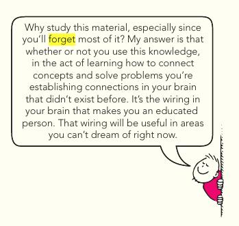

> Students do forget things, we measure the effectiveness of the retrieval practice based upon how much they have remembered the learning material. 

But forgetting doesn't mean that students have unlearned what they have learned. Neither learning is about how much you can recall from memory.

Paul Hewitt Physics

Yes, the best strategy to get a high score is retrieval practice. But high score relies on the ability to recall things, not test the actual learning.

We need not have to do retrieval practice to do programming,  just re-reading and using the code is enough. The best way to learn to program is to use and apply it the hard way. The more you use it and apply better strategies, the more better your programming skill will be.  
The same principle applies to all subjects, whether its maths, physics, biology or philosophy.

What is required is understanding of the subject, through strategies like the Feynman Technique. Understanding creates an index in your brain, which later can be used to retrieve the whole research from online article or books, if you are unable to recall the complete details.

Take for example programming, I do forget the syntax of programming languages, but I know how to use them in many different situations. So when I encounter a problem, I can recall from the index created in my brain about what syntax to use for the logic, but not the exact syntax. So, I can look at the documentation and notes, and apply the code.

> It doesn't matter whether you are explaining by looking at the book or not, as long as you are thinking about any plausible queries and able to explain the answers to a 5 to 12 year-old.

https://www.youtube.com/watch?v=MlJdMr3O5J4

> The craze of Retrieval Practice thrives because of test scores, what if we don't give marks, we [peer review](https://iambrainstorming.ml/if-all-scientific-discovery-relies-on-peer-review-for-validation-why-not-assessment-be-done-through-peer-review/) the student thinking process and give feedback. We ask them to do things and improve their resume.

Feynman Technique is also a kind of retrieval practice but it eliminates its bad practices.

> Retrieval practice should come with the statutory warning taking care of these two points:  
> 1) Do the facts or content you are retrieving is about big ideas, important and helps to develop high order thinking?  
> 2) Are you doing any unnecessary repetition of facts or study material (for high test scores), that is limiting you for further research of the content?

> Also, remember that not doing enough retrieval practice can impact your fluency. It's a bad practice to always look at the documentation or notes for the problem you are trying to solve. It also does hinder understanding. If you are using something regularly, it's better to keep it in memory, and the best way to do this is retrieval practice and spaced learning.
