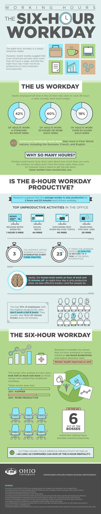

Productivity describes various measures of the efficiency of production.

Most Indian bosses are obsessed with more working hours, but the paradox is the more working hours you have the less productive you become.

**The Relationship Between Hours Worked and Productivity**

[https://cs.stanford.edu/people/eroberts/cs181/projects/crunchmode/econ-hours-productivity.html](https://cs.stanford.edu/people/eroberts/cs181/projects/crunchmode/econ-hours-productivity.html)

> According to data provided by Ohio University, the average worker is productive for two hours and 53 minutes out of an 8-hour workday.

[https://onlinemasters.ohio.edu/blog/benefits-of-a-shorter-work-week/](https://onlinemasters.ohio.edu/blog/benefits-of-a-shorter-work-week/)

> But its not only about productivity but its also about income. In India, a newcomer researcher, programmer or engineer is exploited with long working hours by giving them as low as Rs. 5000 to 10000 per month.

> You have to pay room rent, transportation charges, electricity bill, for food and clothing.
> 
> **The travelling time, which can take more than 4 hours per day due to heavy traffic and bad roads, drains all your energy and makes your productivity even more worse**. 
> 
> It also affects your well being and mental health. 

## **People who work from home all the time ‘cut emissions by 54%’ against those in office**

Study in US shows one day a week of remote working cuts emissions by just 2% but two or four days lowers them by up to 29%

[https://www.theguardian.com/environment/2023/sep/18/people-who-work-from-home-all-the-time-cut-emissions-by-54-against-those-in-office](https://www.theguardian.com/environment/2023/sep/18/people-who-work-from-home-all-the-time-cut-emissions-by-54-against-those-in-office)

## **Challenges of Working from Home for Women in India: Caregiving and the Patriarchal System**

Working from home has had [adverse consequences for women](https://www.brookings.edu/articles/why-has-covid-19-been-especially-harmful-for-working-women/), particularly working mothers, as evidence reveals their increasing responsibility not only in childcare but also in various other family and household care duties. The COVID-19 pandemic and the shift to remote work have exposed the persistent gender disparities in India's patriarchal system, where traditional gender roles and expectations often place the bulk of caregiving responsibilities on women. With the closure of schools and limited access to external support, many working mothers have had to navigate the challenging task of balancing their professional commitments with an increased load of childcare and family care. This situation highlights the urgent need for a more equitable distribution of family responsibilities, along with supportive policies and workplace structures that acknowledge and address the gender imbalances that continue to prevail in India's patriarchal society. Empowering women in the workforce while promoting shared responsibilities in caregiving is essential for achieving gender equality and improving the overall well-being of working women.

## **Flexible working can significantly improve heart health, study shows**

[https://www.theguardian.com/society/2023/nov/09/flexible-working-can-significantly-improve-heart-health-study-shows](https://www.theguardian.com/society/2023/nov/09/flexible-working-can-significantly-improve-heart-health-study-shows)

## **Companies With Flexible Remote Work Policies Outperform On Revenue Growth: [Report](https://www.forbes.com/sites/jenamcgregor/2023/11/14/companies-with-flexible-remote-work-policies-outperform-on-revenue-growth-report/?sh=6d8aedb45ae4)**

Employees frustrated with their CEOs’ return-to-office mandates have tried arguing that remote work is linked with greater productivity. That it helps the environment with fewer commutes and improves diversity by broadening the talent pool. Now, they may have another argument to get their CEOs’ attention: Higher revenue growth.

The report shows that the three-year industry-adjusted revenue growth rate of companies that have what Scoop calls a “fully flexible” policy—meaning they allow employees or teams to choose when or whether they come to the office, or are fully remote—is 21%. Companies in the data set with more restrictive policies—say, those that have corporate mandates for a couple days per week or those that require full-time work in the office—had only a 5% industry-adjusted revenue growth rate, the analysis found. When excluding the tech industry over the same period, public companies that were “fully flexible” outperformed by 13 percentage points.

Lovich, whose firm worked on the analysis with Scoop, says the report doesn’t yet show that flexible policies _cause_ higher revenue growth. Rather, she says flexible policies are one likely “symptom” of a culture that trusts workers, has other employee-friendly benefits and values forward-thinking strategies, technology and ideas. “If they’re less restrictive on \[remote\] work policies, they’re probably more pro-innovation, more purposeful and more engaging,” Lovich says, all of which could lead to higher revenues. “I doubt those companies would be taking attendance and measuring badge swipes.”

## **Unlocking Global Talent: The Power of Fully Remote and Flexible Work in Fostering Diversity and Driving Organizational Success**

In today's interconnected world, the shift towards fully remote work has become instrumental in cultivating a more diverse and dynamic workforce. This transformation extends beyond geographical boundaries, allowing organizations to access talent pools from various states and countries. The collaboration of individuals with diverse backgrounds, experiences, and skill sets enhances the workplace's richness and contributes to the success of the organization.

Fully remote and flexible work bring people together from different countries, promoting collaboration among individuals who may have been initially hesitant to participate. Remote work significantly impacts fostering a culture of inclusivity, unlocking global talent, and contributing to the prosperity of forward-thinking organizations.

## So, suggestions how these problems are solved.  

**1) Awareness**

First is to create awareness, such a job culture is neither good for the company, nor for the employees or society.

More aware citizens **especially parents** can do a lot for their children so that they are not exploited by companies.

**2) Policies the protect employees**

Government policies that take into account employees well being and measures to prevent the exploitation of employees. 

Ideas like providing UBI for learning for unemployed and unskilled, funding grants and ideas so that they spend time on learning and entrepreneurship rather than an exploiting job. 

**3) Measures to increase productivity**

The first step is to decrease work hours. 

Then ask employees to take breaks every one hour (human mind can't work in optimum after an hour), ask them to do exercises like deep breathing and yoga.

Ask them to do work remotely in their home, decrease the number of days they have to come to the office.

> Be aware that remote employees work from home and live at work. Studies show that remote workers work longer hours on average—sometimes, a full extra day per week.

**A guide to distributed teams**

[https://increment.com/teams/a-guide-to-distributed-teams/](https://increment.com/teams/a-guide-to-distributed-teams/)

## Without good judgment your creativity will lead to projects that make no sense.

[https://iambrainstorming.wordpress.com/2017/01/14/all-books-that-dont-meet-the-learning-criteria-must-be-taken-off/](https://iambrainstorming.wordpress.com/2017/01/14/all-books-that-dont-meet-the-learning-criteria-must-be-taken-off/)

## A catch22 paradoxical situation the students and employees can't escape.

> Catch22 paradox, a paradoxical situation from which an individual cannot escape because of contradictory rules or limitations. 

The education system of India too oppressive with the inferior curriculum. What they learn in college never gets utilized when they join a job. This leads to fewer job creators because of a lack of entrepreneurial and problem-solving skills including other problems like fund crunch, no parental support, and monopolistic markets that kill small businesses. When they join a job, they are made to overwork with the low salary. Unskilled labor without critical thinking produces low-quality work, to make it worse they don't have the time to learn new skills or can think about the problem with a tired brain. 

**My friend argued that companies can train them to learn new skills, which will help them to work productively that can benefit the company.** 

**But this can't be the case, here is the reason for it:**

Training employees benefits employees not the company because they have to bear the course fee, also have to pay the salary without doing any real projects of the company, as employees will be busy learning. There is no guarantee that employees will stay and not look for bigger opportunities after they are well trained. The self-interest of companies unlikely to permit such a step. 

**One may argue that employees can learn part-time. This too is also not so possible due to overwork they do.**

For example, an employee knows basic PHP and does the project work for the company with Rs 10,000 per month. With sick leave, there is further deduction. To learn new technology like blockchain or nodejs or machine learning, it requires a full-time learning time, as these technologies require highly technical courses. It requires a rigorous full-time Bootcamp, that can last 3 to 5 months on average.

**So, in order to learn, they have to quit the job. But how will they fund these 5 months, as the salary is too low, and no saving is left after the month-end?** 

Suggestion:

> The Nordic model that they have pioneered over decades has a few basic components: a welfare state with free, high-quality education and health care; a “flexicurity” model of employment, which combines _flexi_ble hiring and firing with strong social se_curity_; and open markets with low tariffs and minimal barriers to trade.

[https://www.foreignaffairs.com/articles/europe/2020-01-02/new-nordic-model](https://www.foreignaffairs.com/articles/europe/2020-01-02/new-nordic-model)
