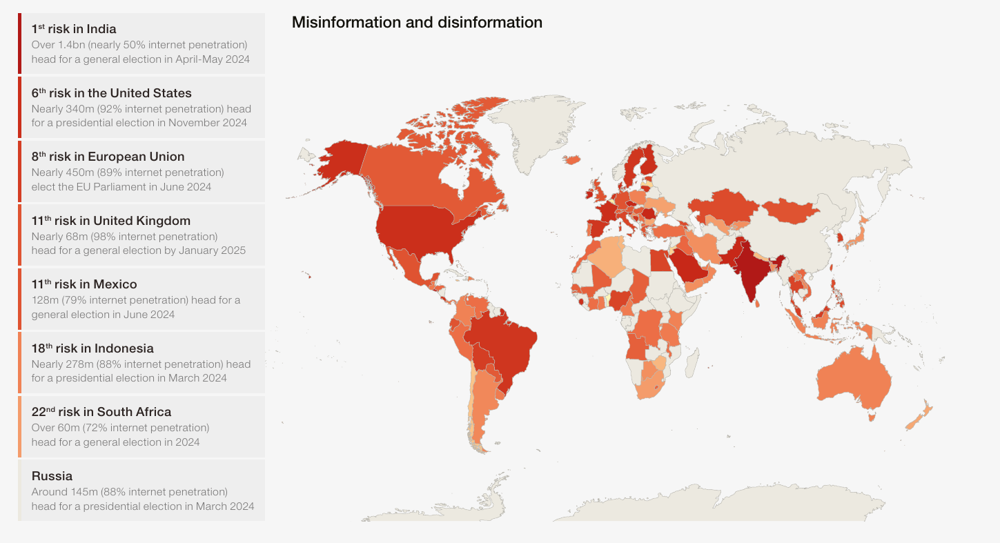

# How to tackle disinformation?
## date: "2023-12-07"
---
categories: 
  - "politics"
  - "psychology"
  - "social-media"
---

## India ranks 1st in Misinformation and disinformation

*- [Global Risks Report 2024 ](https://www.weforum.org/publications/global-risks-report-2024/)*

## India's fake news epidemic

<iframe width="560" height="315" src="https://www.youtube.com/embed/nPHrjxlHx2E?si=6oCYuXBwkKATv9BD" title="YouTube video player" frameborder="0" allow="accelerometer; autoplay; clipboard-write; encrypted-media; gyroscope; picture-in-picture; web-share" referrerpolicy="strict-origin-when-cross-origin" allowfullscreen></iframe>

## **1) Deep Canvassing**

Dave Fleischer told me that people don’t get a chance to reflect like this very often. Daily concerns take up people’s cognitive resources: providing lunch money for their kids, evaluating their performance at work, planning who will take the car to get repaired. Without a chance to introspect, we remain overconfident in our understanding of the issues about which we are most passionate. That overconfidence translates to certainty, and we use that certainty to support extreme views.

One of the most striking examples of this comes from experiments into what psychologists call the illusion of explanatory depth. When scientists asked subjects to rate how well they understood things like zippers, toilets, and combination locks, most people tended to say they had a pretty good grasp of their mechanics. But when experimenters asked those same subjects to explain how they worked in detail, people tended to go back and update their answers, admitting they had pretty much no idea how those things worked. 

**The same was true for political issues.**

When asked to provide opinions on health-care reform, a flat tax, carbon emissions, and so on, **many subjects held extreme views**. When experimenters asked people to provide reasons for their opinions, they did so with ease. But if asked to explain those **issues in mechanistic detail**, they became flustered and realized they knew far less about the policies than they thought they did. 

As a result, their opinions became less extreme.

### Why do we argue? What purpose does it serve?

Cognitive scientist Hugo Mercier, an expert on human reasoning and argumentation, explained that we evolved to reach consensus—sometimes on the facts, sometimes on right and wrong, sometimes on what to eat for dinner—by banging our heads together. Groups that did a better job of reaching consensus, by both producing and evaluating arguments, were better at reaching communal goals and out-survived those that didn’t. That led to the innate psychology that compels us to persuade others to see things our way when we believe our groups are misguided.

Mercier told me that if we couldn’t change our minds or the minds of others, there would be no point in arguing in the first place. He asked me to imagine a world where everyone was deaf. “People would stop talking,” he said. **The fact that we so often disagree isn’t a bug in human reasoning; it’s a feature.** How arguing had led to sudden shifts, all we had to do was look at the history.  

[How to have a respectful argument?](./relationships-emotions-and-happiness.md#the-5-secrets-of-effective-communication-by-david-burns)

## **2) Truth Sandwich**

[https://en.wikipedia.org/wiki/Truth_sandwich](https://en.wikipedia.org/wiki/Truth_sandwich)

A truth sandwich is **a technique in journalism to cover stories involving misinformation without unintentionally furthering the spread of false or misleading clams**.

[https://www.pbs.org/standards/blogs/standards-articles/what-is-a-truth-sandwich/](https://www.pbs.org/standards/blogs/standards-articles/what-is-a-truth-sandwich/)

## Lead by Truth 

Berkeley linguist George Lakoff recently came up with the strategy that he decided to call the truth sandwich. Here’s how to build one: Lead with the truth. In the middle of the report, briefly describe the falsehood. And then fact-check the misinformation and repeat the truth.

## Amplification Give them Power

Lakoff has said that he thinks media organizations are unintentionally spreading misinformation when they repeat lies or quote politicians who are asserting falsehoods.

“Avoid retelling the lies. Avoid putting them in headlines, leads or tweets,” Sullivan wrote of Lakoff’s advice. “Because it is that very amplification that gives them power.”

## Don't engage with disinformation and propaganda

Engaging in disinformation and propaganda can lead to its amplification through various mechanisms, taking advantage of psychological, social, and technological factors. Here are some key reasons:

Confirmation Bias

People tend to be more receptive to information that aligns with their existing beliefs. Disinformation often targets pre-existing biases, leading individuals to accept and share it without critically evaluating its accuracy.

Echo Chambers

Online communities and social networks tend to form echo chambers where like-minded individuals reinforce each other's beliefs. Disinformation spreads rapidly within these closed circles, as it resonates with the shared worldview of the group.

Algorithmic Amplification

Social media algorithms are designed to maximize engagement by showing users content they are likely to find interesting. Disinformation that generates reactions (likes, shares, comments) often gains more visibility, leading platforms to amplify it further.

Distrust in Authentic Media

If individuals have a distrust in authentic media or established institutions, they may be more susceptible to alternative narratives of godi Media, even if they lack credibility. Disinformation campaigns often exploit this distrust to undermine the authority of legitimate sources.

Selective Exposure

People tend to seek information that confirms their existing beliefs and avoid contradictory information. Disinformation providers take advantage of this by tailoring content to specific audiences, making it more likely to be accepted and shared within those groups.

### Navigating the Landscape: The Role of a Truth Teller

The primary task of a truth teller is to navigate the intricate landscape of disinformation without succumbing to distractions. This involves a strategic approach to counter false narratives and resist the temptation to engage in posting leaders photos as criticisms, especially when dealing with leaders obsessed with attention.

### Crafting a Counter-Narrative: The Power of Truth Sandwich

To effectively counter disinformation, the focus shifts to delivering accurate and reliable information. The "truth sandwich" technique emerges as a powerful tool, allowing truth tellers to construct arguments by sandwiching the false statements between layers of truth. This method not only addresses misinformation but also reinforces the importance of presenting correct information without perpetuating falsehoods.

### Breaking Echo Chambers: Constructing Compelling Counter-Narratives

Breaking the echo chamber requires truth tellers to go beyond simply debunking false information. It involves the construction of compelling counter-narratives that are well-supported by evidence. This process demands a departure from emotional appeals, emphasizing instead the use of facts and logical reasoning to persuade individuals within the echo chamber to reconsider their perspectives.

### Unmasking Deception: Exposing Fallacies in Disinformation

An integral part of the truth teller's task is the identification and exposure of [fallacies](https://en.wikipedia.org/wiki/List_of_fallacies) within disinformation. This involves a meticulous process of unraveling the logical errors, misleading tactics, and manipulative techniques employed in false narratives. By shining a light on these fallacies, truth tellers not only educate their audience but also undermine the credibility of the disinformation itself.

### Repeat the truth to tackle disinformation

Repeating the truth is a fundamental strategy in combating disinformation. By consistently and clearly reaffirming accurate information, individuals and communities can establish a foundation of reliable knowledge. Repetition not only reinforces the veracity of the facts but also helps to counteract the effects of misleading narratives and false claims. It builds a collective understanding based on evidence and promotes critical thinking skills, enabling people to discern between credible information and misinformation. In the face of the persistent spread of disinformation, the repetition of truth becomes a powerful tool in fortifying the public against deceptive influences and fostering a more informed and resilient society.

### Staying True: A Holistic Approach for Truth Tellers

In summary, the holistic approach for truth tellers encompasses staying true to the facts, avoiding distractions, and breaking echo chambers through the presentation of well-supported counter-narratives. The incorporation of the "truth sandwich" method becomes a crucial aspect of this endeavor, ensuring that efforts to counter disinformation are effective without inadvertently amplifying false statements.

## **3) Learning Strategies**

Use pairing graphics with words, linking abstract concepts with concrete representations, posing probing questions, and retrieval practice (asking people to explain) etc to explain things. 

[Learning strategies link](https://iambrainstorming.wordpress.com/2017/01/14/all-books-that-dont-meet-the-learning-criteria-must-be-taken-off/)

## **4) The 25% Revolution**

[The 25% Revolution—How Big Does a Minority Have to Be to Reshape Society?](https://www.scientificamerican.com/article/the-25-revolution-how-big-does-a-minority-have-to-be-to-reshape-society/)

### Understanding Diffusion

The things that we would like to spread often fail to diffuse. At the same time, the things that we want to prevent from spreading often succeed despite our best attempts to stop them. 

This basic problem of diffusion—that is, the failure to spread behavior—occurs whenever behavior change encounters resistance. At tempts to spread everything from vaccinations to innovative technologies to environmentally friendly business practices have faced similar difficulties. The less familiar an innovation is, and the more inconvenient, uncomfortable, or expensive it is, the greater the resistance will typically be, and the less likely it will be to diffuse. 

### Weak Ties

The basic idea of the strength of weak ties is that while our strong ties that is, our friends and close family—all tend to know each other, our weak ties—that is, our casual acquaintances – connect us to remote parts of the social network. As the sociologist Mark Granovetter famously put it, **Whatever is to be diffused can reach a larger number of people, and traverse a greater social distance, when passed through weak ties rather than strong.**

**Strategic complementarity:** The value of a behavior increases with the number of others who adopt it.

**Credibility:** The more people who adopt a behavior the more believable it is that the behavior is beneficial or that it is worth the cost of adoption.

**Legitimacy:** The more people who adopt a behavior, the greater the expectation is that other people will approve of the decision to adopt and the lower the risk of embarrassment or sanction.

**Emotional contagion:** The excitement associated with adopting a behavior increases with the number of others who adopt it.
