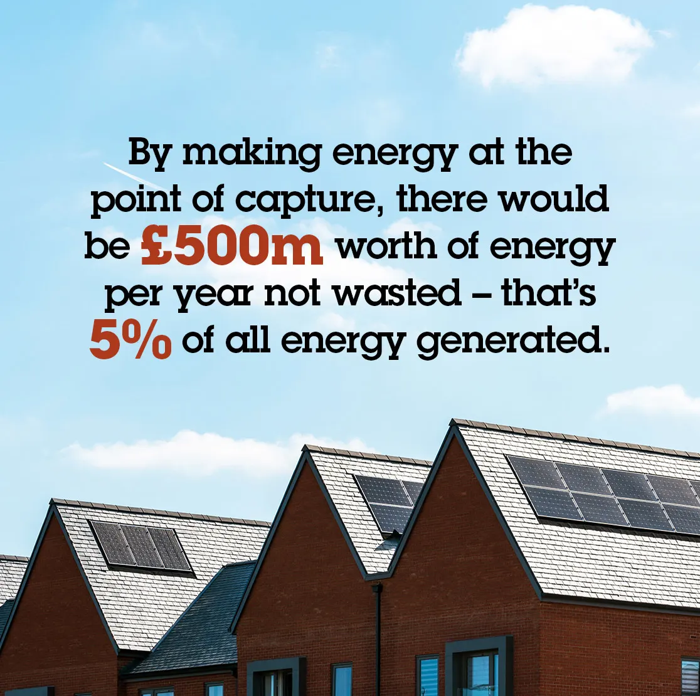
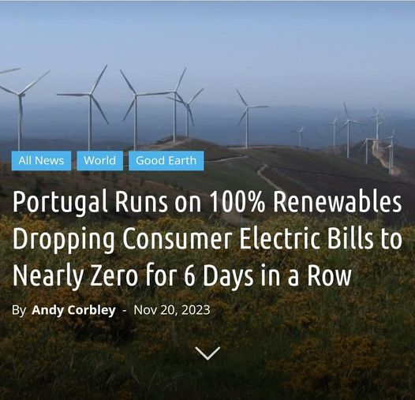
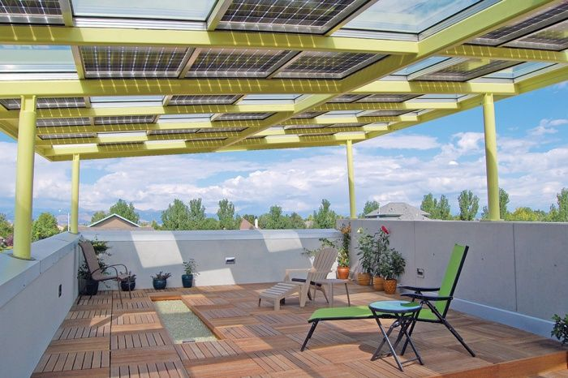
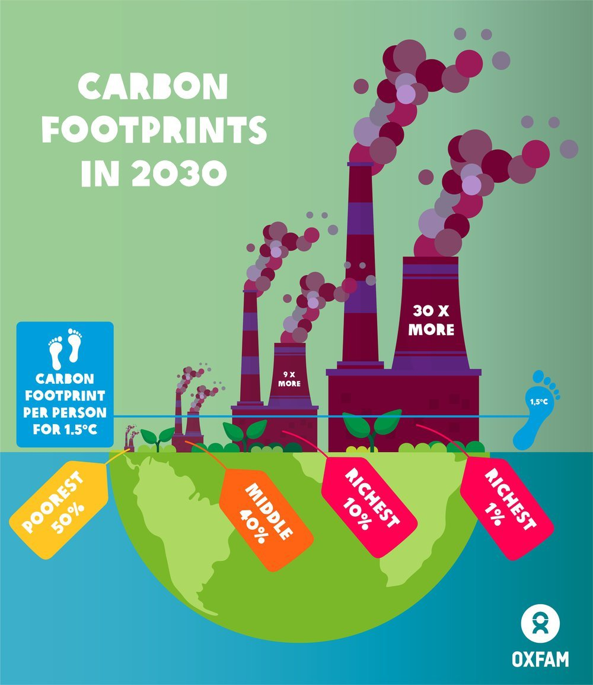

# Phase out fossil fuel subsidies

---
categories: 
  - "climate-change"
  - "fuel-price-hike"
tags: 
  - "climatechange"
  - "fuelpricehike"
---

Fossil fuels are widely recognized as unsustainable, necessitating the development of a comprehensive plan to transition towards decentralized solar power production.

The housing infrastructure in many parts of India is characterized by urban sprawl, with semi-urban cities predominantly featuring two to three-story buildings. These structures offer a promising opportunity for harnessing clean energy through rooftop solar installations. In contrast to Britain, where over 65% of homes are suitable for solar panels, India boasts an even greater potential, can be more than 70% to 80% of houses being conducive to solar energy adoption. This underscores the significant scope for expanding solar power utilization in India's residential sector.

## Over 65% of homes in Britain can work for solar panels

[https://www.ecotricity.co.uk/our-news/2023/over-65-of-homes-in-britain-can-work-for-solar-panels](https://www.ecotricity.co.uk/our-news/2023/over-65-of-homes-in-britain-can-work-for-solar-panels)

Setting up rooftop solar systems may initially appear to be a bit expensive for a middle-class family to invest in. However, it's crucial to note that the cost should be evaluated not just in terms of the initial investment but also in relation to the potential profit and payback over time.

While the upfront costs of installing rooftop solar panels might seem daunting, the long-term financial benefits often outweigh the initial expenses. The return on investment (ROI) for solar installations is relatively high, leading to considerable savings on electricity bills over the years.

## Switching The World To Renewable Energy Will Cost $62 Trillion, But The Payback Would Take Just 6 Years

[News Link](https://cleantechnica.com/2022/09/06/switching-the-world-to-renewable-energy-will-cost-62-trillion-but-the-payback-would-take-just-6-years/?utm_source=pocket_reader)

Solar panels has the capacity to generate enough electricity to power essential household appliances such as an induction cooker, an air conditioner (AC), or even charge an electric bike, making it a feasible and sustainable energy solution for a typical middle-class family.

Beyond meeting immediate energy needs, one notable advantage of solar power is the potential for surplus electricity generation. In the event that the solar panel produces more energy than the household requires, the excess power can be redirected to the grid. This not only contributes to the overall energy supply but also provides an opportunity for the family to earn money through mechanisms like net metering.

Net metering allows homeowners to receive compensation or credits for the surplus energy they feed back into the grid. This financial incentive not only promotes self-sufficiency but also encourages the adoption of solar technology as a means of not just meeting personal energy needs but actively contributing to the broader energy infrastructure.

> Please don't argue the rise of fuel prices for providing unsustainable subsidies on the Ujjwala scheme, build a self-sustainable system by making every household a power generator.

The surge in gas cylinder prices has become a focal point of intense political discourse, particularly due to its substantial impact on the middle class and the economically disadvantaged. While acknowledging the repercussions of rising gas prices on these segments of society, it is crucial to recognize that subsidizing gas is not a sustainable solution.

Instead, a more viable approach involves making substantial investments in renewable energy sources such as solar and wind, coupled with advancements in energy storage technologies like batteries. This strategic shift towards renewables can not only address the immediate concerns about the affordability of energy but also pave the way for a more sustainable and decentralized power infrastructure.

## **Please stop providing coal subsidy**

AAP under the leadership of Arvind Kejriwal, who claims to bring political revolution is providing 200 units of free electricity to people. They are subsidizing coal-produced electricity instead of using that money for producing sustainable renewable energy. 200 units per 5 year cost Rs 72000. At this cost everyone can easily install rooftop solar panels in their homes for free, and also sell the surplus and become energy self-sufficient instead of depending on govt. The solar panel life span is about 20 years, so people can generate electricity for 20 years. Instead of bringing sustainable policy, they want the future of our children and grandchildren on the brink of catastrophe due to climate change.

## Update on Solar Panel policy by AAP govt

Although India missed its target of achieving 100 GW of solar power by 2023, globally, the country stands 5th in solar PV deployment as per REN21’s Global Status Report 2023 & IRENA’s Renewable Capacity Statistics 2023. With zero bills for rooftop solar panels and incentives, residential consumers can still lead the change toward a greener future. States are now coming up with their policies for solar rooftop installation to get residential consumers involved. For instance, Delhi's Solar Policy 2024 offers residential consumers zero electricity bills by installing rooftop solar panels. Chief Minister Arvind Kejriwal's initiative includes incentives, like the Generation Based Incentive (GBI), making solar power accessible and profitable. With a 2kW rooftop solar plant, consumers see a return on investment in just 4 years, setting a green energy precedent for India.

<iframe width="560" height="315" src="https://www.youtube.com/embed/Lt4fa-Oo2h4?si=J9duva5n99NIkJhh" title="YouTube video player" frameborder="0" allow="accelerometer; autoplay; clipboard-write; encrypted-media; gyroscope; picture-in-picture; web-share" allowfullscreen></iframe>

## A detailed explanation of the rooftop solar policy

<iframe width="560" height="315" src="https://www.youtube.com/embed/9_Tc11AlkME?si=gv40RntgkyOsQbM_" title="YouTube video player" frameborder="0" allow="accelerometer; autoplay; clipboard-write; encrypted-media; gyroscope; picture-in-picture; web-share" allowfullscreen></iframe>

> One can also provide zero-interest loans along with the policy so that people can pay in installments or EMIs to afford the solar panel. This will further reduce the roadblock or hesitance of users to install solar panels.

Poor states states like Odisha, Jharkhand, Chhattisgarh are very much dependent on coal revenue. It all about politics. This must change, political pressure must be build on these state.

### The Struggle for Commercialization of Rooftop Solar Panels: Overcoming Government Hesitancy and Corporate Monopolies

Roof top solar panels have the potential to revolutionize the way we generate and consume energy, but commercialization of rooftop solar has been slow due to hesitant government policies and the influence of monopolistic corporate lobbies. The government is reluctant to provide subsidies for roof top solar systems for commercial purposes, which hampers the widespread adoption of this sustainable energy source. Meanwhile, large corporations are more interested in building solar hubs in rivers and fields, which can be easily washed away in floods. It also perpetuates a cycle of corporate profit, rather than decentralizing the power economy and putting it in the hands of the public. It is crucial for governments to recognize the importance of roof top solar panels and provide the necessary support for their commercialization, ultimately benefiting both the environment and the people.

[Storm damages world's biggest floating solar plant in Madhya Pradesh](https://timesofindia.indiatimes.com/city/indore/storm-damages-worlds-biggest-floating-solar-plant/articleshow/109231119.cms)

The irony is that they want to [exert control over vast areas of land in Ladakh](https://scroll.in/article/1073644/in-ladakh-a-massive-energy-project-is-shrouded-in-mystery), while simultaneously failing to utilize or promote the widespread adoption of rooftop solar panels, which would decentralize power generation and transfer control from corporations and governments to the people - a scenario that seems to contradict their apparent desire for control.

### Corporate Monopolies: A Threat to National Security

Corporate monopolies pose threats to both national economic security and sovereignty, as they can wield immense control over essential resources and services. A recent example is the Adani Group, which reportedly [threatened to suspend power supply to Bangladesh](https://scroll.in/latest/1075198/adani-group-to-suspend-power-supply-to-bangladesh-if-dues-not-cleared-report) due to unpaid dues of around $850 million, even cutting the supply by half. Such actions highlight the vulnerabilities nations face when reliant on powerful corporate entities for critical infrastructure. To counteract this risk, decentralizing energy sources, such as installing solar panels on rooftops and maintaining community-based control, is essential. This approach not only reduces dependency on monopolistic corporations but also promotes energy resilience and self-sufficiency, strengthening the nation's ability to secure its own energy future.

## Zero electricity Bills

> Zero electric bills can be a reality in your city. Don't be misled by the gimmick of a zero fossil fuel electricity bill, and don't tolerate overpriced fossil fuel electricity. In both cases, the fossil fuel industry profits, either through subsidies or price gouging.

[Governments Spent Record $1 Trillion Subsidizing Fossil Fuels Last Year](https://e360.yale.edu/digest/1-trillion-fossil-fuel-subsidies)

This decentralization of power generation at the community level can lead to a significant reduction in electricity prices, and in some cases, it has the potential to bring the cost down to zero.

## Adani imported ₹13,000 crores of coal at above market value so crores of Indians overpay for electricity.

[https://www.ft.com/content/7aadb3d7-4a03-44ba-a01e-8ddd8bce29ed](https://www.ft.com/content/7aadb3d7-4a03-44ba-a01e-8ddd8bce29ed)

Price gouging is the practice of increasing the prices of goods, services, or commodities to a level much higher than is considered reasonable or fair.

## It is criminal to finance the fossil fuel industry, and banks need to cease such practices.

Banks continue to provide substantial financing to the fossil fuel sector

According to the annual 'Banking on Climate Chaos' report by NGOs, the top 60 global banks provided $673 billion in financing to coal, oil and gas producers in 2022.

[https://www.lemonde.fr/en/environment/article/2023/04/17/banks-continue-to-provide-substantial-financing-to-the-fossil-fuel-sector\_6023235\_114.html](https://www.lemonde.fr/en/environment/article/2023/04/17/banks-continue-to-provide-substantial-financing-to-the-fossil-fuel-sector_6023235_114.html)

## **UNDP’s Policy Toolkit for a Fair Energy Pricing Reform**

[Fossil fuel subsidies reform could limit climate change while tackling global inequalities. Here's how.](https://www.undp.org/blog/fossil-fuel-subsidies-reform-could-limit-climate-change-while-tackling-global-inequalities-heres-how)

**Step 1: Phase out fossil fuel subsidies**

**Step 2: It has been said many times over, and we do so again... Put a price on carbon!**

**Step 3: Redirect money towards the people and make investments that are in line with the SDGs**

Marketing teams can be build and door to door campaigns, road shows can be done along with installation support to aware people about climate change, and financial benefits they are going to get by becoming an electricity supplier to the grid.

Clean energy also helps to fight climate change.  

<iframe width="560" height="315" src="https://www.youtube.com/embed/8Sl28fkrozE?si=CPCL0GaNtIJVvgI-" title="YouTube video player" frameborder="0" allow="accelerometer; autoplay; clipboard-write; encrypted-media; gyroscope; picture-in-picture; web-share" allowfullscreen></iframe>

Hundreds of people lost their lives within a week due to heat waves in India. The provision of subsidies for coal electricity raises ethical concerns and carries severe consequences, akin to what some argue could be compared with genocidal crimes.

[https://time.com/6288119/india-heat-wave-2/](https://time.com/6288119/india-heat-wave-2/)

## Solar is now ‘cheapest electricity in history’, confirms IEA

[https://www.carbonbrief.org/solar-is-now-cheapest-electricity-in-history-confirms-iea/](https://www.carbonbrief.org/solar-is-now-cheapest-electricity-in-history-confirms-iea/)

- Renewable energy sources are all around us

- Renewable energy is cheaper

- Renewable energy is healthier

- Renewable energy creates jobs

- Renewable energy makes economic sense

About [$7 trillion](https://www.imf.org/en/Blogs/Articles/2023/08/24/fossil-fuel-subsidies-surged-to-record-7-trillion) was spent on subsidizing the fossil fuel industry in 2022, including through explicit subsidies, tax breaks, and health and environmental damages that were not priced into the cost of fossil fuels.

In comparison, about [$4 trillion](https://www.iea.org/reports/net-zero-by-2050) a year needs to be invested in renewable energy until 2030 – including investments in technology and infrastructure – to allow us to reach net-zero emissions by 2050.

[https://www.un.org/en/climatechange/raising-ambition/renewable-energy](https://www.un.org/en/climatechange/raising-ambition/renewable-energy)

## Do solar panels take away terrace space, which is typically used for social gatherings and leisure activities?

Integrated solar panels, as shown in the attached photo, not only generate energy but also save or create usable space for gathering or activities. You can have many similar designs.

## Building Integrated Photovoltaics (BIPV) 

[BIPV in one Article](https://www.maysunsolar.com/bipv-in-one-article/)

## Why Fossil Fuel Companies Can’t Leave Resources Stranded? 

Huge legal, political, and economic obstacles stand in the way of [limiting global temperature rise to 1.5 C.](https://undark.org/2023/11/02/opinion-fossil-fuel-stranding/)

The strategies would include light-speed development of a renewable energy infrastructure, especially [power grids](https://www.nytimes.com/2023/10/17/climate/electric-grids-climate-iea.html) that can support a massive increase in renewable production. They would include policies to produce huge growth in [energy efficiency](https://www.iea.org/reports/the-value-of-urgent-action-on-energy-efficiency) — an unfortunately unsexy solution compared to megascale wind turbines and vast solar arrays. And they would include aggressive campaigning to support politicians willing to advocate for the hellishly difficult policies — such as ending [fossil fuel subsidies](https://www.context.news/net-zero/how-fossil-fuel-subsidies-are-hurting-the-energy-transition) and levying a [carbon tax](https://undark.org/2019/04/04/the-carbon-tax-that-keeps-on-giving/) — needed to meet the climate crisis.

## Navigating the Perils of Oil Dependency: A Call for Renewable Energy Transition

[Oil Dependence Is a Dangerous Habit](https://www.americanprogress.org/article/oil-dependence-is-a-dangerous-habit/)

Oil dependency poses a multifaceted danger to nations. First and foremost, relying on oil imports from "dangerous or unstable" countries can inadvertently fund and sustain regimes that may harbor anti-democratic sentiments or engage in actions contrary to the interests of importing nations. The financial support provided through oil purchases may inadvertently empower governments with questionable human rights records or hostile foreign policies. Additionally, the global demand for oil, driven by major consumers of importing countries, can elevate oil prices. Situations like wars, such as the conflict between Russia and Ukraine, can further escalate prices, exacerbating the economic strain on nations heavily dependent on oil imports.

Furthermore, the economic disparities resulting from oil dependence exacerbate tensions within oil-rich nations. The failure of many regimes to distribute oil revenues equitably contributes to social unrest and violence. Instances of oil-related violence in countries like Nigeria highlight the dangerous consequences of relying on a resource that can intensify internal conflicts. The unequal distribution of wealth from oil revenues not only destabilizes nations but also perpetuates global inequalities, contributing to a cycle of conflict and underdevelopment.

To address these challenges, a shift towards renewable energy sources is crucial. By embracing renewable energy, countries can become more energy secure and independent. This transition not only mitigates the geopolitical and economic risks associated with oil dependency but also contributes to a more sustainable and equitable global energy landscape. Embracing renewable energy technologies is not only a practical necessity but also a step towards fostering international cooperation and addressing the shared challenges posed by reliance on fossil fuels.

## Disparity in Carbon Emissions: Wealthiest 1 Percent Outpace Poorest Half, Straining Global Climate Goals

[Carbon emissions of richest 1 percent more than double the emissions of the poorest half of humanity](https://www.oxfam.org/en/press-releases/carbon-emissions-richest-1-percent-more-double-emissions-poorest-half-humanity)

The report assesses the consumption emissions of different income groups between 1990 and 2015 – 25 years when humanity doubled the amount of carbon dioxide in the atmosphere. It found:   

- The richest 10 percent accounted for over half (52 percent) of the emissions added to the atmosphere between 1990 and 2015. The richest one percent were responsible for 15 percent of emissions during this time – more than all the citizens of the EU and more than twice that of the poorest half of humanity (7 percent).     
- During this time, the richest 10 percent blew one third of our remaining global 1.5C carbon budget, compared to just 4 percent for the poorest half of the population. The carbon budget is the amount of carbon dioxide that can be added to the atmosphere without causing global temperatures to rise above 1.5C – the goal set by governments in the Paris Agreement to avoid the very worst impacts of uncontrolled climate change.     
- Annual emissions grew by 60 percent between 1990 and 2015. The richest 5 percent were responsible for over a third (37 percent) of this growth. The total increase in emissions of the richest one percent was three times more than that of the poorest 50 percent.

## Indian Ocean in permanent heatwave

A new study shows the steady warming of the Indian Ocean, and predicts that the ocean will be in a 'permanent heatwave' state by the end of the century.

<iframe width="560" height="315" src="https://www.youtube.com/embed/jGP5DldecQI?si=QOKbBLc71PPG0DPE" title="YouTube video player" frameborder="0" allow="accelerometer; autoplay; clipboard-write; encrypted-media; gyroscope; picture-in-picture; web-share" referrerpolicy="strict-origin-when-cross-origin" allowfullscreen></iframe>
