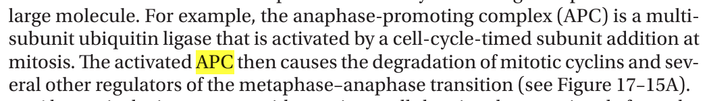
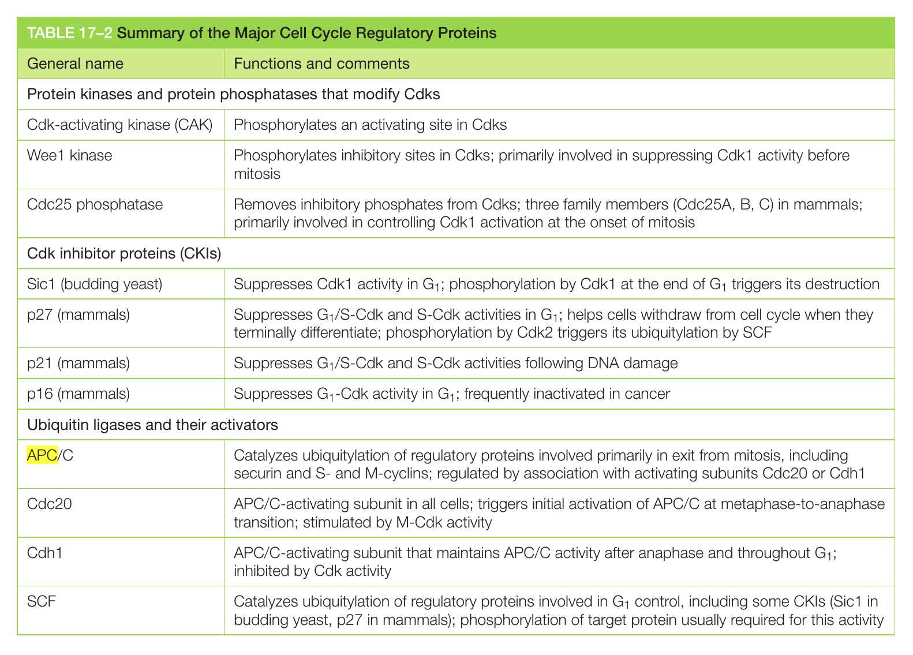

KBC = CRAP, BULLSHIT, KQUESTIONS

CSIR NET Dec 2018 Life Sciences

In the metazoan cell cycle, metaphase to anaphase transition is regulated by the activity of  
1) Cdk1/cyclinB  
2) APC/C  
3) Cdc25  
4)Weel  
So, how this question is important.  
Let's find out about APC/C  
First APC is a short form of Anaphase-promoting complex, so you have to make a habit to memorize all the acronym. Do you know what is WAC? It is the Women Army Corps. Found this example from the dictionary.  
This is excerpt from Cell Bruce Alberts,

Let me say the page number, its 360, Molecular Biology of Cell, 6th Edition. Do memorise the page number, question can come from any line.

Also there is a chart for your help. Please regurgitate as many times as quickly as you can.

Do you know how many proteins our biodiversity has, and every protein has a function, if you just memorized 10,000 [protein names](https://www.rcsb.org) with its function, you can be genius to run any experiment on proteins.
