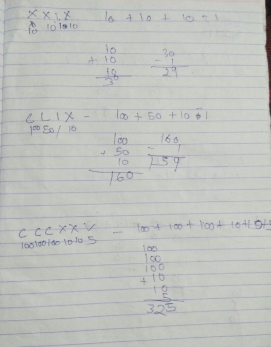
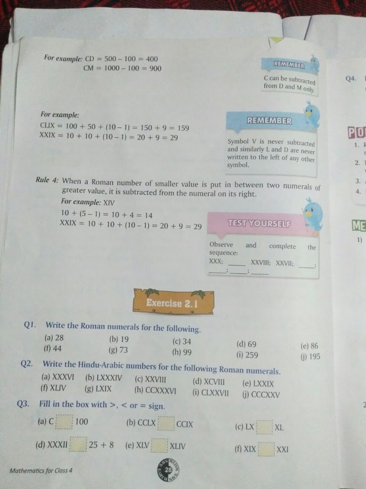

**Learning Objectives**  
To convert Roman numbers to Hindu-Arabic numbers

**What are the big ideas that students have to learn?**  
1) Memorizing these Roman Symbols with their respective Hindu-Arabic value  
2) When to do addition and when to do subtraction based upon the position of  Roman Symbols

**1) Memorizing these Roman Symbols with their respective Hindu-Arabic value**  
Without memorizing the mapping of Roman Symbols to its respective Hindu-Arabic value, students can't reach their learning outcomes. The mapping is very hard to memorize. So it's critical to provide them memory tricks for it.

Kids usually know  
1) I means 1  
2) V means 5  
3) X means 10  
But what about other symbols, here are the memory tricks that students have to imagine.  
4) L means 50  
So tell them L means (L)ake, and Lake is half filled (50%)  
5) C means 100  
Tell them C means see and see is a full (100%) eye  
6) D means 500  
Choose a student whose name starts with D and give him/her a Rs 500  
7) M means 1000  
The child gave Rs 1000 to Mom  
M means Mom and Mom got 1000

**Some of the problems with these techniques:**  
When you ask them to tell what M means, they will say Mom instead of 1000, or if you ask what L means they will say Lake instead of 50. 
So ask them to recall the complete story, L means Lake and the Lake is half filled means 50. Then, ask them to skip the intermediatory dialogues.  
After some 5-10 mins practice they should say:

**M means 1000** (not M means Mom, or I gave Mom 1000)

Some students don't know how Rs 500 and Rs 1000 look like. Show them the notes, so that they can have a better memory. Use the words that are related to them.  
**Also, ask them to say the reverse.**  
**1000 means M**  
500 means D etc.

_Don't **abuse** these techniques, use only when its really important and mapping is too hard to memorize._   
e.g. It will be an abuse of this technique if you ask them to memorize many roman numerals mapping upto 100 (e.g. 40, 90, 4, 75)

Now lets come to the second big idea:

**2) When to do addition and when to do subtraction based upon the position of  Roman Symbols**

**Provide them problems with two symbols**   
(Repeatedly solved and unsolved for practice and finding out patterns)

**The big idea is**   
**BIG small => Addition (+)**  
**same same => Addition (+)**  
**small BIG => Subtraction (-) # But remember you have to do: BIG - small**, NOT small - BIG

Let them write the numeric values below each symbol, and ask them which pattern does it follow.

Here is a sample:

Then, the next step is to provide larger problems with repeatedly solved and unsolved for practice

> In problem-solving, break down the larger problem into easy to handle smaller components, practice the smaller component and then increase the complexity and practice till you reach the level of larger problem. 

**Here is the sample of the book:**  
**Problems of the book**:  
1) It doesn't provide the memory tricks  
2) It doesn't provide repeatedly solved and unsolved problems for smaller components as well as bigger components  
3) Even no examples of how to get Roman numbers from the Hindu-Arabic value, but exercises contains these problem sets.

