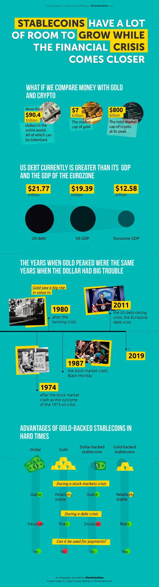

Terra 2.0 recently experienced a crash resulting in a collapse of $40 billion. Many speculate that the bear market in crypto is due to the collapse of Terra. Although the reason for the collapse is attributed to bad algorithmic design, a similar collapse of the USD could have a precarious impact on the entire crypto market, creating havoc not only in the US but globally if USD is adopted everywhere.

The USD is issued by the US government. While they aim to maintain only a 10-15% inflation rate per year, its predictability is under centralized control. Throughout history, there have been instances of bank crises leading to a sudden devaluation of the USD, and history may repeat itself.

Using the USD as the mainstream cryptocurrency contradicts the ethos of cryptocurrency, as it should be decentralized. Its use needs to be limited and avoided from dominating the market. Furthermore, since the USD is a national currency primarily serving the needs of the United States, it is less likely to effectively meet the diverse economic requirements of international nations. For example, if you belong to some other country and hold USD, the 10% USD inflation will transfer wealth from you to the US. There is no limit to how much the US government can print, and neither one can predict when they will start printing, it can be during a war, during an election, or any other crisis like covid-19

While the USD may be appropriate for short-term use, like when you want to use the money within a year, gold is perceived as a superior option for long-term savings and is better at providing a hedge against inflation or crypto-speculation.

## Decentralized USD Stable coin:

DAI is the first USD-pegged decentralized stable coin. It use many other cryptocurrency as collateral including USDC. It uses price oracle of USD to stabilize the DAI price same as USD.

DAI, a crypto-collateralized stablecoin by MakerDAO, has seen its asset weightage shift [towards stablecoins](https://members.delphidigital.io/reports/usdc-grows-dais-collateral-woes-bayc-pushes-higher/). Many criticized DAI for being backed by 60% stablecoins, as it means that DAI is also exposed to the same centralization and regulatory risks of the stablecoins (mainly USDC).

Similarly USD stable coin is also implemented for polkadot ecosystem, e.g. [AcalNetwork](https://github.com/AcalaNetwork/Acala) You can view the detailed workings through the link.

Acala's aUSD also [crashed due to a bug in its code](https://www.cryptotimes.io/why-did-acala-ausd-drop/). Though errors in the code can be fixed, what truly matters is a stable coin protocol or algorithm design that works. Here is a [video explaining why it's so hard to build a decentralized stable coin](https://finematics.com/bank-run-in-defi-iron-finance-explained/).

One interesting stable coin is [Ampleforth](https://finematics.com/ampleforth-explained/), where the number of coins in your wallet keeps changing.

## Gold price pegged decentralized stable coin:

Gold cryptocurrency can provide hedge against inflation and fluctuating prices of or other cryptocurrency. For example, from 2004 to 2022, the price of an [ounce of gold in rupees](https://goldprice.org/gold-price-charts/20-year-gold-price-history-in-indian-rupees-per-ounce) has changed from Rs. 20,000 to Rs. 160,000. Gold has a history of being the best and most well-tested currency since 700 BC.

Here are the few [gold backed cryptocurrency:](https://www.softwaretestinghelp.com/gold-backed-cryptocurrency/)

1. Tether Gold (XAUT)

3. DigixGlobal (DGX)

5. PAX Gold (PAXG)

7. Gold Coin (GLC)

9. Perth Mint Gold Token (PMGT)

11. Meld

But like USDT and other USD based crypto stable coin, gold stable coins too are not fully decentralized and work under centralized regulated entities.

For a currency to become stable, it needs widespread usage and a substantial market cap. Despite Bitcoin having a significant market cap, it is unlikely to become stable due to most coins being held by a few corporations. Furthermore, it relies on ancient technology that is challenging to upgrade and faces issues like centralization with a few mining pools.

> Maybe in the future, we won't need stablecoins pegged to USD or gold. Funds could be transferred with improved decentralized governance using the native currency, and prices could be determined through more advanced decentralized algorithms, rather than [relying solely on demand and supply](https://iambrainstorming.wordpress.com/2022/12/19/what-if-crypto-token-prices-are-discovered-through-consensus-rather-than-demand-and-supply/) as attributes. This could bring stability to the native currency.

