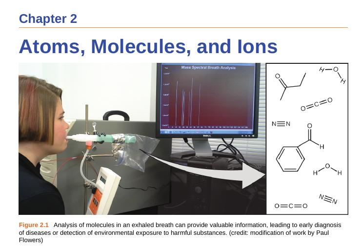

Comparative analysis of **Openstax** chemistry book and our **NCERT** chemistry book read by largest populated country  
  
Review of chapter **Atoms, Molecules and Ions** of Openstax and **Structure of Atom** in NCERT  
  
  
  
  

  

Openstax starts the chapter with a picture mass spectral analysis. Mass spectrometry is a very important technique to study atomic properties. To make you more curious it talks about the diagnosis of diseases through analysis of molecules in an exhaled breath.  
  
  
But ncert book image is this:  
  
NO IMAGE  
  
**Let's come down to the introduction:**  
  
**NCERT Chemistry:**  
_The existence of atoms has been proposed since the time of early Indian and Greek philosophers (400 B.C.) who were of the view that atoms are the fundamental building blocks of matter. According to them, the continued subdivisions of matter would ultimately yield atoms which would not be further divisible. The word ‘atom’ has been derived from the Greek word ‘a-tomio’ which means ‘uncut-able’ or ‘non-divisible’. These earlier ideas were mere speculations and there was no way to test them experimentally. These ideas remained dormant for a very long time and were revived again by scientists in the nineteenth century._  
_The atomic theory of matter was first proposed on a firm scientific basis by John Dalton, a British school teacher in 1808. His theory, called Dalton’s atomic theory, regarded the atom as the ultimate particle of matter (Unit 1)._  
_In this unit we start with the experimental observations made by scientists towards the end of nineteenth and beginning of twentieth century. These established that atoms can be further divided into sub-atomic particles, i.e., electrons, protons and neutrons— a concept very different from that of Dalton. The major problems before the scientists at that time were:_  
_to account for the stability of atom after the discovery of sub-atomic particles,_  
_to compare the behaviour of one element from other in terms of both physical and chemical properties,to explain the formation of different kinds of molecules by the combination of different atoms and, to understand the origin and nature of the characteristics of electromagnetic radiation absorbed or emitted by atoms._  
  
**Openstax Chemistry:**  
_Your overall health and susceptibility to disease depends upon the complex interaction between your genetic makeup and environmental exposure, with the outcome difficult to predict. Early detection of biomarkers, substances that indicate an organism’s disease or physiological state, could allow diagnosis and treatment before a condition becomes serious or irreversible. Recent studies have shown that your exhaled breath can contain molecules that may be biomarkers for recent exposure to environmental contaminants or for pathological conditions ranging from asthma to lung cancer. Scientists are working to develop biomarker “fingerprints” that could be used to diagnose a specific disease based on the amounts and identities of certain molecules in a patient’s exhaled breath. An essential concept underlying this goal is that of a molecule’s identity, which is determined by the numbers and types of atoms it contains, and how they are bonded together. This chapter will describe some of the fundamental chemical principles_ _related to the composition of matter, including those central to the concept of molecular identity._  
  
  
So openstax chemistry talks about latest applications of molecular identity such as biomarker "fingerprints", its gives you an idea of what's going on in the cutting edge research. So your imagination is just on the fly that will let you probe into the latest research, thinking in the brink, and can make you even interested in doing further research. It gives you an exemplar,  why structure? Why structure is so important to us.  
  
Ncert book gives a disinterested, boring and average introduction that just presents information of past definition. It doesn't address probing and experimental limitations of why atom was thought to be indivisible at that time. Also is the data even fully correct.  
  
  
**This is an excerpt from Nivaldo J.Tro introduction:**  
  
_The answers have varied over time. On the scale of everyday objects, the matter appears continuous, or infinitely divisible. And until about 200 years ago, many scientists thought that matter was indeed continuous-- but they were proven wrong. If you were to divide the graphite from your pencil tip into smaller and smaller pieces (far smaller than the eye could see), you would eventually end up with individual carbon atoms. The word atom comes from the Gree atomos, meaning "indivisible". You cannot divide a carbon atom into smaller pieces and still have carbon. Atoms compose all ordinary matter- if you want to understand the matter, you must begin by understanding atoms._  
  
**But ncert book writes this:**   
_"The existence of atoms has been proposed since the time of early Indian and Greek philosophers (400 B.C.) who were of the view that atoms are the fundamental building blocks of matter. According to them, the continued subdivisions of matter would ultimately yield atoms which would not be further divisible."_   
  
Also, let's compare the texts of the same topic i.e. atoms un-divisible. Nivaldo Tro explains why atoms are indivisible because it will no longer stay as carbon in the given example. It also gives an example of real life, the graphite of pencil tip which we always find breaking, so you can just imagine it without effort as its so familiar to you.  
  
Here are the links to two books for downloading for further comparison. The shallowness of ncert books never goes throughout the book.  
[https://openstax.org/subjects/science](https://openstax.org/subjects/science)  
  
[http://epathshala.nic.in/e-pathshala-4/flipbook/](http://epathshala.nic.in/e-pathshala-4/flipbook/)  
  
Why question to everyone is:  **Does a country with nearly 41% of the population below the age of 20 (which our PM is proud of, talks about skill development) deserves such kind of books?**  
**I have already written that about 99.9% of our books are even below the standards of ncert books, one can imagine how grave the situation is.**  
**[https://iambrainstorming.ml/all-books-that-dont-meet-the-learning-criteria-must-be-taken-off/](https://iambrainstorming.ml/all-books-that-dont-meet-the-learning-criteria-must-be-taken-off/)**  
  
Openstax books are all open access for everyone, but our policy maker doesn't even adopt an open access book and they talk about quality.
