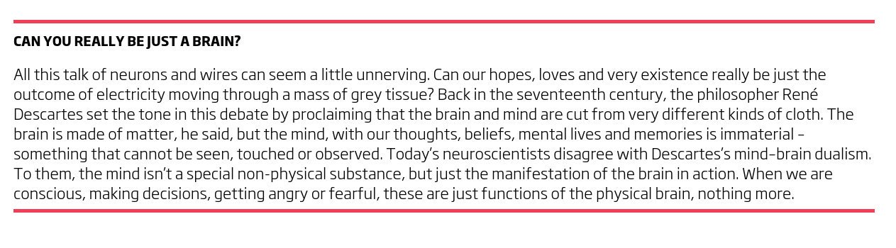

"Nothing in Biology Makes Sense Except in the Light of Evolution" is a 1973 essay by the evolutionary biologist and Eastern Orthodox Christian Theodosius Dobzhansky, criticising anti-evolution creationism and espousing theistic evolution.

Through evolution, human behavior depends on incentives, and incentive structure is shaped by economics.

https://www.youtube.com/watch?v=actEhnPE4VM

https://www.youtube.com/watch?v=g9uUIUqhrSQ

Introduction to Incentives

> Even what you think depends on incentives, because good education depends on incentive structure.
> 
> [Public-private partnership schools & colleges and its implementation](https://iambrainstorming.blogspot.com/2017/06/public-private-partnership-schools-and.html)

Do economist think that everyone is self-interested all the time? Of course not. We love our spouses and children just like everyone else! But economists do think that people respond in predictable ways to incentives of all kinds. Fame, power, reputation, sex, and love are all important incentives. Economist even think that benevolence responds to incentives. It's not surprising to economist, for example, that charities publicize the names of their donors. Some people do give anonymously, but how many building on your campus are named Anonymous Hall? --- Modern Principles of Economics

Social networking sites all make use of incentive system, likes, retweet to incentivize the content.

> Incentives can make you do the right things, also the bad things.

> When we are conscious, making decisions, getting angry or fearful, these are just functions of the physical brain, nothing more.
> 
> \- On Free WILL

The Brain By NewScientist

https://youtu.be/se-sQy8t75E

No Free Will: How the idea impacts our thinking processes?

> Having the right incentives is key, but incentives are messy, many times can have unintended consequences, sometimes attempted solution to a problem can make the problem worse #CobraEffect

The people's world is run by the people's brains. Different people can behave differently to the same kinds of incentives. #WorldView #Education #KnowingTheRulesOfGame #MentalModels #InformationInBrain

https://youtu.be/3ez10ADR\_gM?t=455

Incentives

The invisible hand no more works with automation. People do respond to incentives in a predictable way, but they need not have to take advantage of each other's greed, they do can behave rationally and think about community before acting.

> We behave based on economic design, and we design based open our behaviour. #Catch22

> One can align self-interest with interests of common. Can we build such designs?

Invisible hands no longer works with automation
