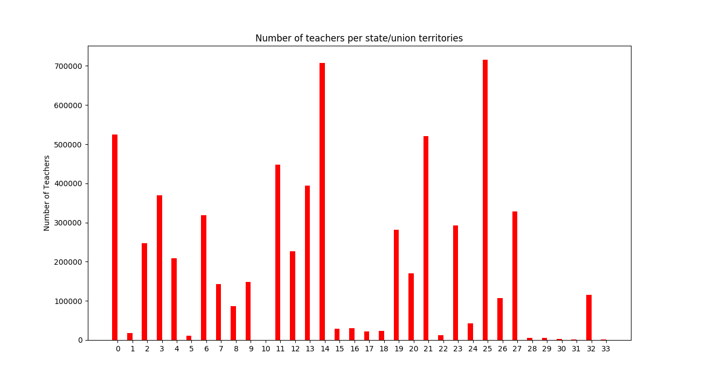

Source: data.gov.in  
  
  
0        Andhra Pradesh  
1     Arunachal Pradesh  
2                 Assam  
3                 Bihar  
4          Chhattisgarh  
5                   Goa  
6               Gujarat  
7               Haryana  
8      Himachal Pradesh  
9     Jammu and Kashmir  
10            Jharkhand  
11            Karnataka  
12               Kerala  
13       Madhya Pradesh  
14          Maharashtra  
15              Manipur  
16            Meghalaya  
17              Mizoram  
18             Nagaland  
19               Odisha  
20               Punjab  
21            Rajasthan  
22               Sikkim  
23           Tamil Nadu  
24              Tripura  
25        Uttar Pradesh  
26          Uttarakhand  
27          West Bengal  
28    A. and N. Islands  
29           Chandigarh  
30     D. and N. Haveli  
31        Daman and Diu  
32                Delhi  
33          Lakshadweep  

  

  
As per 2010-11 report total number of teachers: 6554246  
  
India Total population: 1,340,708,984  
  
% of teachers of total population: 0.49%  
  
41% of the population are below 20 years: 549690683  
  
If required teachers or trainer to student ratio is 1/50 = 0.02  
present teachers to student ratio is 6554246/549690683 = 0.011  
  
In countries like USA, 2% of total population are teachers.  
  
**Whats need to be done?**  
  

- Funding children instead of schools. (How policy should be so that it improves teachers, student ratio needs to be thought of?)
- Reward real world problem solving through projects instead of marks and clearing the entrances, the mindset of just marks should be completely removed.
- Weed out takers and create a culture of producing more givers

  
        [https://www.ted.com/talks/adam\_grant\_are\_you\_a\_giver\_or\_a\_taker](https://www.ted.com/talks/adam_grant_are_you_a_giver_or_a_taker)
