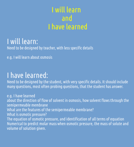
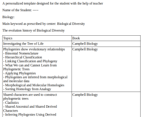
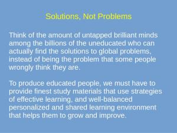
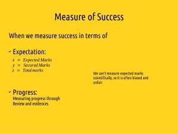
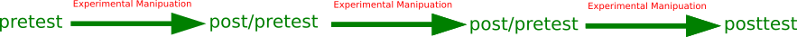
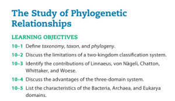
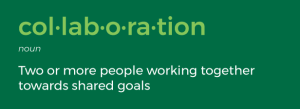
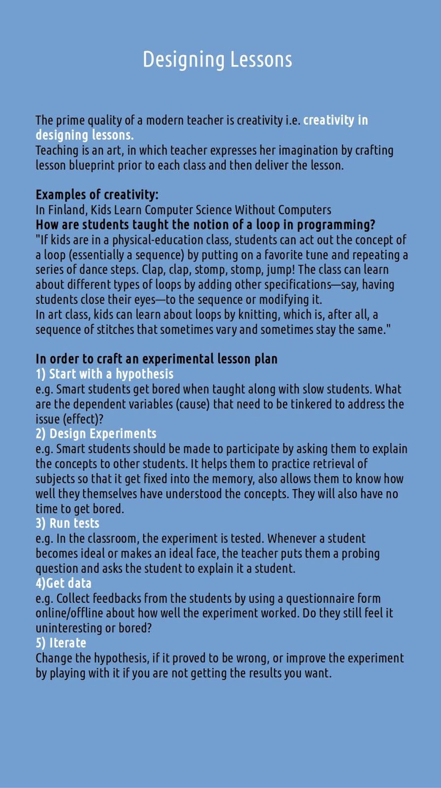
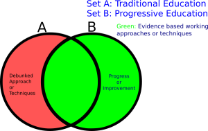

\[youtube=https://www.youtube.com/watch?v=asg\_avW9nK4&w=320&h=266\]

**Some students perform better, while others not. What are the main reasons?**  
  
1) **Study material provided and learning strategies used by teachers.** **[It simply doesn't meet the learning criteria.](http://technoperiod.blogspot.in/2017/01/all-books-that-dont-meet-learning.html)**  
[https://github.com/amiyatulu/teacher\_resources](https://github.com/amiyatulu/teacher_resources)  
Students are feed with so much of abstract stuff as a result only those students excel who have a better memory retention capacity of abstract information and those who work too hard for it. But such a hard work is meaningless, as you will forget such information after exams are over.  
  
2) **Not teaching kids from where they are.**   
I will explain it with a concrete example.  
  
While teaching chemistry, one of my students was so fast in holding information and doing the problems, while other was slow. The reason for her/his slowness is **not** that he/she is less intelligent, it's because (s)he is **taking more time for processing due to lack of previous foundational information.**   
  
When (s)he does the processing, (s)he **has to take the account of many kinds of stuff that (s)he has not learned before.** For example, while teaching chemical kinetics I found out that (s)he doesn't know even the BDMAS operation of maths. Chemical kinetics chapter is math heavy, but I tried to explain everything with concrete representation, but still, students were **unable** to do the problems or **reach the solution accurately** because it requires so much practice of math fundamentals before doing those problems. But the good thing is that they have understood everything that I taught.  
  
From this, **I learned that you can explain stuff catching anyone from the street if you are explaining it in the simplest way possible, so that (s)he can understand it.**  
  
Similarly, while teaching redox reactions, one of my students was too slow, because (s)he doesn't know about periodic table much. What are the electronegative elements? Also (s)he was making the error in calculation while solving for x. Changing values from LHS to RHS or vice versa problem that most students face while solving an equation.  
  
So the fast student needn't have to spend so much time in doing because her/his brain is already trained for the fundamental stuff that is required. So (s)he requires less processing to reach the solution.  
  
So the message is "**_New information is built over reusing of previous information_**"  For example, **one has to know the alphabets to write words, words and grammar rules to write sentences**.  
  
  
  
**Why personalized education?**  
There are no one-size-fits for all. All learn at a different pace as they have different levels of background and prior information and different experiences, different choices, different personalities and different strengths and weaknesses.  
  
  
**Why learning pace differ?**  
There are many reasons for it, especially the prior knowledge of the subjects, and learning habits. Some are bookworms spend more time on studies, while others are more sportive and entertainment seeker. There is a lot of impact of having a prior knowledge such as good vocabularies, overlearning of basic mathematical skills which free down the working memory so that there working memory is used in building strategies to solve mathematical problems with full capacity, the preceding familiarity with the subject taught. Learning habits include using or not using effective evidence-based learning strategies.  
  
**The problem with different learning pace.**  
In the present system, most schools teach the same curriculum without giving any freedom to the learning pace of students. As a result of which students are unable to cope with the curriculum, and the result is all-or-none i.e. those who are unable to cope with the speed of curriculum, fall behind because less learning/understanding leads to further less learning of later topics, and **this process is compounded** every time.  
  

  

  

Question design is important, and it should be more personalized. If a student doesn't perform well in some topics of the exam, such topics should be noted down and intervention needs to be taken, then again a posttest with questions based on the performance of pretest.

  

These tests should be of **low stakes**.

Questions design should meet the learning strategies, not random questions only to test students.

**Each unit should undergo this chain, till the learning goals are reached.**

  

[How experimental manipulation needs to be done?](http://technoperiod.blogspot.in/2017/05/experimental-manipulation-after-tests.html)

  

Some of the more questions are 

**What time interval these tests need to be taken?** That depends on the study material, and students learning time and should be done carefully by the teacher by proper observation.

**But it increases too much workload for teachers?**

Most work will be designing questions and checking of answer scripts. But this workload can be decreased by the use of technology.

  

Most often the study material/books have questions, so they can manipulate values and give it again, or giving only a few questions (not all questions in the material) for each topic in each test, or using questions from many books 

  

Probiquery: A single page application to share questions with students  
Source Code (in github):  
[https://github.com/amiyatulu/pobiquery](https://github.com/amiyatulu/pobiquery)  
Demo:  
[https://rebrand.ly/demo\_probiquery](https://rebrand.ly/demo_probiquery)

  

**Discovering Merit**

  

The purpose of education is the progress of students, but when we look at the industry they require the scaling that help them to discover merit.

  

Here, the need for comparison between students is required. In education comparison between students, not necessarily mean competition. The comparison helps us to construct a critical nature in us, that helps us to progress. The purpose of comparison is to discover what is effective and what is ineffective or less effective.

  

We need an effective methodology that helps students to track their progress, also scaling system that helps the industry to appoint candidate based on merit.

  

Summative assessment should be microscopic instead of macroscopic.

It encourages growth mindset and mastery of subjects.

  

The summative assessment or exam should meet the following specification:

  

1) Each unit should be given time for at least half hour to solve the questions. In a single day, 6 units need to be covered, instead of all units.

2) Questions from each concept or learning objective should be present for each unit.

  

  

  

**How to implement project-based learning?**

A website for submission of links to blogs where ideas and procedure of projects are written. They should share few photographs and/or videos about the projects that were done, along with the caption that explains the photograph. Also, use social networking sites like tweeter to share the links

Students record of the projects must be uploaded to a website, which will undergo plagiarism checker and review. Then provide feedback to the students and schools to improve on it.

The website should also act as an interface for sharing ideas, feedback and criticism between different schools and colleges so that everyone refines and improves their projects

  

  

All these different kinds of websites should only act as a feedback system to share and improve ideas, and can be used to narrate statistical information, but should not be used for any lawful step against/ in for of students, schools or colleges. 

  

**These websites will bring awareness towards effective learning strategies so that no one remains ill/less/misinformed due to lack of communication.**

**The action plan will act as _collective intelligence_ to transform education.**

  

  

[https://drive.google.com/file/d/0B8x9dkicaW23SWJVb1FGbURvT2s/view?usp=sharing](https://drive.google.com/file/d/0B8x9dkicaW23SWJVb1FGbURvT2s/view?usp=sharing)

  

  
**Traditional Vs Progressive Education:**  

**Why share learning outcomes with students?**

  

  

[http://www.learningscientists.org/blog/2017/10/4-1](http://www.learningscientists.org/blog/2017/10/4-1)
