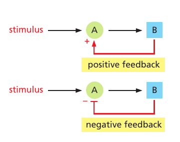
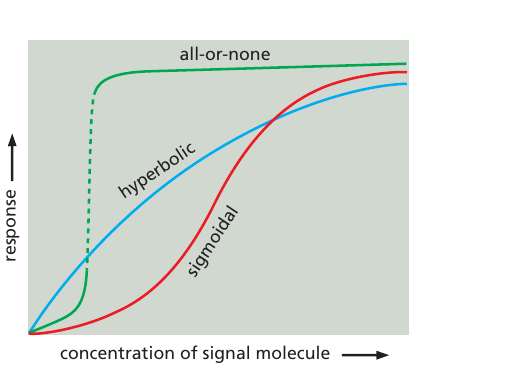
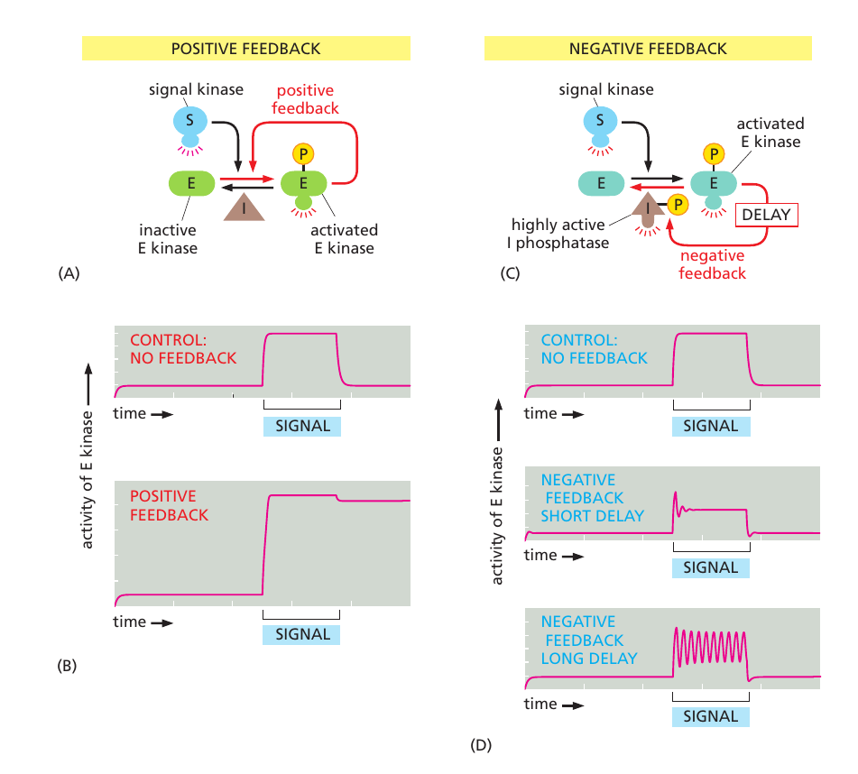

# Feedback Loop for understanding free will

## Thermostat a simple feedback loop

A thermostat is a simple feedback loop system that helps maintain a desired temperature in a room or building. It consists of four main components: a sensor, a controller, an actuator, and a setpoint.
### Sensor

The sensor measures the temperature of the room. It is usually a thermistor or a thermocouple that changes its resistance or voltage output with temperature variations.
### Controller

The controller compares the measured temperature with the desired temperature (setpoint). If the measured temperature is lower than the setpoint, the controller sends a signal to the actuator to turn on the heating system. If the measured temperature is higher than the setpoint, the controller sends a signal to turn off the heating system.
### Actuator

The actuator is responsible for controlling the heating system (such as a furnace, boiler, or air conditioner). It receives the signal from the controller and adjusts the heating system accordingly.
### Setpoint

The setpoint is the desired temperature that the user wants to maintain in the room or building. It can be adjusted manually or automatically based on the user's preferences and environmental conditions.

## Our body also works through feedback loops at the cellular level

- Book: Molecular Biology of the Cell, Bruce Alberts

In positive feedback, the output stimulates its own production; in negative feedback, the output inhibits its own production. Feedback loops are of great general importance in biology, and **they regulate many chemical and physical processes in cells**. Those that regulate cell signaling can either operate exclusively within the target cell or involve the secretion of extracellular signals.
Here, we focus on those feedback loops that operate entirely within the target cell; even the simplest of these loops can produce complex and interesting effects.

In these simple examples, a stimulus activates protein A, which, in turn, activates protein B. Protein B then acts back to either increase or decrease the activity of A.i

Positive feedback in a signaling pathway can transform the behavior of the responding cell. If the positive feedback is of only moderate strength, its effect will be simply to steepen the response to the signal, generating a sigmoidal response like those described earlier; but if the feedback is strong enough, it can produce an all-or-none response. 

This response goes hand in hand with a further property: once the responding system has switched to the high level of activation, this condition is often self-sustaining and can persist even after the signal strength drops back below its critical value. In such a case, the system is said to be bistable: it can exist in either a “switched-off” or a “switched-on” state, and a transient stimulus can flip it from the one state to the other.

### Cell memory and positive feedback loop

Through positive feedback, a transient extracellular signal can induce long-term changes in cells and their progeny that can persist for the lifetime of the organism. The signals that trigger muscle-cell specification, for example, turn on the transcription of a series of genes that encode muscle-specific transcription regulatory proteins, which stimulate the transcription of their own genes, as well as genes encoding various other muscle-cell proteins; in this way, the decision to become a muscle cell is made permanent. This type of cell memory, which depends on positive feedback, is one of the basic ways in which a cell can undergo a lasting change of character without any alteration in its DNA sequence.

### Summary of feedback loop in cell
Each cell in a multicellular animal is programmed to respond to a specific set of extracellular signal molecules produced by other cells. The signal molecules act by binding to a complementary set of receptor proteins expressed by the target cells. Most extracellular signal molecules activate cell-surface receptor proteins, which act as signal transducers, converting the extracellular signal into intracellular ones that alter the behavior of the target cell. Activated receptors relay the signal into the cell interior by activating intracellular signaling proteins. Some of these signaling proteins transduce, amplify, or spread the signal as they relay it, while others integrate signals from different signaling pathways. Some function as switches that are transiently activated by phosphorylation or GTP binding. Large signaling complexes form by means of modular interaction domains in the signaling proteins, which allow the proteins to form functional signaling networks.

Target cells use various mechanisms, including feedback loops, to adjust the ways in which they respond to extracellular signals. Positive feedback loops can help cells to respond in an all-or-none fashion to a gradually increasing concentration of an extracellular signal and to convert a short-lasting signal into a long-lasting, or even irreversible, response. Negative feedback allows cells to adapt to a signal molecule, which enables them to respond to small changes in the concentration of the signal molecule over a large concentration range.

## Feedback loop in brain

Take for example, feedback loop of anger and fear, activated by rumination and involving the amygdala, can be quite complex but generally follows a pattern:

### Trigger

The loop typically begins with a trigger, which could be an external event or an internal thought or memory that provokes feelings of anger or fear. This trigger activates the amygdala, a region of the brain associated with processing emotions, particularly those related to survival instincts like fear and aggression.

### Emotional Response

When the amygdala is activated, it sends signals to various parts of the brain that regulate emotions, resulting in an emotional response. In the case of anger, this might manifest as feelings of frustration, irritation, or hostility. In the case of fear, it might lead to feelings of anxiety, panic, or a heightened sense of danger.

### Cognitive Appraisal

Following the emotional response, the brain engages in cognitive appraisal, where it interprets and evaluates the situation. Rumination, or repetitive thinking about the trigger and its consequences, plays a significant role here. Rumination often involves dwelling on negative thoughts, replaying scenarios, and focusing on perceived threats or injustices.

### Amplification

Rumination can amplify the emotional response, making the feelings of anger or fear more intense and prolonged. This is where the feedback loop comes into play. The more one ruminates on the trigger and its implications, the more the amygdala is activated, leading to stronger emotional responses.

### Physiological Effects

Alongside the cognitive and emotional processes, there are physiological effects associated with anger and fear. These can include increased heart rate, elevated blood pressure, muscle tension, and changes in breathing patterns. These physiological changes can further fuel the emotional response and perpetuate the feedback loop.

### Behavioral Responses

Finally, the loop influences behavioral responses. For example, someone caught in this feedback loop might act out aggressively when experiencing anger or avoid situations that trigger fear. These behaviors can, in turn, reinforce the initial trigger or create new triggers, perpetuating the cycle.

Breaking this loop often requires interventions that address both the cognitive and emotional components, such as cognitive-behavioral therapy (CBT), mindfulness techniques, or stress-reduction strategies. These approaches aim to disrupt rumination, regulate emotional responses, and promote healthier coping mechanisms.
