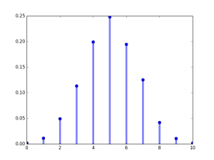
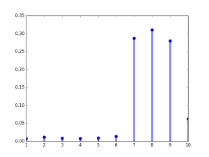

**What type of variable is the mark, discrete or continuous?**  
Marks is a discrete random variable that has a finite number of values or a countable number of values.  
  
A continuous random variable has infinitely many values, and those values can be associated with measurements on a continuous scale in such a way that there are no gaps or interruptions.  
  
**Requirements for a Probability Distribution**  
1\. ΣP(x) = 1 where x assumes all possible values of marks  
2\. 0 ≤ P(x) ≤ 1 for every individual value of x  
  
For example, 2000 students gave exams with full marks of 10, the probability distribution of marks to have a normal like curve will have following frequency distribution given in the table.  
  
  

| Marks x | Frequency _f_ | Probability P(X=x) |
| --- | --- | --- |
| 0 | 4 | 0.002 |
| 1 | 23 | 0.0115 |
| 2 | 99 | 0.0495 |
| 3 | 227 | 0.1135 |
| 4 | 399 | 0.1995 |
| 5 | 497 | 0.2485 |
| 6 | 390 | 0.195 |
| 7 | 251 | 0.1255 |
| 8 | 84 | 0.042 |
| 9 | 22 | 0.011 |
| 10 | 4 | 0.002 |

  
  
  

