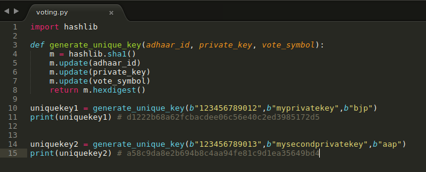
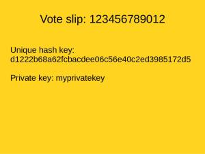

Here is the complete procedure to make a secure voting system.  
  
We require a unique key for every voter.  
  
The unique key is generated by using:  
1) Public Key: Voter Id or Adhaar Number  
2) Private key: A random key (6-8 character alphanumeric key) from mind, at the time of voting  
3) Vote symbol  
  
  

  
  
A read-only machine generates a unique key using the cryptographic function on the public key, private key and vote symbol.  
  
Then ballot paper is printed from the machine **that has** the unique key.  
  
The voter casts its vote in the ballot paper.  
  
The votes in ballot paper are counted using a machine and also the scan of the ballot paper is uploaded on the website after results are declared.  
Machine learning has become so powerful that it can count the vote without any error.  
  
When the result is declared the public can check whether that ballot paper (that has the unique key) exists on the website with the correct voting symbol. The voter can authenticate that his/her vote has been counted.  
  
  
Merits:  
1) **Completely secure**: As the machine that generates the unique code is read-only, nothing is stored in the machine.  
Only one can manipulate by stealing the voted paper ballots. But if they do it, it can be known as these ballot papers are uploaded on the website. People can review their votes by using their random unique key.  
  
2) **Fast**: As counting is done by machine, it is also a fast method. You can use as many numbers of machines to count.  
3) **Secure of identity**: It also keeps the identity of the voter secure.  
  
Even EVM like machine can be used and votes can be published online for review by people, provided the unique key is printed in the VVPAT slip.  
And the vote symbol in EVM machine is stored with linking the random key.  
(Perhaps an extra attachment is required that stores unique key linked to the vote symbol instead of vote counter )  
  
The private key or the vote slip should be kept secret by the voter if they want to keep their voting secret.  
  

  
  
The unique key with its vote symbol can be published online in form of PDF after the counting is done.  
  
In the case of discrepancy, a voter must produce the private key in court (along with VVPAT slip) if the published result i.e. unique key and the vote symbol don't match together. The court can take the private key, public key and vote symbol and generate the unique key to check whether the claim of unique key belongs to the person, and vote symbol linked with is correct or not.  
  
Another way of fraud is adding a new unique hash key which voter has not generated. To tackle it a copy of all generated unique hash key without the votes are stored in a different machine along with its hard copy per booth. The machine should shuffle the unique hash keys before displaying or printing so that one can't make a prediction of voter identity by using booth row sequence and unique hash keys sequence.
