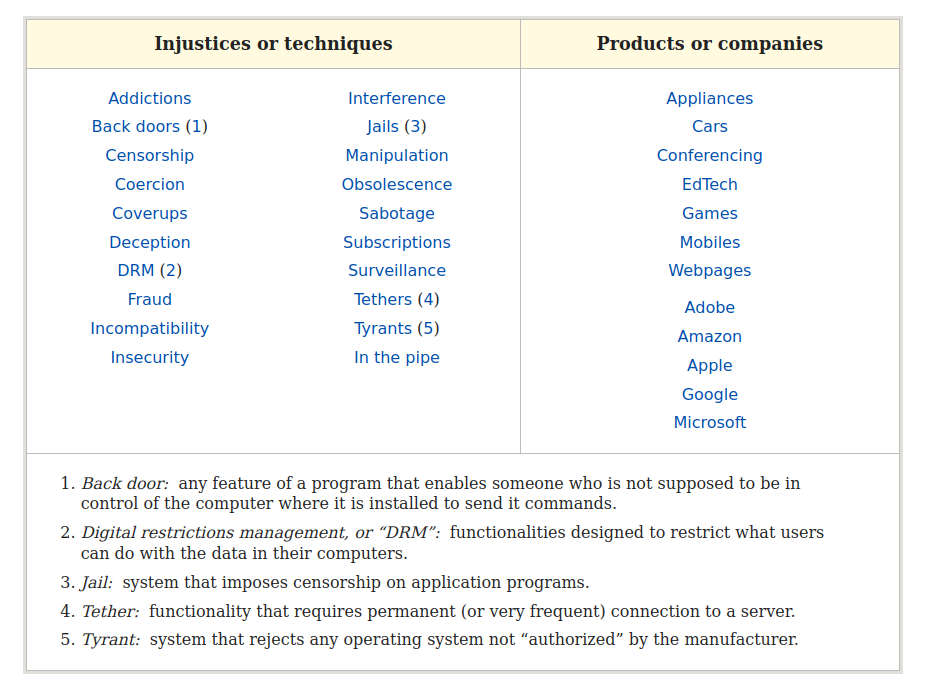

# Open Source or Free Software or FOSS Philosophy

[gnu.org Philosophy](https://www.gnu.org/philosophy/philosophy.en.html)

## What is a Free Software

“Free software” means software that respects users' freedom and community. Roughly, it means that the users have the freedom to run, copy, distribute, study, change and improve the software.

> Thus, “free software” is a matter of liberty, not price. To understand the concept, you should think of “free” as in “free speech,” not as in “free beer.”

> When users don't control the program, we call it a “nonfree” or “proprietary” program. The nonfree program controls the users, and the developer controls the program; this makes the program an [instrument of unjust power](https://www.gnu.org/philosophy/free-software-even-more-important.html).

## The four essential freedoms

A program is free software if the program's users have the four essential freedoms:

- The freedom to run the program as you wish, for any purpose (freedom 0).
- The freedom to study how the program works, and change it so it does your computing as you wish (freedom 1). Access to the source code is a precondition for this.
- The freedom to redistribute copies so you can help others (freedom 2).
- The freedom to distribute copies of your modified versions to others (freedom 3). By doing this you can give the whole community a chance to benefit from your changes. Access to the source code is a precondition for this.

## The freedom to study the source code and make changes

In order to the freedom to make changes and the freedom to publish the changed versions to be meaningful, you need to have access to the source code of the program. Therefore, accessibility of source code is a necessary condition for free software. Obfuscated “source code” is not real source code and does not count as source code.

Source code is defined as the preferred form of the program for making changes in. Thus, whatever form a developer changes to develop the program is the source code of that developer's version.

## Proprietary Software Is Often Malware

Proprietary software, also called nonfree software, means software that doesn't respect users' freedom and community. A proprietary program puts its developer or owner in a position of power over its users. This power is in itself an injustice.

> Power corrupts; the proprietary program's developer is tempted to design the program to mistreat its users. (Software designed to function in a way that mistreats the user is called malware.) Of course, the developer usually does not do this out of malice, but rather to profit more at the users' expense. That does not make it any less nasty or more legitimate.

Yielding to that temptation has become ever more frequent; nowadays it is standard practice. Modern proprietary software is typically an opportunity to be tricked, harmed, bullied or swindled.

[GNU Org: Proprietary](https://www.gnu.org/proprietary/proprietary.html)

## Free is not free access to closed source app

The term "free" in FOSS does not mean that users have free access to api of closed-source applications.

You have access to use the program for free, but in closed source software you have no control over the app; neither can you distribute it freely. For example, an ed tech company can provide some material within the app for free, but make it patented and illegal to share or modify it by others.

In this scenario, the term "free" refers to the lack of monetary cost associated with using the app, but it does not equate to freedom in terms of control and usage. Users have limited rights and are subject to the conditions set by the company, which may restrict their ability to modify, share, or distribute the app.

Proprietary software, such as the example mentioned, often relies on patents and copyrights to protect its intellectual property and maintain control over its users. This creates an imbalance of power, where the developer or owner holds all the rights to the software and its users must abide by their terms and conditions.

In contrast, Free and Open Source Software (FOSS) offers users the freedom to run, copy, distribute, study, change, and improve the software without any restrictions. The source code of FOSS is openly available for anyone to inspect, modify, and share. This ensures that users have control over their software and are not subject to the limitations imposed by proprietary software companies.

By choosing FOSS, users can avoid the risks associated with proprietary software, such as restrictions on usage, distribution, and modification. FOSS fosters a collaborative and transparent environment, where users can contribute to the development and improvement of the software, ensuring that it remains safe, secure, and trustworthy.

## “Free” as in freedom, to show we do not mean the software is gratis

When we say that open source software is "free" as in freedom, we mean that users have the liberty to use, study, modify, and distribute the software without any restrictions. This freedom empowers users to take control of their software, adapt it to their needs, and contribute to its development.

However, this does not imply that developers working on open source projects must work unpaid. While many developers contribute to open source projects out of passion or as a hobby, there are several ways in which developers can be compensated for their work. Some of these include:

- Employment: Developers can be employed by companies or organizations that use, maintain, or contribute to open source projects. In this case, they are paid for their work on the project as part of their job responsibilities.
- Grants and sponsorships: Some organizations and foundations provide grants or sponsorships to fund the development of open source projects. This can help cover the costs of development, including paying developers for their work.
- Donations: Open source projects can receive donations from individuals or organizations who support their work. These donations can be used to fund development, including paying developers for their contributions.
- **Decentralized Governance**: With the development of [decentralized fair governance using blockchain](../what-do-we-need-to-decentralize-in-the-coming-years.md#funding-open-source), open source developers can be paid more fairly for their contributions. Some governance systems, such as [Polkadot's OpenGov](https://polkadot.polkassembly.io/), are already paying open source developers.

There are several ways in which developers can be compensated for their work on open source projects, ensuring that they can continue to contribute to the community without sacrificing their livelihood.

## Open source and security

Open source software has gained immense popularity over the years, and for good reason. One of the primary benefits of open source software is the increased security it offers. The open source model encourages collaboration and transparency, which allows for a more thorough examination of the code, leading to the identification and correction of security vulnerabilities.

Free and Open Source Software (FOSS) refers to software that is both free to use and modify, as well as open for anyone to examine the source code. This transparency allows for a wider pool of experts to review the code, leading to the identification and correction of security vulnerabilities. In contrast, proprietary software is often developed behind closed doors, with only a select few individuals having access to the source code. This limited review can result in security vulnerabilities going undetected for extended periods, leaving users vulnerable to attacks.

The open source community is quick to address security issues as they arise. When a vulnerability is discovered, developers from around the world collaborate to develop and distribute patches to fix the issue. This rapid response helps to minimize the potential impact of security breaches and protect users from harm. Additionally, the open source community often has a culture of responsible disclosure, where security researchers inform developers of vulnerabilities before publicly disclosing them, giving developers time to develop and release patches before the vulnerability becomes widely known.

Open source software is also less susceptible to targeted attacks, such as zero-day exploits, which are vulnerabilities that are unknown to the developers and for which no patch exists. Since the source code is available for inspection, security researchers can identify and report these vulnerabilities more quickly than they can with proprietary software. This increased scrutiny helps to reduce the likelihood of zero-day exploits being successfully used against open source software.

In conclusion, open source software offers a higher level of security compared to proprietary software. The collaborative nature of the open source community and the transparency of the code allow for a more thorough examination of the software, leading to the identification and correction of security vulnerabilities. The rapid response to security issues and the reduced susceptibility to targeted attacks make open source software a more secure choice for users and organizations alike.

[- Schneier on Security](https://www.schneier.com/crypto-gram/archives/1999/0915.html)

## Which Open Source License to Use?

<https://choosealicense.com/>

[Copyleft licenses](https://fossa.com/blog/all-about-copyleft-licenses/) generally require that any derivative work of the copyleft-licensed software be released under the same license as the original software. In other words, the modified code has to be exactly as “open” as the original. One of the practical ramifications of this requirement is that OSS users may be forced to publish their own changes or additions in source code form if they release a binary that includes a copyleft-licensed component.

[GNU GPLv3 is a copyleft license](https://choosealicense.com/licenses/gpl-3.0/)

Copyleft licenses play a crucial role in promoting fairness and countering the unjust power taken by proprietary software makers and companies that do not pay a fair share of profit to open source developers. By using copyleft licenses, developers can ensure that their work remains accessible and available for others to use, modify, and share, without fear of exploitation by proprietary interests. This approach helps to create a more equitable digital landscape where developers can collaborate and benefit from each other's work, while also protecting their rights and ensuring that their contributions are not unfairly appropriated.

The use of copyleft licenses also discourages the mistreatment of users by proprietary software makers. By making the source code of a program available to the public, copyleft ensures that users can inspect and understand the inner workings of a program, allowing them to identify and address any malware or malicious features that may be present. This transparency promotes trust between developers and users, and encourages the creation of software that prioritizes the needs and rights of the people who use it.

Furthermore, copyleft licenses help to address the issue of companies profiting from open source software without fairly compensating the developers who create it. By requiring that any modifications or derivatives of the original work be released under the same copyleft license, these licenses ensure that the benefits of open source software development are shared among the entire community. This not only encourages collaboration and innovation, but also helps to ensure that developers are fairly compensated for their contributions, rather than being exploited by companies that seek to profit from their work without giving back.

[Which Open Source License Is Best for Commercialization?](https://fossa.com/blog/which-open-source-license-is-the-best-for-commercialization/)

Choosing the best open source license is one of the most important decisions you can make for a new project. While permissive licenses like MIT, BSD, or Apache 2.0 are popular for reducing user resistance in non-commercial projects, they may not be ideal for commercialization. Permissive-by-default licensing schemes can impact your ability to capture value from your creations, as you will need to outcompete others building on top of your project, in addition to managing your own free offering. Many successful OSS companies like Redis, Elastic, and MongoDB have tackled this challenge by adopting more creative and restrictive licensing schemes. Although there is a fear that stronger copyleft licenses like GPL might deter potential users, they can actually provide a strategic advantage for commercial open source projects. Copyleft licenses ensure that derivative works also remain open source, preventing competitors from leveraging your project without contributing back. This can help maintain control over the project's direction and monetization, ultimately supporting the successful commercialization of your software. Therefore, when the goal is to maximize value capture, copyleft licenses can be a beneficial choice for commercial open source endeavors.

### Affero General Public License (AGPLv3): A Copyleft License for the Client-Server and Networked World

[The fundamentals of the AGPLv3](https://www.fsf.org/bulletin/2021/fall/the-fundamentals-of-the-agplv3)

The GNU Affero General Public License version 3 (AGPLv3) is the most protective of computer user freedom, yet it remains the most misunderstood of the GNU family of licenses.

The AGPLv3 traces its origins to a company called Affero, Inc., established in 2001 to provide a platform for interactive "Web applications" such as discussion forums, mailing lists, email, and blogs. To ensure that users could access the source code of these applications and that any derivatives would also be shared alike, Affero needed a copyleft license. At that time, the GNU General Public License version 2 (GPLv2) was the copyleft license of choice. **However, GPLv2 was written when the client/server paradigm was not widespread and could not guarantee the copyleft assurances desired for Affero's platform. Specifically, one could modify Affero’s source code and provide access to the program over a network without releasing its source code to the public.** To address this issue, with help from the Free Software Foundation (FSF), Affero published the Affero General Public License version one (AGPLv1) in March 2002. By November 2007, the AGPL joined the GNU family of licenses with version three, offering a copyleft license designed to protect user freedom in an increasingly networked world.

### We need a FOSS license to protect us from proprietary AI.

GPLv2 was written before the widespread adoption of the client/server paradigm and thus could not guarantee copyleft assurances for servers. Similarly, the AGPL was drafted before the rise of generative AI and has similar limitations in providing copyleft assurances. Most AI models are trained using open-source code and open-access creative commons content, such as Wikipedia. Proprietary AI systems likely to collapse without the data contributions of open-source developers and Creative Commons content creators. However, the resulting AI models are often made proprietary, despite their heavy reliance on FOSS code and open-access content.

This practice goes against the philosophy of the FOSS community, and most open-source developers and creative commons content creators wouldn't agree to it. A new license is needed to address this issue and ensure that the FOSS community's contributions are respected and protected.

## Blockchain-Powered Funding: Democratizing Open Source Software Development

In the rapidly evolving landscape of open source blockchain technology, the funding of software development is undergoing significant changes. Traditionally, commercial funders have been hesitant to invest in copyleft open source software, as they are unable to develop closed source proprietary software based on it. However, the emergence of open source blockchain money has introduced new funding models that are more accessible and inclusive for developers, reducing their reliance on altruistic donations or corporate philanthropy.

Blockchain-based funding mechanisms, such as cryptocurrencies and initial coin offerings (ICOs), have provided developers with an alternative source of funding for their open source projects. These decentralized funding models enable developers to receive financial support directly from the community, without having to rely on the approval of commercial funders.

Moreover, the rise of [decentralized autonomous organizations (DAOs)](https://polkadot.polkassembly.io/), has further democratized the funding process for open source projects. DAOs are organizations that operate on a blockchain and are governed by smart contracts, allowing for transparent and decentralized decision-making processes. By leveraging the power of DAOs, developers can secure funding for their projects through community-driven initiatives, while also maintaining control over the development process and ensuring that the benefits of their work are shared among the entire community.
