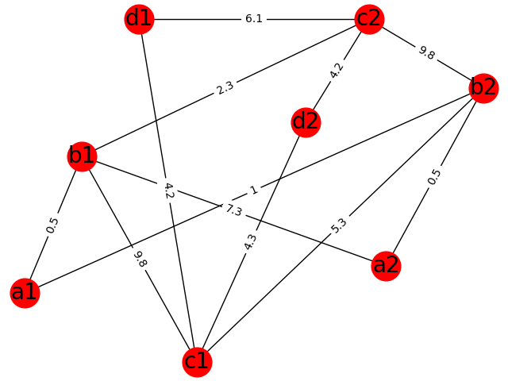

**Incentives Matters:**

Flow of Money:

Govt => Students => Teachers => Infrastructure provider  
NOT     Students => Private Infrastructure provider => Teachers  or  
NOT     Govt  => Infrastructure provider and Teachers

Incentives are rewards and penalties that motivate behavior

https://www.youtube.com/watch?v=U3z0Rxummxc

**Benefits of  this model**:  
1) No much reliance on government for the safeguarding of the quality education. Teachers as an entrepreneur will take care of it because it will bring competition for quality.

2) Teachers income depends on the ability to uphold students. So they are solely responsible for their income. They will work for themselves, instead of doing just an obligatory job on a monthly salary.

3) Students will have the freedom to choose a class, not just school. (Funding children not school)

**It also solves most problems that belong to coaching center model.**  
Some of the problems of coaching center model, that is solved in it are:  
1) There is no limitation of students intake, so no personalized care.  
2) They are expensive. Students after attending a few months usually don't go to coaching centers because of teaching to test, but many coaching centers charge yearly fees, just like private schools and colleges, especially popular ones. Also, add expenses that parents spend on colleges and schools.  
3) Many coaching centers have poor infrastructure. No auditing of infrastructure for them.  
4) Students exhaustion due to coaching centers, as they have to attain both schools and coaching classes.

The process of the model:  
1) **Govt or other private entities may provide infrastructure.**  
2) **Teachers as Entrepreneurs with coaching center business model**  
Why is coaching center business model effective?  
[https://iambrainstorming.blogspot.in/2017/05/allowing-mediocre-colleges-to-provide.html](https://iambrainstorming.blogspot.in/2017/05/allowing-mediocre-colleges-to-provide.html)

Teachers should run the schools, instead of any building owner. Each teacher will have its share of the money produced. A govt website can be made that will help in the collaboration of teachers for becoming partners. Teachers should pay some amount of money for infrastructure spending of the government or other private entities every month.

3) **Ability to choose teacher not school.**  
Students should have the ability to choose at the level of the teacher, not at the level of school.  
4) **Limits to the number of students per teacher**  
Students should be affiliated in the name of teacher for a particular subject instead of school. The teacher should be given the charge for student results instead of school. Students must register their teacher name before five months of course completion. They can't change their teacher after registering. 15 days should be kept as a testing period for students, teachers, and parents to explore their preferences.

> The maximum limit of students per subject teacher for six months should be 30 with an **average classroom size of 10 students**. Teachers can take more students in special cases, such as the [online library with mentors](https://iambrainstorming.wordpress.com/2017/08/24/importance-of-educational-videos-and-solving-its-limitation-by-teachers-assistance/), project works that require large collaboration, or for learning things where 1:1 teacher and student participation is not that important, such as gym or dance classes.

Even 30 students for me seems unachievable for teaching technical subjects if students don't make an intrinsic effort or have less foundational knowledge or teacher lack the required knowledge (inexperienced) who is still learning. It depends on teacher, how many students (s)he can manage, based on time (s)he wants to give, type of students, and creative pedagogical ideas and technological ideas to handle students.

5) **Exams**

Exams need to be topic-wise, mastery-based, and are of low stakes. You need to reappear the topic exam which you have not scored well. Examination center can be another node in the given below competitive collaboration algorithm, where some 5 students of a teacher can connect to a particular exam center node. Exam centers should have properties like CCTV cameras, random invigilators.

> Its the subject teacher who will prepare or select the questions for his/her students, if a teacher has 30 or fewer students, he/she has to prepare _30_ times _n_ questions for _each_ topic, where _n_ is a number of questions assigned to a student for _each_ topic.

For example, each topic can have 6 questions, 30 times 6 equals 180 questions per topic. If there are 5 topics, total questions equal 180\*5=  900 questions. The question paper will have 900 questions, but the student will attempt 6\*5 = 30 assigned questions out of it.

_Its an example, question paper can contain all the questions of the content. It would be somewhere around 300-400 questions per chapter with a few topics._ 

Questions can be the same or equivalent that of practice questions given in the classroom.

> In case of multiple choice questions and numerical, one has to elaborate the thinking process, approach to the problem, strategy to solve it, and the reasoning for eliminating and choosing the options, in order to fetch marks. There will not be any stringent time limitation in the exam. One can take extra one to two hours for writing.

**Exam center node will randomly assign these questions to students.**

**How random selection will be done?** Mapping of question number and student id generated by the algorithm will come through the internet at the time of examination.  All questions will already be present offline on the computer or as paper, students will just choose the questions they are asked to do.

> 3 hours exams is not a place where you will give students research questions or questions that differ a lot from practice questions. It's for classroom assignments, not for the exam.

> _Also, questions and answers will come under peer review to check the quality of questions and how students have learned, and are of low stakes i.e Pass or fail in each topic, not whole subject._  
> _Other evidence of learning should also come under peer review._

**Continuous boundless learning with #RetrievalPractice #Spacing**

Last week of Nth month will have three exams each of two days. The one taught in Nth month, that is taught in N-2 month, and that is taught in N-5 month. #SimplifiedModelYou can also skip the one that is taught in Nth month if you are doing assessment weekly in real time.  So, only 4 days for exams for N-2 and N-5 month.

> **Avrit**: A democratic way of designing and reviewing the quality and the importance of study material or content, assignments, projects, practicals and assessments and your evidence of learning.
> 
> [https://github.com/amiyatulu/avrit-ui](https://github.com/amiyatulu/avrit-ui)

Personalized learning goals:  
[http://technoperiod.blogspot.in/2017/02/personalized-learning-goals-new.html](http://technoperiod.blogspot.in/2017/02/personalized-learning-goals-new.html)

6) **Fund student, not school**  
From students of a low-income family, each month some tuition fees can be given.

Also, visit:

How colleges and schools can be run like an assembly system. [http://technoperiod.blogspot.in/2016/05/how-moocs-open-lab-can-completely.html](http://technoperiod.blogspot.in/2016/05/how-moocs-open-lab-can-completely.html)

## **The algorithm to design the database and implement it:**

Competitive Collaboration Algorithm

[http://technoperiod.blogspot.com/2018/10/the-competitive-collaboration-algorithm.html](http://technoperiod.blogspot.com/2018/10/the-competitive-collaboration-algorithm.html)

**What competitive collaboration algorithm can achieve in education?**  
Please read the advantages after reading the linked blog.  
1) The network can include all service providers, such as classroom, content provider such as MOOCs, open laboratories,  dance classes, gym, parks, playground, child care for working parents, teachers based on specialization, science park with essential experiments and equipments like telescope to validate what has been learned in classroom, even part-time job providers at the same place or just anything that is required in education.  
2) Anyone can become a service provider that meets the requirements, and resources will not remain ideal, because of its availability and discovery in the app.  
3) Reviews of services in the app will help to get the quality assessment of services.  
4) No requirement of residential colleges and schools, quality education will be available just nearby your home, as entrepreneurs will like to add nodes based on requirements in a particular location using the data available in the app.  
5) High teacher salary, less student fees, and more quality education.  
6) **Life long learning** with no certificate or degree provider, real learning that is required for society, and evidence of your work and learning are directly uploaded online that is linked to the resume of the student which will come under review.  
For example, if you are learning painting, you have to provide a beautiful painting done by you, if you are learning music, you have to provide a music composition done by you, if you are learning science, you need to provide the annotations, questions, explanation through voice recording or through documentation. _Your resume with all the evidence links can be stored in immutable and open database like blockchain._

Glad to hear feedback or any loopholes in the system.

**References:**

https://youtu.be/A9UmdY0E8hU

Social democracies give free higher education to everybody, and cheap student loans, and grants. That enables more people to use their talents and earn money

[Does class size matter?](https://blogs.edweek.org/edweek/finding_common_ground/2013/10/does_class_size_matter.html)

[https://blogs.edweek.org/edweek/finding\_common\_ground/2013/10/does\_class\_size\_matter.html](https://blogs.edweek.org/edweek/finding_common_ground/2013/10/does_class_size_matter.html)

Large class size (8-10) comes with students of different learning pace, but it can be an opportunity because it's more economical, more collaboration and more Faymen's Technique, more questions and more thinking. It works if you are giving more time to students, and able to keep all students engaged in learning with best learning practices.
