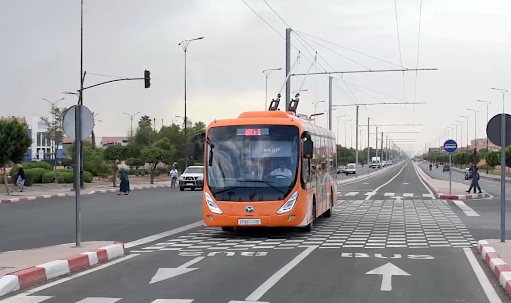

# The False Promise of EVs: Why the Real Future Lies in Grid-Powered Public Transit

## Date: 07-06-2025

In the global race to curb emissions and transition to a cleaner future, electric vehicles (EVs) have been hailed as the silver bullet. Governments provide subsidies, manufacturers pour billions into production, and consumers are nudged toward "green" choices. But beneath the glossy promise of EVs lies a harsh and inconvenient truth: they may be no more than a temporary illusion of sustainability.

### Lithium-Ion Batteries and the Rare Earth Dilemma

The foundation of EVs is the lithium-ion battery, which depends heavily on rare earth elements like lithium, cobalt, and nickel. These elements are not only limited in quantity but also geographically concentrated. For example:

* **Cobalt**: Over 70% of the world’s supply comes from the Democratic Republic of Congo, often mined under inhumane conditions, including child labor.
* **Lithium**: Extracted predominantly from South America’s Lithium Triangle and parts of China, the mining process consumes enormous water resources, impacting local ecosystems and communities.
* **Nickel**: Mining and refining nickel release significant carbon emissions and toxic waste.

This resource bottleneck creates a global dependence on a few countries and exposes the world to geopolitical risks, price volatility, and environmental degradation. In short, it replaces oil wars with mineral wars.

[China Blocks mangnets for India alone](china-blocks-magnet.jpeg)

### EVs: A Mirage of Sustainability

While EVs reduce tailpipe emissions, their production footprint is anything but clean. From mining and refining to battery manufacturing and disposal, the ecological costs are considerable. The battery lifecycle—from extraction to recycling—is neither circular nor regenerative at the current pace of technology.

Furthermore, replacing every internal combustion engine (ICE) vehicle with an EV doesn’t reduce traffic congestion, urban sprawl, or energy waste. It merely shifts the burden from gasoline to metals and electricity, much of which is still generated from fossil fuels in many parts of the world.

### The Real Solution: Grid-Powered Public Transit

Rather than pouring resources into individualized transport options, we need a fundamental shift in how we move people, not just vehicles. The future lies in **electrified public transport**—not battery-powered buses, but **grid-connected systems** like:

* **Trams and Light Rail Transit (LRT)**: Time-tested in European cities, they are efficient, reliable, and emit zero tailpipe emissions.
* **Trolleybuses and Bus Trams**: Electrified buses drawing power from overhead lines can operate on dedicated corridors, combining flexibility with energy efficiency.
* **Solar-Integrated Infrastructure**: Powering these systems with locally produced solar and wind energy ensures a sustainable and decentralized energy model.

These systems do not rely on rare earth metals in the same intensive way as EVs. Instead of each person owning a car with a massive battery, we can have shared, durable transport systems that draw energy directly from the grid in real time.

### More Than Technology: A Cultural Shift

The over-reliance on EVs stems from a car-centric worldview that prioritizes individual ownership over collective wellbeing. This mindset must change. Sustainable urban mobility requires:

* **Compact city planning** with walkable neighborhoods
* **Affordable and accessible public transit**
* **Policies to disincentivize car ownership**

### Conclusion

Electric vehicles are not a panacea. They are a costly detour that risks locking us into new forms of inequality, environmental harm, and geopolitical conflict. The true path to sustainability lies in rethinking mobility itself—not just electrifying the status quo, but rebuilding it altogether.

Instead of asking how we can make cars cleaner, we should be asking: **how do we reduce our dependence on cars altogether?** Grid-powered trams, buses, and collective transit systems offer a future that is not only cleaner but fairer, more efficient, and genuinely sustainable.
