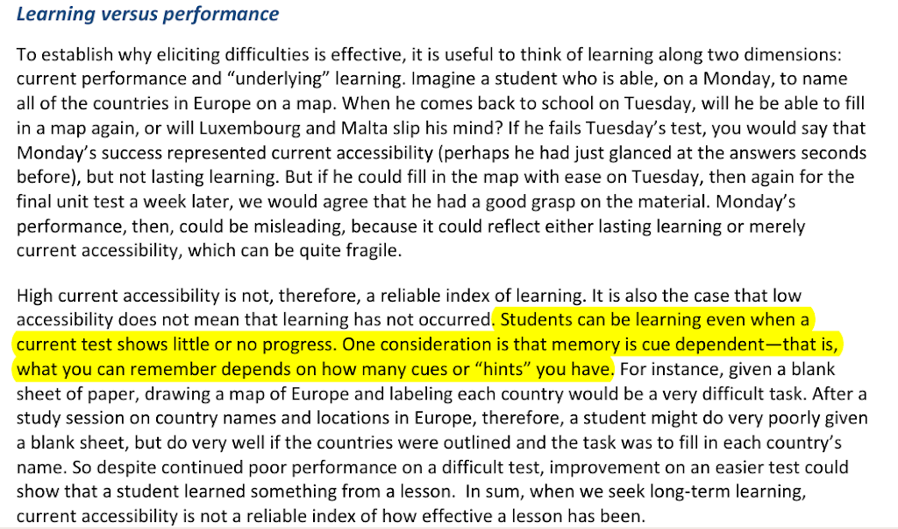
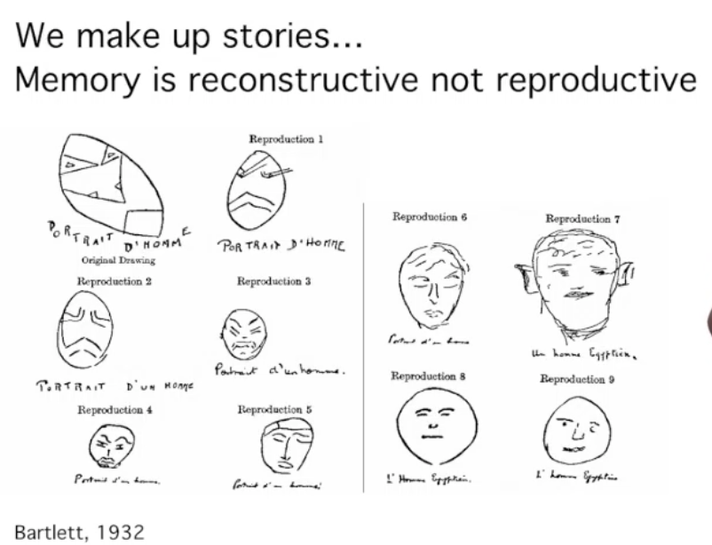
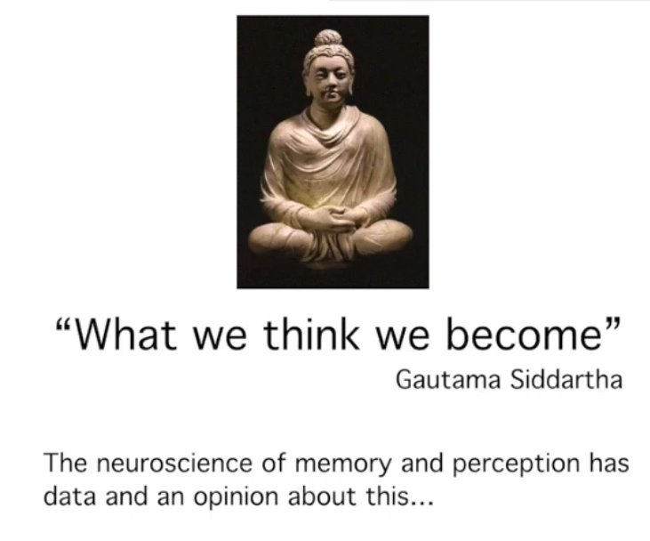
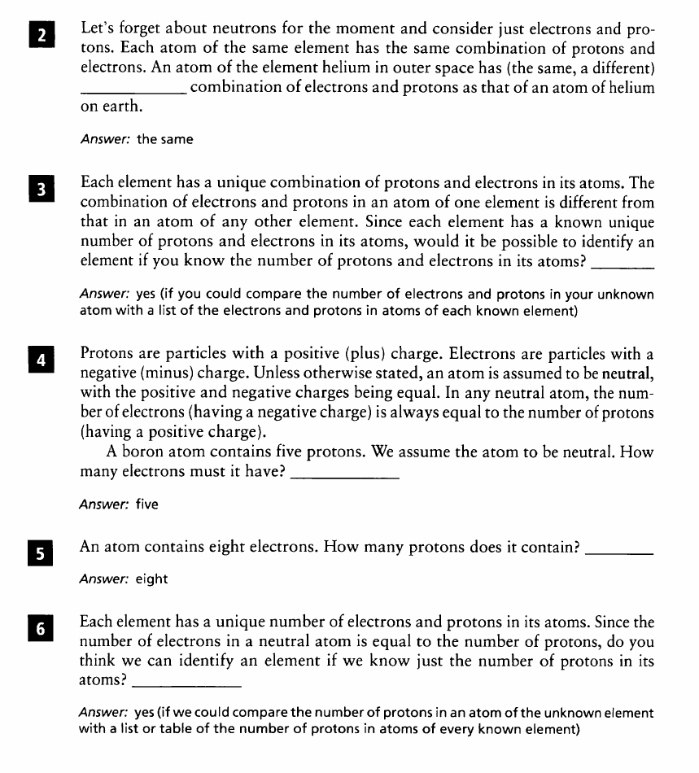
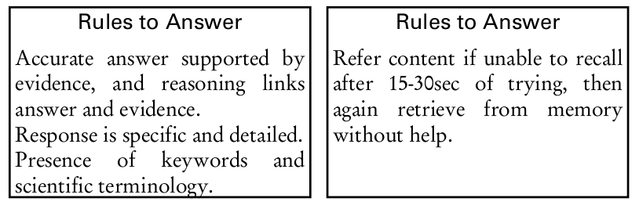
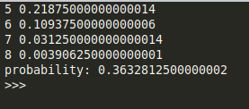
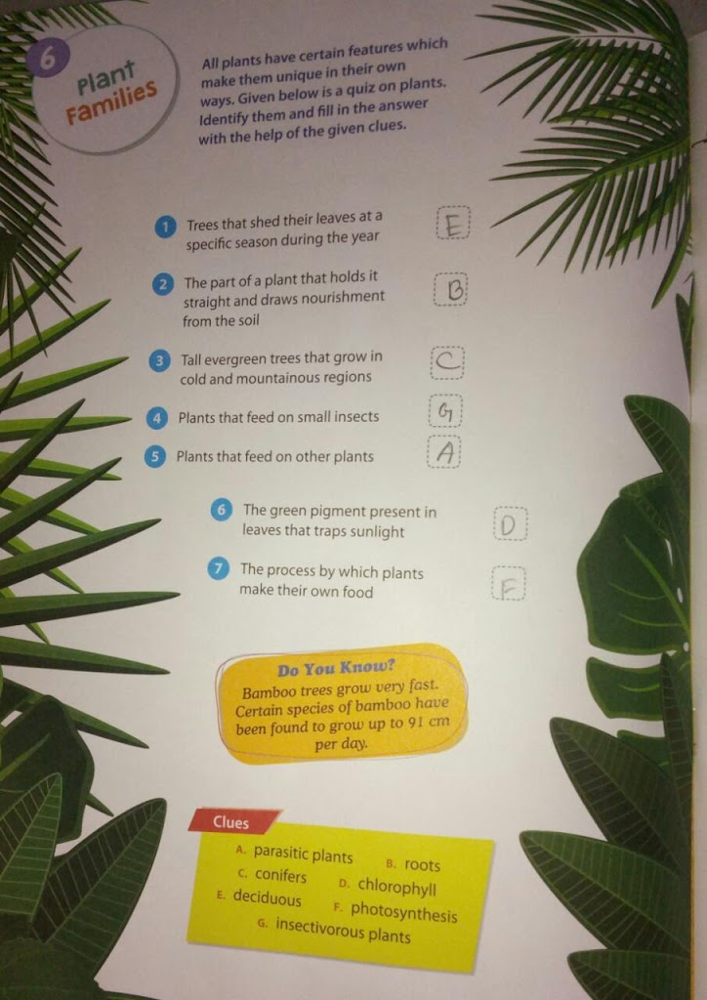
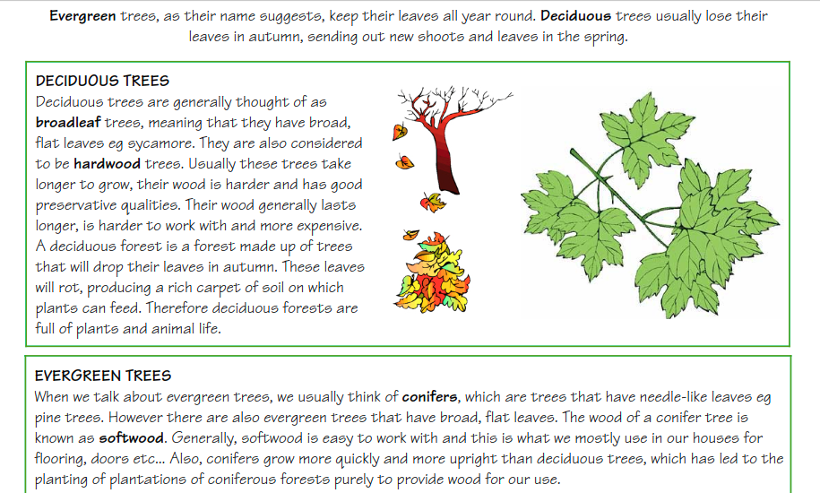

Why question designing should be brain-friendly and cue based?

Evidence:

Applying Science of Learning in Education (Society for the Teaching of Psychology)

**We make up stories, Memory is reconstructive not reproductive**

**Reconstructive memory** refers to the way memories are pieced together from bits of information. Memories are not perfectly formed, and they depend on outside influences to develop the whole picture. These influences can be anything, such as a person's own expectations or suggestions from other people. People want to believe that memories are perfect and not able to be molded by information outside of the memory. However, in memory recall, there are blind spots. The brain fills in those gaps, and that is reconstructive memory. When recollecting a memory, a person will remember pieces of it and, in order to form a whole memory, they add to it, or reconstruct it.

Reference Video

\[embed\]https://youtu.be/EIH9UBkEJJA\[/embed\]

[https://www.ibiology.org/neuroscience/what-we-think-we-become/](https://www.ibiology.org/neuroscience/what-we-think-we-become/)

Examples of cue based questions and without cue based questions:

[https://technoperiod.blogspot.in/2017/02/cbse-and-other-boards-all-about-rote.html](https://technoperiod.blogspot.in/2017/02/cbse-and-other-boards-all-about-rote.html)

> At present, our education system asks to reproduce the text and problems of books. Our education system should value the limitations of our brains and should reconstruct the degenerative process of teaching, training, publication, and learning.

Books can also be cue based that encourages learning with growth mindset.

Chemistry Concepts and Learning by Clifford C. Houk and Richard Post

Cues can also be given during **retrieval practice or formative assessment**, but after students have made enough effort for retrieval. Using retrieval practice or questions with changing the cues or context will make memory context-free and take care of cue-dependent forgetting.

Cue-dependent forgetting, or retrieval failure, is the failure to recall information without memory cues. The term either pertains to semantic cues, state-dependent cues or context-dependent cues. -- Wikipedia

[https://github.com/amiyatulu/flashcard](https://github.com/amiyatulu/flashcard)

Boosting Metacognition through In-Class Assessments [http://www.improvewithmetacognition.com/boosting-metacognition-through-in-class-assessments/](http://www.improvewithmetacognition.com/boosting-metacognition-through-in-class-assessments/)

Guided notes: Guided notes are instructor-prepared notes that cue students to respond to key information in a lecture or discussion. The cues can be blank spaces where students add information, or notations prompting students to engage in a variety of note-taking behaviors. [https://www.nature.com/articles/s41539-017-0018-1](https://www.nature.com/articles/s41539-017-0018-1)

**Examples:** An example of guided notes: [Circulatory System](https://nbviewer.jupyter.org/urls/book-amiyatulu.hashbase.io/Circulatory%20System.ipynb)

Uses analogy, inquiry, elaboration and connections with other discipline.

Examples of Question to Reproduce the text of books **Explain the features of User mode and Kernel mode of Windows 2000 operating system.** -Ignou MCA, 2017, Operating System Concepts and Networking Management [https://webservices.ignou.ac.in/Pre-Question/Question%20Paper%20June%202017/SOCIS/SOCIS.htm#socis4](https://webservices.ignou.ac.in/Pre-Question/Question%20Paper%20June%202017/SOCIS/SOCIS.htm#socis4)

Same Question that ask you to reconstruct the paragraph

CPU usage is generally represented as a simple percentage of CPU time spent on ideal/non-idle tasks. Crashes in kernel/user mode are catastrophic; they will halt the entire PC. In kernel/user, the executing code has complete and unrestricted/restricted access to the underlying hardware Kernel/user mode is generally reserved for the lowest-level, most trusted functions of the operating system it's possible to enable display of Kernel time in Task Manager, as I have in the above screenshot. The green/red line is total CPU time; the green/red line is Kernel time. The gap between the two is kernel/user time.

The question causes learning about user mode and kernel mode if a student didn't know it before, but one can answer it right with informed guesses. As options are binary, based on probability you have 50:50 chances to get each answer right.

The correct way of writing questions is to decrease the probability to at least 0.25, by giving more than four distractors.

Many times it's not possible to create more distractors like in this question which has all dichotomous answer. But that's not a considerable problem as the overall probability to get all choices right by complete guess in the paragraph will be low : (0.5)^8 = 0.00390625

One can also create a threshold for each paragraph, probability above threshold will not fetch any marks.

""" Python Programming: Binomial probability """
import scipy.stats as sp
n, p = 8, 0.5
s = sp.binom(n,p)
prob=0
r = n + 1
at\_least = 5
for x in range(at\_least, r):
 print(x, s.pmf(x))
 prob = prob + s.pmf(x)
print("probability:", prob)

Probability of getting **at least 5** answer correct out of **8 sub-questions in paragraph** by random guess is 0.363, which is decently low.

**Example of bad cue based questions which promote rote learning.** Take these questions:

> The following example has two serious flaws. **First it lacks elaboration, second, it supports cue-dependent forgetting.**

Children don't know the meaning of key terms such as shed, deciduous, evergreen, nourishment, pigment. When the answer was told to them once or twice, in spite of no understanding of sentences, children were able to say the options without help.

A better design: 1) **Book should elaborate the concept and teacher should tell the meaning of each key terms which the child don't know**

2) **Change the context and ask cue based questions Ask children to not to look the text to answer these question.**

\_\_\_\_\_\_\_trees has broad and flat leaves. Therefore, they are called as \_\_\_\_\_leaf trees. The wood of these trees are \_\_\_\_ (softer/harder). These tree take \_\_\_\_\_(longer/shorter) time to grow. Their work is \_\_\_\_(more/less) expensive. A deciduous \_\_\_\_(forest/desert) is made up of trees that (will/will not)\_\_\_\_\_ drop their \_\_\_\_(leaves/flower) in \_\_\_\_\_(autumn/spring).

Conifers have \_\_\_\_ (needle-like/broad) leaves. Example of conifer is \_\_\_\_(pine/mango) tree. Conifers are \_\_\_\_ (evergreen/deciduous) trees which have \_\_\_\_\_(needle-like/broad) leaves. But there are also evergreen trees that have \_\_\_\_(broad/bend) leaves. The wood of conifer tree is \_\_\_\_(softer/harder) than deciduous trees, so its wood is called (softwood/hardwood). Conifers grow more \_\_\_\_(quickly/slowly) and \_\_\_\_(more/less) upright than deciduous trees.

Further reading about cue dependent forgetting: [Teaching for long term memory](https://github.com/amiyatulu/teacher_resources/blob/master/Teaching%20For%20Long%20Term%20Learning.pdf)
