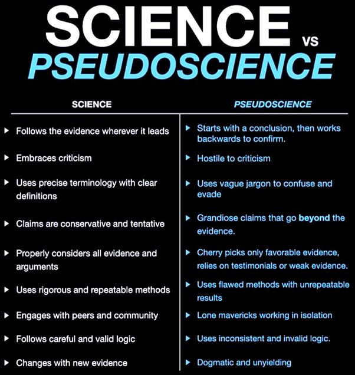

# Homeopathy

## What is Pseudoscience? 

Pseudoscience refers to ideas, theories, or practices that are presented as scientific, but lack the rigorous methodology, empirical evidence, and critical evaluation that are hallmarks of genuine scientific inquiry. Pseudoscience often relies on anecdotal evidence, personal beliefs, and unproven claims to support its ideas, rather than adhering to the scientific method and peer-reviewed research.

🇮🇳 ଓଡିଆ

ସିଉଡୋ ସାଇନ୍ସ (Pseudoscience) ଧାରଣା ବା ଥିଓରୀ କୁ ବୁଝାଏ ଯାହା ବଜ୍ଞାନିକ ବୋଲି କୁହାଯାଏ, କିନ୍ତୁ କଠୋର ପଦ୍ଧତି, ପରୀକ୍ଷାମୂଳକ ପ୍ରମାଣ ଏବଂ ସମାଲୋଚନାମୂଳକ ମୂଲ୍ୟାଙ୍କନର ଯାହା ପ୍ରକୃତ ବଜ୍ଞାନିକ ଅନୁସନ୍ଧାନର ଚିହ୍ନ ଅଟେ ତାହା Pseudoscience ରେ ଘୋର ଅଭାବ ଥାଏ| ବଜ୍ଞାନିକ ପଦ୍ଧତି ଏବଂ ସମୀକ୍ଷା-ଅନୁସନ୍ଧାନକୁ ଅନୁସରଣ କରିବା ପରିବର୍ତ୍ତେ ଛଦ୍ମ ବିଜ୍ଞାନ କିମ୍ବା Pseudoscience ପ୍ରାୟତ ଅପ୍ରମାଣିତ ଦାବି, ଲୋକ ମାନଙ୍କ କାହାଣୀ, ବ୍ୟକ୍ତିଗତ ବିଶ୍ୱାସ ଉପରେ ନିର୍ଭର କରେ |

Some common characteristics of pseudoscience include:

- **Lack of falsifiability:** Pseudoscientific claims are often difficult or impossible to disprove because they are vague, flexible, or based on subjective experiences.

e.g. Claims of precognition, or the ability to predict future events, are difficult to falsify. A person might claim to have predicted a natural disaster or stock market crash, but without a way to definitively determine whether the prediction was based on genuine precognition or simply a lucky guess, the claim remains unfalsifiable.

- **Cherry-picking evidence:** Pseudoscientists tend to selectively choose data that supports their claims while ignoring or dismissing contradictory evidence.

- **Appeal to authority:** Pseudoscientists often rely on the opinions of respected figures or historical precedents to support their claims, rather than presenting empirical evidence.

- **Conspiracy theories:** Pseudoscience often involves elaborate conspiracy theories to explain why the scientific community has not accepted its claims, rather than addressing the lack of evidence.

- **Use of scientific-sounding jargon:** Pseudoscientists may use technical terminology or complex-sounding explanations to make their ideas seem more credible, even if the underlying concepts are not scientifically valid.

- **Over-reliance on anecdotal evidence:** Pseudoscientific claims often rely on personal experiences, testimonials, and anecdotes rather than empirical data and controlled studies.

- **Failure to progress:** Genuine scientific theories and ideas are continually tested, refined, and improved upon through ongoing research and experimentation. Pseudoscience, on the other hand, tends to remain stagnant, with little or no progress in understanding or application.

Examples of pseudoscience include astrology, homeopathy, psychic readings, and many alternative medicine practices. While some of these may have some beneficial effects for individuals, they lack the empirical evidence and scientific rigor to be considered legitimate scientific theories or practices.

## PBS Video on Homeopathy

<video width="100%" controls preload="none" poster="../images/homeopathy.png">
  <source src="https://bafybeiaqtot4s3eb3s6kgusa65sirmsgpfflnurwwh2u7f5loe4ttyo6pa.ipfs.dweb.link/" type="video/mp4">
</video>