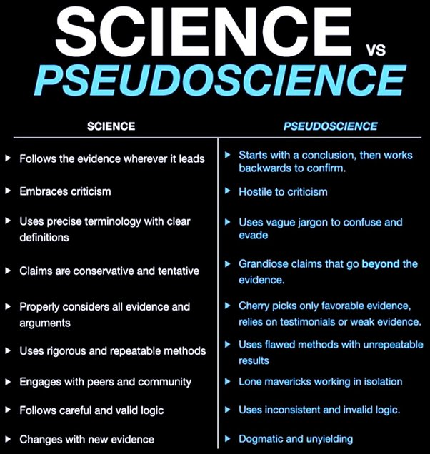

# What is Pseudoscience? 

Pseudoscience refers to ideas, theories, or practices that are presented as scientific, but lack the rigorous methodology, empirical evidence, and critical evaluation that are hallmarks of genuine scientific inquiry. Pseudoscience often relies on anecdotal evidence, personal beliefs, and unproven claims to support its ideas, rather than adhering to the scientific method and peer-reviewed research.

🇮🇳 ଓଡିଆ

ସିଉଡୋ ସାଇନ୍ସ (Pseudoscience) ଧାରଣା ବା ଥିଓରୀ କୁ ବୁଝାଏ ଯାହା ବଜ୍ଞାନିକ ବୋଲି କୁହାଯାଏ, କିନ୍ତୁ କଠୋର ପଦ୍ଧତି, ପରୀକ୍ଷାମୂଳକ ପ୍ରମାଣ ଏବଂ ସମାଲୋଚନାମୂଳକ ମୂଲ୍ୟାଙ୍କନର ଯାହା ପ୍ରକୃତ ବଜ୍ଞାନିକ ଅନୁସନ୍ଧାନର ଚିହ୍ନ ଅଟେ ତାହା Pseudoscience ରେ ଘୋର ଅଭାବ ଥାଏ| ବଜ୍ଞାନିକ ପଦ୍ଧତି ଏବଂ ସମୀକ୍ଷା-ଅନୁସନ୍ଧାନକୁ ଅନୁସରଣ କରିବା ପରିବର୍ତ୍ତେ ଛଦ୍ମ ବିଜ୍ଞାନ କିମ୍ବା Pseudoscience ପ୍ରାୟତ ଅପ୍ରମାଣିତ ଦାବି, ଲୋକ ମାନଙ୍କ କାହାଣୀ, ବ୍ୟକ୍ତିଗତ ବିଶ୍ୱାସ ଉପରେ ନିର୍ଭର କରେ |

Some common characteristics of pseudoscience include:

- **Lack of falsifiability:** Pseudoscientific claims are often difficult or impossible to disprove because they are vague, flexible, or based on subjective experiences.

e.g. Claims of precognition, or the ability to predict future events, are difficult to falsify. A person might claim to have predicted a natural disaster or stock market crash, but without a way to definitively determine whether the prediction was based on genuine precognition or simply a lucky guess, the claim remains unfalsifiable.

- **Cherry-picking evidence:** Pseudoscientists tend to selectively choose data that supports their claims while ignoring or dismissing contradictory evidence.

- **Appeal to authority:** Pseudoscientists often rely on the opinions of respected figures or historical precedents to support their claims, rather than presenting empirical evidence.

- **Conspiracy theories:** Pseudoscience often involves elaborate conspiracy theories to explain why the scientific community has not accepted its claims, rather than addressing the lack of evidence.

- **Use of scientific-sounding jargon:** Pseudoscientists may use technical terminology or complex-sounding explanations to make their ideas seem more credible, even if the underlying concepts are not scientifically valid.

- **Over-reliance on anecdotal evidence:** Pseudoscientific claims often rely on personal experiences, testimonials, and anecdotes rather than empirical data and controlled studies.

- **Failure to progress:** Genuine scientific theories and ideas are continually tested, refined, and improved upon through ongoing research and experimentation. Pseudoscience, on the other hand, tends to remain stagnant, with little or no progress in understanding or application.

Examples of pseudoscience include astrology, homeopathy, psychic readings, and many alternative medicine practices. While some of these may have some beneficial effects for individuals, they lack the empirical evidence and scientific rigor to be considered legitimate scientific theories or practices.

## Science vs Pseudoscience

Science is a systematic and empirical approach to understanding the natural world, while pseudoscience is a collection of beliefs or practices that are presented as scientific but lack the rigor and methodology of true science. Let's break down the differences between science and pseudoscience in more detail.

### Follows the evidence wherever it leads vs. Starts with a conclusion, then works backwards to confirm:

Science follows a process of observation, hypothesis formation, experimentation, and conclusion, always following the evidence wherever it leads. This means that if the evidence contradicts the hypothesis, scientists will change their hypothesis accordingly. On the other hand, pseudoscience starts with a conclusion and then works backward to confirm it, often ignoring or dismissing any evidence that contradicts the conclusion.

Example: In the case of climate change, scientists have gathered extensive evidence through the study of ice cores, tree rings, and other sources, showing that the Earth's temperature has been rising at an alarming rate. Pseudoscientists, however, may start with the conclusion that climate change is a hoax and then cherry-pick data or use flawed methods to support that conclusion.

### Embraces criticism vs. Hostile to criticism:

Science encourages critical thinking, open debate, and constructive criticism to advance knowledge and understanding. Pseudoscience, on the other hand, is often hostile to criticism and may attack those who question its methods or conclusions.

Example: When a new scientific study is published, it is subject to scrutiny and criticism by other scientists in the field, who may try to replicate the study or challenge its conclusions. Pseudoscientists, however, may dismiss or discredit any criticism, even if it comes from experts in the field.

### Uses precise terminology with clear definitions vs. Uses vague jargon to confuse and evade:

Science uses precise terminology and clear definitions to communicate ideas and findings. Pseudoscience often uses vague jargon or technical-sounding language to create the appearance of scientific legitimacy, but without clear definitions or meaning.

Example: In the field of nutrition, scientists use precise terms like "macronutrients" and "micronutrients" to describe the different types of nutrients our bodies need. Pseudoscientists may use vague terms like "energy fields" or "cleansing" to describe their methods, without providing clear definitions or evidence for their claims.

### Claims are conservative and tentative vs. Grandiose claims that go beyond the evidence

Science is conservative in its claims, always acknowledging the limitations of the evidence and the tentative nature of scientific knowledge. Pseudoscience, on the other hand, often makes grandiose claims that go beyond the evidence, promising cures or solutions that are not supported by scientific research.

Example: A scientific study may find a correlation between a certain diet and improved health outcomes, but scientists would be careful to note that the study does not prove causation and that more research is needed. Pseudoscientists, however, may claim that a particular diet can cure all diseases or reverse aging, without any scientific evidence to support these claims.

### Properly considers all evidence and argument vs. Cherry picks on favorable evidence, relies on testimonials or weak evidence:

Science considers all relevant evidence and arguments, even if they contradict the prevailing theory or hypothesis. Pseudoscience, on the other hand, may cherry-pick evidence that supports its claims while ignoring or dismissing evidence that contradicts it. Pseudoscientists may also rely on testimonials or anecdotal evidence, which are not considered reliable by the scientific community.

Example: A scientific study on the effectiveness of a new drug would consider all relevant data, including any adverse effects or side effects, before drawing conclusions. Pseudoscientists, however, may focus only on the positive testimonials of people who claim to have benefited from the drug, while ignoring any negative outcomes.

### Use rigorous and repeatable methods vs. Uses flawed methods with unrepeatable results:

Science relies on rigorous and repeatable methods, ensuring that experiments can be replicated by other scientists and that the results are reliable. Pseudoscience, on the other hand, may use flawed methods or rely on one-time events that cannot be replicated, making it difficult to determine the validity of the claims.

Example: A scientific study on the effects of a new drug would use a carefully designed experiment, with controls and randomization to ensure that the results are reliable and reproducible. Pseudoscientists, however, may rely on anecdotal evidence or uncontrolled studies, which cannot be replicated and may not be reliable.

### Engages with peers and community vs. Lone mavericks working in isolation:

Science is a collaborative and community-based endeavor, with scientists sharing their findings and working together to advance knowledge. Pseudoscience, on the other hand, often involves lone mavericks working in isolation, who may reject the scientific consensus and refuse to engage with the broader scientific community.

Example: Scientists working in a particular field will often attend conferences, publish papers, and collaborate with other researchers to advance their understanding of a particular topic. Pseudoscientists, however, may work in isolation, rejecting the scientific consensus and refusing to engage with the broader scientific community.

### Follows careful and valid logic vs. Uses inconsistent and invalid logic:

Science follows careful and valid logic, using established principles of reasoning and inference to draw conclusions from the evidence. Pseudoscience, on the other hand, may use inconsistent or invalid logic, making false assumptions or drawing conclusions that do not follow from the evidence.

Example: A scientific study on the effects of a new drug may use valid logic to analyze the data and draw conclusions, such as using statistical methods to determine the significance of the results. Pseudoscientists, however, may use invalid logic, such as assuming that correlation implies causation or drawing conclusions based on personal beliefs rather than evidence.

### Changes with new evidence vs. Dogmatic and unyielding:

Science is open to new evidence and is willing to change its conclusions based on new data. Pseudoscience, on the other hand, is often dogmatic and unyielding, refusing to change its beliefs even in the face of overwhelming evidence to the contrary.

Example: When new evidence emerges that challenges a scientific theory, scientists will reevaluate the evidence and may revise the theory accordingly. Pseudoscientists, however, may dismiss or ignore new evidence that contradicts their beliefs, and may continue to promote their claims even in the face of overwhelming evidence to the contrary.

# Homeopathy

## PBS Video on Homeopathy

[Does Homeopathy Work?](https://www.pbs.org/video/does-homeopathy-work-fkfvyt/)
